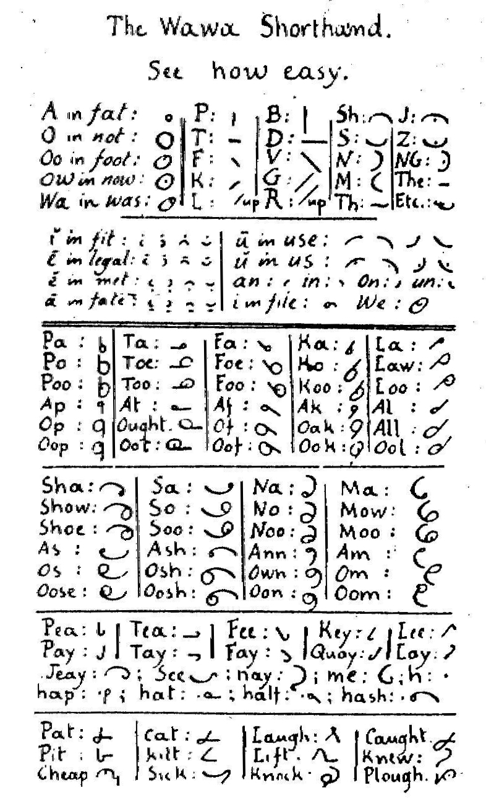
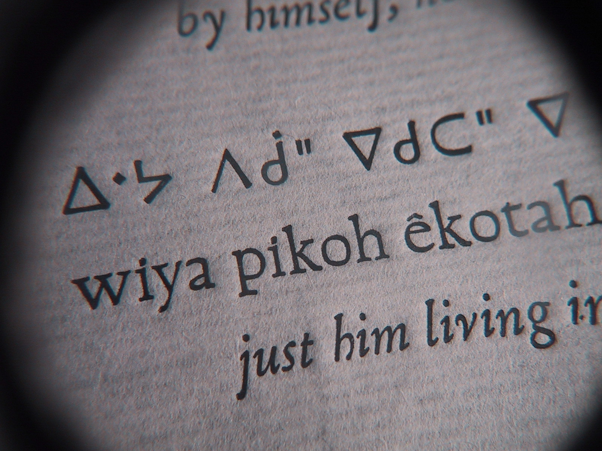
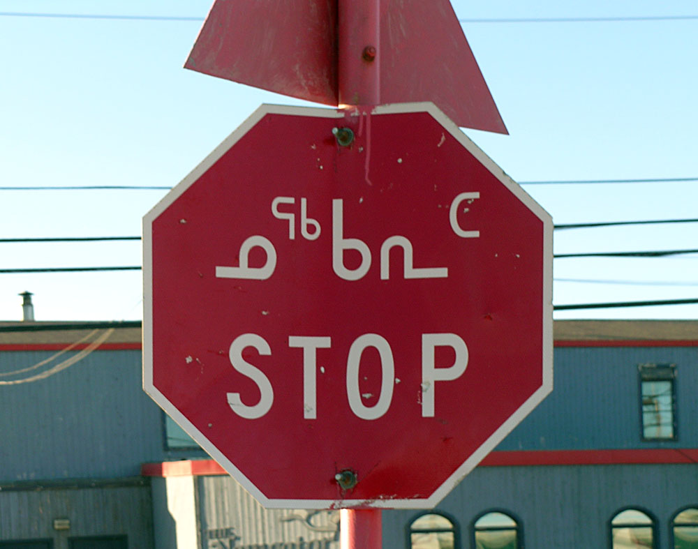

W momencie wybuchu popularności stenografii pismo łacińskie było już
jako-tako ugruntowane. Zaczynały się już wykształcać stałe jego formy,
czemu sprzyjał rozwój druku i wymiana korespondencji o zasięgu
międzynarodowym. Jednak stenografowie nigdy nie porzucili marzeń o
stenografii jako piśmie elementarnym, którego uczyć będą w szkołach
podstawowych.

Jak pisałem wcześniej, co zresztą łatwo zauważyć, zamiar ich się nie
powiódł. Nie można jednak powiedzieć, że ponieśli całkowitą klęskę.
Niektóre małe narody przyswoiły sobie stenografię jako 
pismo podstawowe - a mianowicie plemiona indiańskie, do których pod koniec XIX wieku
zawędrowali misjonarze z poczuciem misji i pragnieniem, aby te poniżone
wcześniej narody wzniosły się na poziom cywilizacji dzięki posiadaniu
własnego pisma.

I tak na przykład Kamlupowie z Brytyjskiej Kolumbii obdarowani zostali
pochodną systemu Duploye, zwaną Wawa Shorthand.

Języki Indian przypominają nieco rodzinę mandżurską, czyli są w dużej
mierze sylabiczne. Zatem podstawowe techniki stenograficzne znajdują dla
nich znakomite zastosowanie. Poczynając od wielkich Czirokezów, którzy
swój alfabet sylabiczny posiedli już na początku XIX wieku, ewangelista
James Evans przygotował dla narodu Krików sylabariusz w oparciu o
Dewanagari i stenografię:

Dalej poszło już z górki, na bazie tego alfabetu w połowie XIX wieku
stworzył też dla narodu Odżibłejów:

Trzydzieści lat później Edmund Peck na tej podstawie ułożył sylabariusz
dla Inuitów. W roku 1976 został on uznany za urzędowy na terytorium
Nunavut i Nunavik w Quebecu, na równi z alfabetem łacińskim:

W swojej bezbrzeżnej naiwności i entuzjazmie uznaję te przypadki za
wystarczający dowód na to, że dowolny działający system stenograficzny
mógłby z powodzeniem zastąpić lokalny derywat alfabetu łacińskiego, a
nawet (cóż za odwaga!) myślę (brawo!), że dałoby się opracować jakiś
uproszczony alfabet na bazie współczesnego pisma łacińskiego oraz
badawczego alfabetu IPA, który mógłby przyspieszyć dwukrotnie zarówno
zapis, jak i odczyt w języku ojczystym.

