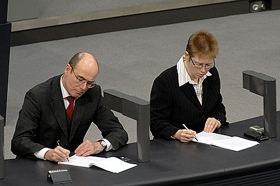
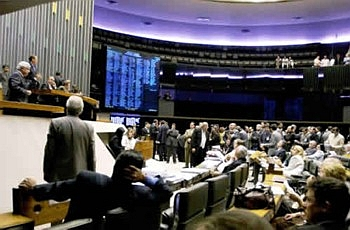

  
 <!-- {width="320" height="212"}](foto_475.jpg)
  Stenografowie w Bundestagu -->



Biura stenograficzne pracowały we wszystkich parlamentach na naszej
planecie. W wielu wciąż działają. Działały wedle procedury, którą
stworzono po raz pierwszy w czasach nowożytnych w parlamencie pruskim.
Jej twórcy czerpali oczywiście z dokonań poprzedników, w tym
starożytnych biur notarialnych.

 <!-- {width="320" height="209"}](http://www.bundestag.de/blickpunkt/bilderInhalte/0408/500px/0408022.jpg)
  Stenografowie w Bundestagu podczas obrad plenarnych -->



Podstawowy zespół stenograficzny parlamentu pruskiego składał się z 12
szybkopisów i tyluż pisarzy czyli przepisywaczy. Do tego doliczyć należy
dziennikarza, czyli tego, kto zapisuje porządek obrad oraz głównego
redaktora. Stenografowie podczas obrad pracowali parami w cyklach 10-cio
minutowych. Po zajęciu miejsc przez zmienników natychmiast wstawali i
spiesznym krokiem udawali się do swoich pisarzy (w innym pomieszczeniu),
którym niezwłocznie dyktowali swoje zapiski. W przypadku niejasności
można było porównać dwa stenogramy. Gotowe rękopisy przekazywano ich
autorom, czyli mówcom, którzy te słowa wcześniej wygłosili. Mieli oni
prawo wnieść poprawki natury gramatycznej i uściślić niejasne
sformułowania. Nie mieli za to prawa zmieniać sensu swoich wypowiedzi,
czy zmieniać zajętego stanowiska w jakiejś sprawie. Następnie protokoły
wędrowały do głównego redaktora, który poddawał je ostatecznemu
wygładzeniu i szykował do archiwizacji i ew. druku.

<!--  {width="320" height="209"}](http://www.gov.mu/portal/goc/assemblysite/images/reporter.gif)
  Zespół stenograficzny parlamentu Republiki Mauritius -->
  

 

Stenografów zatrudniano na podstawie konkursu szybkości.

  
<!--   {width="320" height="210"}](steno4.jpg)
  Parlament brazylijski. Stenografów widać siedzących na prawo od głowy stojącego pana. -->



W Wielkiej Brytanii stenogramy parlamentarne w ogóle nie były
przepisywane na pismo długie, ponieważ znajomość stenografii była
powszechna wśród zainteresowanych ich treścią. Podobnie pracownicy
drukarni (zecerzy) potrafili czytać stenogramy, więc szykowali druk
bezpośrednio z notatek, a redakcję i korektę czyniono podczas składu.
Nie były to oficjalne protokoły, lecz notatki wynajętych przez
poszczególne gazety reporterów. Parlament brytyjski nie miał swojego
biura stenograficznego.

Ciekawostką jest dla mnie fakt, że w radach wielkich miast Brazylii
funkcjonują duże biura stenograficzne i nikt tam nie zamierza tego
zmieniać.

<!--  {width="320" height="213"}](TAQUIGRAFOS-PLENARIO-9695-300.jpg)
  Stenografowie przy Camara Municipal de Sao Paulo -->



W Polsce powojennej biuro stenograficzne również pracowało wedle tej
procedury. Nic w tym dziwnego, skoro pierwsi stenografowie wywodzili się
z niemieckiej szkoły Stolze-Schrey, której przekład przygotował Jan
Michał Gumiński jakby na zamówienie polskiego sejmu i senatu. Opis tej
procedury i rys historyczny z samego źródła **[>>tutaj<<](../../historia_polska/ii_rp/sejm_kronika/)**.

<!-- {width="320" height="154"}](2521sejm.jpg)
  Polski współczesny sejm. Mniej więcej w centrum zdjęcia stanowisko stenografów. -->



Współcześnie za bieżący zapis obrad, czy to Sejmu, czy Senatu, odpowiada
aparatura nagrywająca. Materiał z niej przekazywany jest na bieżąco do
biura maszynistek, które przepisują i przygotowują protokoły do wglądu
dla posłów. Gotowy monitor z obrad pojawia się dopiero po ok. dwóch
tygodniach. Rola stenografów ograniczona jest do uzupełniania protokołów
o głosy z sali i ew. uwagi na temat mowy ciała (np. poseł Bździński
rzucił w posłankę Kociubińską bu...kietem). Tak jest we wszystkich
parlamentach, gdzie wciąż zatrudnia się stenografów. Podobno protokoły
przygotowywane przez biura stenograficzne gotowe były do wglądu dla
posłów już następnego dnia (przepisywane maszynowo w nocy), a dnia
następnego (o ile poseł oddał materiał) przekazywano je do druku.

Dodać tutaj należy, że stenografowie w polskim parlamencie pracują dziś
głównie w Senacie. Jest to grupka starszych pań-emerytek wynajmowanych
na umowę-zlecenie, pracujących głównie z powodów idealistycznych. Nie
prowadzi się już kursów stenografii, zatem po odejściu ostatnich
stenografów parlament będzie musiał zainwestować w jakąś drogą i
wyrafinowaną technikę zapisu audio-wideo, żeby zarchiwizować możliwie
pełen przebieg procedury legislacyjnej.