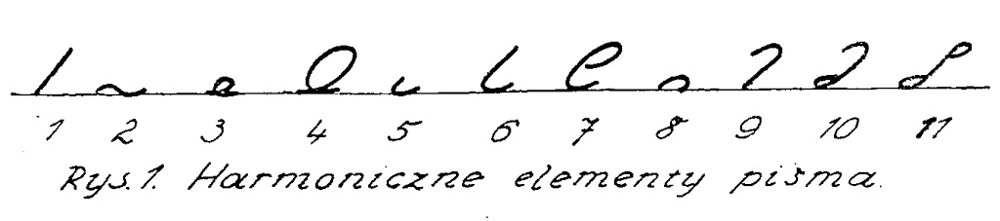
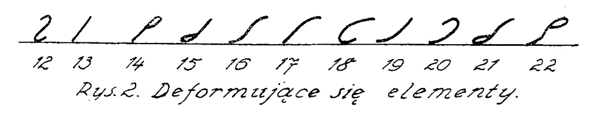
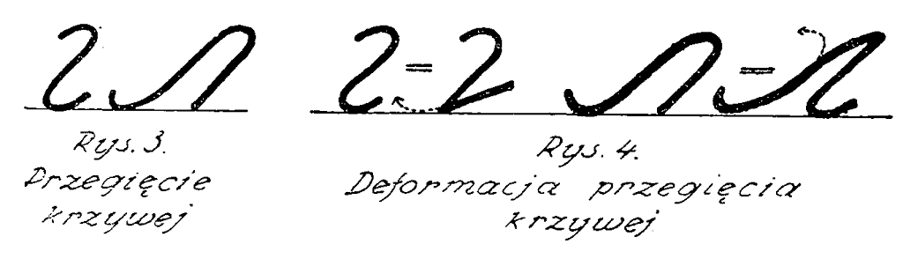
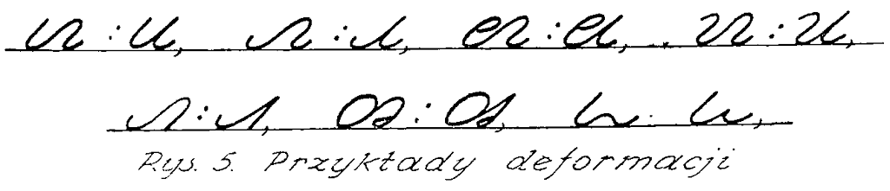
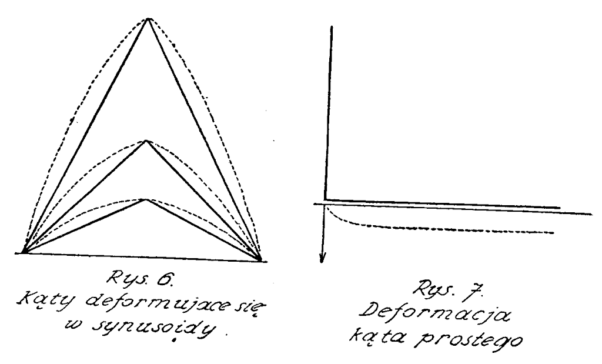
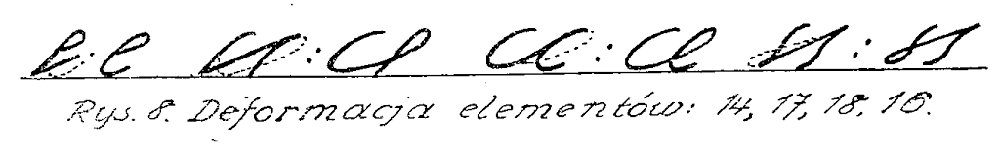

Przedstawiam poniżej kolejny artykuł z cyklu teoretycznego. Niektóre
fragmenty mogą być niezrozumiałe dla czytelnika, który wcześniej nie
zapoznał się z [jakimś podręcznikiem](http://stenografia.pl/podreczniki/polinski/) do
stenografii systemu Polińskiego, ale wszyscy mogą się zorientować, jak
szczegółowo projektanci systemów podchodzą do każdej kreseczki, każdego
ruchu ręką. Warto również zapoznać się choćby z ilustracjami z cytowanej
w poniższym artykule [pracy Sokołowa "Teoretyczne Podstawy Stenografii", mam tu dostępną wersję z roku 1937](https://sites.google.com/a/stenografia.pl/stenografia/home/repo_pdf/TeoreticheskieOsnoviStenografii1937-Sokolov.pdf?attredirects=0&d=1) (13MB).

Proszę także wziąć poprawkę na wiernopoddańczą wymowę tego tekstu:
został opublikowany w roku 1953, co powinno być wystarczającym
wyjaśnieniem i usprawiedliwieniem.

## TEORIA DEFORMACJI - FRANCISZEK KOTAS (Cieszyn)

Największą zdobyczą stenografii radzieckiej jest stworzenie teorii
deformacji przez najwybitniejszego teoretyka stenografii radzieckiej, N.
N. Sokołowa, i zastosowanie jej w radzieckim jednolitym systemie
stenograficznym utworzonym przez te­goż teoretyka.

Celem niniejszego artykułu jest popularne przedstawienie tej teorii
czytelnikom "Stenografa Polskiego", z pominięciem zawiłych dowodów
naukowych, i zachęcenie stenografów interesujących się problemami teorii
stenografii do bliższego zapo­znania się z problemem deformacji na
podstawie dzieła N. N. Sokołowa "Teoreticzeskie Osnowy Stenogra­fii"
(str. 81-108), które można na­być w każdej księgarni.

Tak "Kurs Stenografii" (1948) jak i "Teoreticzeskie Osnowy Stenogra­fii"
(1949) tworzą podstawę, na której opierała się praca zespołu roboczego
nad zastosowaniem radziec­kiego jednolitego systemu stenogra­ficznego do
języka polskiego. Przyjmując brak znajomości radzieckiego systemu
stenograficznego u przeciętnego czytelnika "Stenogra­fa Polskiego"
posługuję się przy tłumaczeniu teorii deformacji analogicznymi znakami
stenograficznymi naszych systemów stenograficznych. Podawane cytaty i
stronice odnoszą się do dzieła "Teoreticzeskie Osnowy Stenografii" N. N.
Sokołowa.

### Ujemne oddziaływanie deformacji na pismo stenograficzne

Znaki (elementy) stenograficzne jako części liter posiadają mniejszą
ilość cech odróżniających je od siebie niż litery zwykłego pisma, toteż
deformacja (zniekształcanie) znaków stenograficznych w prędkim pisaniu
stenograficznym jest poważniejsza w swoich skutkach niż deformacja
zwykłego pisma. Trudniej odczytywać zniekształcone znaki stenograficzne
niż zniekształcone litery.

Należy odróżniać deformację obiektywną - tj. taką, która występuje w
prędkim pisaniu u każdego stenografa z winy niewłaściwie dla danego
systemu stenograficznego dobranych znaków - od deformacji subiektywnej -
t. j. takiej, która może występować nie tylko w prędkim pisaniu, ale
często także w powolnym, z winy stenografa (najczęściej niedbalstwa lub
braku dostatecznego treningu). Deformacja obiektywna "pojawia się
nieuniknienie w szybkim piśmie nie­zależnie od wytrenowanej ręki" (str.
82)."Sferą występowania deformacji jest szybkie wiązane pismo" (str.
81). W niniejszym artykule będzie mowa tylko o deformacji obiektywnej.
Nasze stare systemy stenograficzne posiadają w alfabecie dużo
deformujących się elementów. One to są źródłem zjawiska, że
stenograf-praktyk utknie często na 300 zgłoskach, a często nawet już na
200, i mimo poważnego treningu nie mo­że ruszyć wzwyż. Deformujące się
znaki są głównym czynnikiem utrudniającym stosowanie stenografii w
praktyce i one to powodują, że nasze maszynistki często nie przyznają
się do tego, iż uczyły się w szkole lub na kursie stenografii, by
uniknąć mozolnych prac stenograficznych. Deformacja jest głównym
czynnikiem, który zawinił, że stenografia nie rozpowszechniła się u nas
w kraju w takim stopniu, jakby na to ze względu na swój utylitaryzm
zasługiwała.

### Istota deformacji

W prędkim pisaniu panuje rytm. Ręka wykonuje miarowe, wahadłowe ruchu w
górę i w dół w równych odstępach czasu. "Nasze pismo zawsze dąży do
określonej rytmiczności - równomiernego następ­stwa po sobie rozmachów w
górę i w dół. Ta rytmiczność jest wynikiem tego, że naturalny ruch ręki
jest ruchem wahadłowym" (str. 85). Rytm wymaga więc, by poszczególne
znaki stenograficzne wypisywane były w jednakowych odcinkach czasu.
Poszczególne znaki stenograficzne wypisuje się jednak w róż­nych
odcinkach czasu. Tabela 7 w książce Sokołowa (str. 97) zawiera odnośne
dane, otrzymane przy pomocy elektrycznego zegara, a mianowicie:

1. czas (w ułamkach sekundy) potrzebny do oddzielnego napisania
poszczególnych znaków stenograficznych (rubr. 3),
2. czas potrzebny do napisania powiększonych znaków
stenograficznych (rubr. 5),
3. czas potrzebny do napisania znaków stenograficznych w piśmie
wiązanym (rubr. 6).

Wśród znaków stenograficznych są takie, które w piśmie wiązanym wypisuje
się wyraźnie przeciętnie w czasie 0,2 sekundy, a które bez trudności
poddają się rytmowi. Są wśród nich takie, które do wyraźnego pisania w
piśmie wiązanym potrzebują przeciętnie 0,3-0,4 sek., często nawet daleko
więcej czasu, a które wskutek tego wprowadzają zaburzenia w rytmiczne
pisanie. W prędkim rytmicznym pisaniu ręka nie potrafi zwalniać, by te
"nierytmiczne" znaki wyraźnie wypisywać.Ręka kierowana rytmem usiłuje
 wypisywać znaki nierytmiczne w takich samych odcinkach czasu, jak znaki
rytmiczne, a ponieważ to jest niemożliwe, zbliża formy nierytmiczne do
rytmicznych - czyli zniekształca je, deformuje.

### Znaki harmoniczne i nieharmoniczne

Znaki, które nie sprzeciwiają się ruchom rytmicznym ręki, nazywa Sokołow
"harmonicznymi" (rys. 18, str. 75). Jest ich 11. Można je znaleźć we
wspomnianej tabeli 7 na pierwszych 11 miejscach. Odpowiadają one
następującym znakom systemu Polińskiego: *wy, n, s, ś, o, b, d, k, w, g, dz*. 
W systemie Sokołowa mają one inne znaczenie, a mianowicie: 
*k, n, r, 1, s, p, m, t, w, ż, c*. 
(Patrz rys. 1).

Do znaków nieharmonicznych (rys. 40, str. 91), burzących rytmiczne
pisanie, należą wszystkie znaki o strukturze bardziej skomplikowanej,
jaknp. kreska płomykowa (u w systemie Polińskiego, w w systemie
Korbela), i znaki, których główny trzon stanowi kreskę płomykową (c w
systemie Polińskiego) oraz inne (patrz rys. 2).

Można je znaleźć u Sokołowa w tab. 7, pod licz. 12 - 21. Znaki te nadają
się cło oznaczania grup spółgłoskowych, przedrostków, przyrostków i
końcówek gramatycznych, szczególnie zaś wtedy, gdy te składniki językowe
rzadziej występują, natomiast w alfabecie zadania swego spełnić nie
mogą. Można zauważyć, że liczne znaki stenograficzne, pozornie bardzo
proste, nie robiące na pierwszy rzut oka wrażenia, by mogły się
sprzeciwiać rytmowi ręki, są znakami nieharmonicznymi. Należą do nich
np. m i z systemu Polińskiego. Zrozumiemy to wtedy, gdy wnikniemy w
istotę deformacji.

### Dwa typy deformacji

Rozróżniamy dwa typy deforma­cji:

1. deformację przegięcia krzy­wej 
2. deformację kątową.

Przegięcie krzywej występuje w m systemu Polińskiego i Korbela, w którym
to znaku po półkolistym łuku u góry (obrót w prawo) następuje półkolisty
łuk u dołu (obrót w lewo), oraz w sąsiadujących ze sobą znakach (np. ow
w systemie Polińskiego), gdzie po półkolistym łuku u dołu (obrót w lewo)
następuje pół­kolisty łuk u góry (obrót w prawo). Jest to więc, jak
Sokołow krótko mówi: "przejście lewego albo prawego obrotu w
przeciwstawny" (str. 82).(Patrz rys. 3).

### Jak powstaje deformacja przegięcia krzywej?

Po pierwszym rozmachu dla wykonania górnego wyokrąglenia znaku m rozwija
się siła odśrodkowa zmierzająca do zamknięcia koła. Jeżeli nie zrobimy
przerwy dla zrekompensowania tej siły (jak to ma miejsce przy pisaniu
znaku w systemu Polińskiego,), to w wyniku działania siły odśrodkowej i
drugie­go rozmachu dla wykonania przeciwstawnego łuku (dolnego łuku
znaku m) linia znaku nie pójdzie po zamierzonym półkolu, "wyokrąglenie
się ścina, element zmienia swój kształt - deformuje się" (str. 85).
Wynikiem deformacji jest znak w lub znak bardziej podobny do w niż do m.
Analogicznie deformuje się półkolisty łuk u góry znaku w w połączeniu
znaków ow. Wynikiem deformacji jest tu znak b lub znak bardziej podobny
do b niż do w.(Patrz rys. 4).

Przykładowo przedstawia się to w ten sposób, że (w systemie Polińskiego)
bm przekształca się w bb, om w ob, dm w db, mm w mb, ow w oj, og w oz, a
bn w b-o (rys. 30, str. 85) (patrz rys. 5). "Przegięcie krzywej
deformuje się w nie de­formujące się konfiguracje" (str. 85).

### Deformacja kątowa

"Wypisywanie kąta nie jest ruchem harmonicznym" (str. 87). Szybkość
wypisywania kątów jest ograniczona, podobnie jak w wypadku przegięcia
krzywej. Jednak ostre kąty pisze się znacznie szybciej od prostych i
rozwartych.

Sokołow wykazał, że wszystkie kąty deformują się w odpowiadająceim
 sinusoidy(liniekrzywe o kształcie fali wodnej) (rys. 34, str. 88).
"To niebezpieczeństwo przechodzenia w sinusoidy jest największe dla
prostych i rozwartych kątów" (str. 88). Ostre kąty "przechodząc w
sinusoidy zachowują wrażenie kątów" (str. 88), bo ostre kąty deformują
się w bardzo ostre łuki, mała różniące się od kątów. "Dlatego w
praktycznym prędkim pisaniu można pisać ostre kąty dostatecznie szybko,
chociaż w rzeczywistości piszemy w tym wypadku sinusoidy" (str. 88). "Im
większy jest kąt, tym większa jest różnica między nimi a sinusoidą"
(str. 88), stąd sinusoidy jako wynik deformacji kąta prostego i kątów
rozwartych nie robią już wrażenia kątów (rys. 34, str. 88). (Patrz rys.
6) Jak powstaje deformacja kątowa? Jeżeli ręka wykona ruch wzdłuż
jednego z ramion kąta (np. w dół), to wskutek prawa bezwładności ma ona
tendencję kontynuowania ruchu w zadanym kierunku. Jeżeli nie zrobimy
przerwy w wierzchołku kąta (t. j. w miejscu, w którym mamy zamiar
doczepić drugie ramię kąta i zmienić kierunek pisania) dla
zrekompensowania bezwładności, to w wyniku działania bezwładności i
nowego impulsu do napisania drugiego ramienia kąta - kierunek deformacji
pójdzie "między nie skompensowanym kierunkiem pierwszego ruchu
wahadłowego a kierunkiem zamierzonym drugiego wahnięcia zaokrąglając
kąt, po czym ruch przejdzie w kierunek zadany" (rys. 39, str. 90) (patrz
rys. 7). Kąty przekształcają się więc w łuki.

### Deformujące się elementy

Z powyższych wywodów wynika, że znaki m i r w systemach Polińskiego i
Korbela należą do deformujących się. W nowych systemach stenograficznych
należy unikać tych znaków lub też przeznaczyć im skromniejsząrolę.
Element 12 (znak m) oznacza w systemie Sokołowa najrzadziej
występującą spółgłoskę języka rosyjskiego: f. Ele­menty 14 i 15 (znak c
w systemie Korbela oraz jego odwrotność - znak z) "należą do liczby
deformujących się, gdyż połączenia dają kąty" (rys. 41, str. 91) (parz
rys. 8). "Sprawa pogarsza się jeszcze przez to, że w wyniku wypisywania
pętlic powstaje nie całkiem skompensowany ruch, który przeszkadza
do­kładnemu wypisywaniu kąta". Element 14, znak c, przekształca się w
znak d. Jeżeli powiększymy rozmiar elementów 14 i 15, to proste linie
tych elementów łagodzą deformację. W systemie Sokołowa znaki te
oznaczają stosunkowo rzadkie spółgłoski języka rosyjskiego g i ch.

### Deformacja łukowa

Odmianą deformacji kątowej jest deformacja łukowa. Połączenia łuku z
prostą albo łuku z łukiem (linia płomykowa) dosyć często pojawiają się w
systemach stenograficznych (patrz elementy 16 - 22). Należą tu między
innymi znaki p i py oraz c systemu Polińskiego. Inercyjny kierunek
(kierunek wynikający z bezwładności) elementu 17 (znak py w systemie
Polińskiego), wytworzony rozmachem dla nakreślenia górnego łuku tego
znaku, spowoduje u dołu wyokrąglenie; inercyjny kierunek, wytworzony
rozmachem dla nakreślenia półkola lewego (u gó­ry), przekształci
następujący po nim element 17 (znak py systemu Polińskiego) w znak z
górną pętelką. Znaki py + py przekształcą się w znaki py + dy (patrz
rys. 8). W elemencie 18 występuje wygięcie przegięcia krzywej. Inercyjny
kierunek doprowadza do przekształcenia następującego po nim elementu 18
w pętlę (pp przekształca się w pd) (patrz rys. 8). W elemencie 16
kierunek inercyjny doprowadza do tego, że dolna część tego elementu
przekształca się w pętlę. (Patrz rys. 8)

Z powyższych przykładów wynika, że części elipsy (elementy 17 ł 19) są
niedogodne w piśmie praktycznym.

W podsumowaniu swoich naukowych wywodów Sokołow ostatecznie w taki
sposób określa istotę deformacji:

"Deformacja pisma jest wynikiem podporządkowania nieharmonicznych form
rytmowi wahadłowych ruchów ręki. Rozwijające się w szybkim pisaniu siły
inercyjne określają kierunek deformacji wyrównujący nie skompensowany
kierunek z kierunkiem zamierzonym".

### Czy można uniknąć deformacji?

Znaki nieharmoniczne nie będą się deformowały, jeżeli do nich
dostosujemy tempo pisania. Stenograf-praktyk nie może jednak dobierać
tempa pisania do takich czy innych znaków, tempo narzuca mu mówca, zaś w
szybkim tempie ręka opanowana rytmem pracuje automatycznie, wskutek
czego deformacja znaków nieharmonicznych jest nieunikniona.
Deformację będzie można znacznie ograniczyć w nowym systemie
stenograficznym, wzorowanym na systemie radzieckim Sokołowa, przez
unikanie stosowania w alfabecie nieharmonicznych znaków. Przy braku
odpowiedniej liczby elementów harmonicznych należy w nowym systemie
stosować elementy nieharmoniczne dla bardzo rzadko występujących
spółgłosek.

"Zadaniem teorii stenografii jest zmniejszenie w granicach możliwości
takich nieharmonicznych połączeń". Po tej linii idą prace Komisji
systemowej, zbierającej się w Warszawie co dwa tygodnie na narady.
