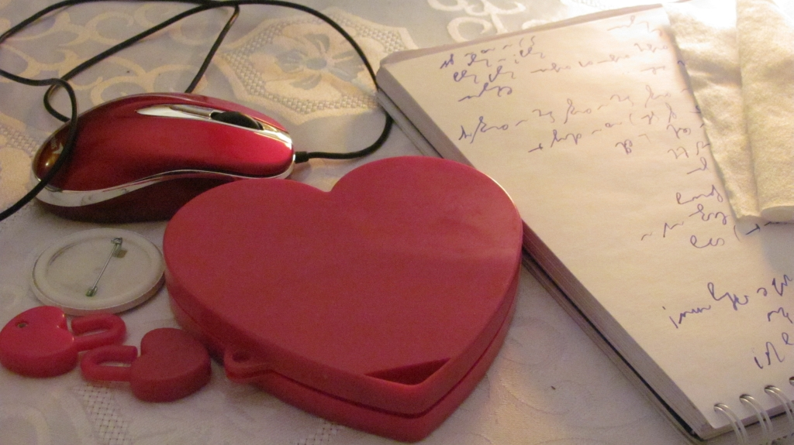
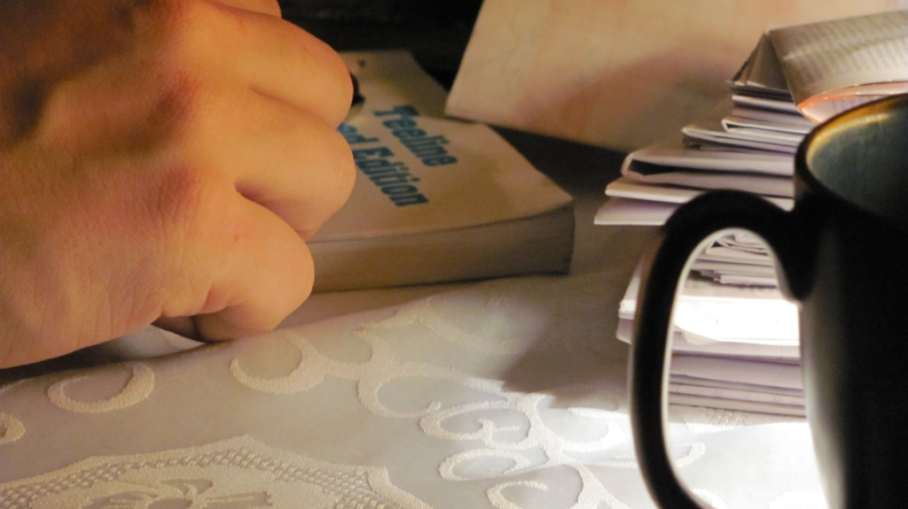

Hobby znalazłem sobie takie, że wystarczy do emerytury, a zapewne i
dalej. O ile będzie jakaś emerytura, a zatem i jakieś dalej. Aktualnie
mam więcej materiału w formie surowej, niż jestem w stanie na bieżąco
przerabiać, a mam na myśli samo zapoznawanie się z nim, samolubne
pochłanianie informacji, a nie idealistyczne dzielenie się nią - ot
chociażby przez ten blog.

Nad czym zatem teraz pracuję równolegle (żeby wymienić tylko to z
dziedziny stenografii)?

1. **Ste*Mi*** - robocza nazwa nowego, odręcznego systemu
stenograficznego. Jeszcze kilka dni temu myślałem, że nic nowego w tej
materii nie wymyślę i pozostanie mi tylko spisanie dokumentu
systemowego. Tylko? Zakładam, że zajmie mi to kilka miesięcy uczciwej
pracy.
2. **Brewiskrypt** - ogólny system pisania skrótowego, z przeznaczeniem
do użycia na dowolnym nośniku, przy pomocy dowolnego narzędzia - a zatem
także przydatny przy pisaniu na klawiaturze. Ma być oparty o litery
polskie. Projekt aktualnie w powijakach, choć trzeba przyznać, że
badania statystyczne, jakie wykonał No-qanek stanowią dobrą bazę na
początek - żeby się w ogóle cokolwiek wykluło.
3. Wyżej wymieniony dokument systemowy - samo opracowanie formy i
szkieletu formalnego dokumentu zaliczam do osobnego projektu,
szczególnie, że dzięki temu podciągam się znacznie
z[LaTeX](http://pl.wikipedia.org/wiki/LaTeX)a.
4. Dokończenie strony głównej w rozdziałach o historii stenografii: cały
czas zbieram materiały do opracowania historii polskiej stenografii
kursywnej 
(historia geometrycznej już się ukazała),
ale jest znacznie krótsza).
5. Napisanie na stronę główną rozdziału o teorii stenografii - jak się
to przyrządza i z czym to się je.
6. Książka pt. "Historia stenografii" w oparciu o "Dzieje stenografii"
Stefanii Bobrowskiej i Szymona Tauba, ale także prace np. Karola
Faulmanna, czy Izaaka Pitmana. Ma mieć przewagę nad poprzedniczką taką,
że ma zawierać ilustracje do możliwie wszystkich opisanych systemów
stenograficznych, a jak cierpliwości i pracowitości wystarczy, to może
jeszcze i tabele porównawcze.
7. Digitalizacja posiadanych materiałów i publikacja w Internecie, w tym
poszukiwanie miejsc, gdzie można "wrzucać" książki (w formie PDF, czy
sekwencji obrazków, czy w jakiejkolwiek innej), żeby znalazły się w jak
największej liczbie archiwów - to skutecznie zapobiegnie ich zaginięciu
po wsze czasy w czeluściach bibliotek. Wyszukiwarki w internetowym
śmietniku będą działać coraz lepiej, więc w ten sposób materiały te
pozostaną dostępne dla każdego zainteresowanego tak długo, jak długo
będzie istniał Internet.
8. Poszukiwanie i pozyskiwanie następnych materiałów na temat
stenografii.

O reszcie aktualnie nie pamiętam, co nie znaczy, że jakbym nie przysiadł
uczciwie, to lista nie stałaby się dłuższa (*BTW: to zdanie jest drwiną
z angielskich kondyszjonali*).

Dobranoc.
