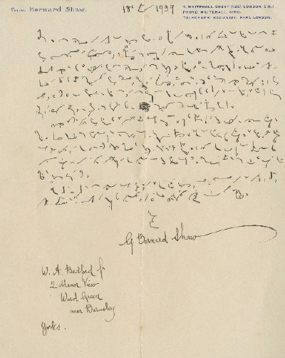

[George Bernard Shaw](http://pl.wikipedia.org/wiki/George_Bernard_Shaw) był postacią
nietuzinkową z wielu względów. Polska wikipedia nie wspomina o takich
faktach (angielska tylko pokrótce), jak jego pasje związane z reformą
ortografii angielskiej. Nie napisano tam również, że miał zwyczaj
stenografować swoje utwory, choć nie tylko dlatego, że w ten sposób
można pisać szybciej. Oto odręczny list Shawa do W.A. Bedforda z 18
stycznia 1939 roku. Mam tylko fragmenty przetranskrybowane, które
niniejszym niżej prezentuję we własnym tłumaczeniu:

"All my
works are written in Pitman as far as first drafts are concerned"
"*Wszystkie swoje prace napisałem Pitmanem, w każdym razie ich pierwsze
redakcje*"  

oznajmia Shaw i kontynuuje:  

"But you
will look in vain in my shorthand for grammalogues and logorams, and
contractions and word groups which make verbatim reporting possible. I
have long since discarded most of them as unnecessary for my work, and
very baffling to the typist who has to transcribe it. Of course I retain
the ticks and dots that stand arbitrarily for the articles,
prepositions, and conjuctions, with some of the words that occur most
frequently; but for the rest, when there is no speaker to pace me, and
my speed can be no greater than at which I can compose, I find it far
easier, and consequently shorter, to spell the word fully than to
recollect or invent a contraction for it." 

"*Jednak próżno by
szukać w mojej stenografii znaczników, skrótów, zgrupowań słów i
logogramów, dzięki którym można zapisywać dokładnie słowo mówione. Dawno
temu porzuciłem je jako nieprzydatne w mojej pracy i bardzo kłopotliwe
dla maszynistki, która musiała je transkrybować. Oczywiście zachowuję
kropki i kreski diakrytyczne tam, gdzie to konieczne dla partykuł,
przyimków i spójników z najczęściej występującymi słowami; lecz dla
reszty, skoro nie ma mówcy, który by mi narzucał tempo, a moja prędkość
nie musi być większa niż taka, w której swobodnie komponuję, znajduję to
łatwiejszym i konsekwentnie krótszym, wypisywanie słów w pełni, niż
przypominanie sobie, lub wymyślanie dla nich skrótów.*"

I dalej:  

"You must
also allow for the fact that I learned shorthand sixty years ago. During
that time it has been necessary to make changes to prevent the textbooks
from falling out of copyright into the public domain. I have not
followed these changes. I place the short vowels in the old way, and
have some other obsolete tricks that baffle the up-to-date
typist." 

"*Musisz również zważyć fakt, że nauczyłem się
stenografii sześćdziesiąt lat temu. Od tamtej pory system musiał być
zmieniany, by zapobiec uwolnieniu praw autorskich podręczników do domeny
publicznej. Nie podążałem za tymi zmianami. Oznaczam krótkie samogłoski
na stary sposób, stosuję także kilka przebrzmiałych trików, które
kłopoczą moją wykształconą współcześnie maszynistkę*." 

Konkluduje:  

"I have
done a good deal of my writing in the train, and I have found Pitman,
because the characters are not written, but drawn, resists the joggling
of the carriage much better than longhand, which is often hopelessly
illegible under such circumstances." 

"*Dużo piszę w pociągach i
znajduję Pitmana, jako że jego znaki są bardziej rysowane, niż pisane,
bardziej odpornym na wstrząsy wagonu niż pismo długie, które w takich
warunkach staje się często beznadziejnie nieczytelne.*"

Wiemy zatem, że Shaw korzystał z systemu Pitmana. Pisał dużo w
pociągach, podczas swoich podróży do Londynu. Stenografia Pitmana jego
zdaniem jest łatwiejsza do użycia w trudnych warunkach, kiedy trzęsie,
może na stojąco i w marszu. Cóż, system ten sprawdzał się także przed
wynalezieniem kolei żelaznej, przed pracami z zakresu ergonomii i BHP -
rzeczywiście będzie miał przewagę nad pismem długim. I nie można
zapominać, że w taki sposób pisząc, Shaw mógł produkować tekst szybciej,
niż przepisywała go później maszynistka.

A zatem, początkujący pisarze, którzy nie macie czasu zasiąść za
biurkiem, za to go mnóstwo spędzacie w środkach komunikacji publicznej,
zastanówcie się, może sensownie byłoby nauczyć się jakiejś stenografii?

;-)
