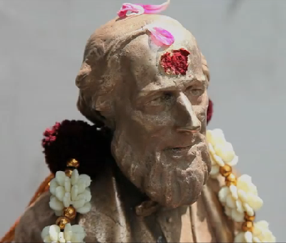

Czytam sobie różne wieści ze świata i 
[takie coś mi wpadło](http://www.shorthandworld.co.uk/home/index.php/2011/03/pitman-hailed-a-god/),
że Izaaka Pitmana w pewnym mieście w Indiach, Chennai, czczą jako boga.
[Oczywiście, boga stenografii](http://www.thenational.ae/news/worldwide/south-asia/the-land-where-isaac-pitman-shorthand-inventor-is-a-god).
Codziennie studenci szkoły wraz z tzw. ciałem pedagogicznym odprawiają
ceremonię zwaną "pudża", polegającą na adoracji wszelkimi
przyjemnościami, jak pożywienie, kwiaty, ogień, światło, dźwięk, zapachy
itp. trzydziestocentymetrowej figurki nobliwego, angielskiego
dżentelmena z bródką.

[Jest także film o szkole stenografii w Chennai](http://www.thenational.ae/news/worldwide/south-asia/a-story-of-stenography).

No niesamowite, prawdę mówiąc. Przez ostatni tysiąc lat odwykliśmy
trochę od takich klimatów, jak sądzę. O 
[Gildii Stenografów](http://www.stenold.org/) 
wspominałem na stronie głównej.
Jest to jedna z najprężniej działających aktualnie szkół propagujących
system Pitmana. Ostatecznie z materiału filmowego i z artykułu nie
wyrozumiałem, czy uczą tylko stenografii angielskiej, czy także jej
przekładu na któryś z języków wielkich Indii. Ale na ich stronie
umieszczone są informacje na temat systemu Pitmana po angielsku i po
tamilsku - szkoda tylko, że nie znam tamilskiego alfabetu, byłoby
interesujące przyjrzeć się tej metodzie. Choć z pobieżnego [jego
przeglądu](http://pl.wikipedia.org/wiki/Pismo_tamilskie) widać, że
musieli docenić wynalazek stenografii.

Interesujące jest spostrzeżenie rzucone przez dyrektora szkoły: *dziś
nie ma chętnych do nauki stenografii, ponieważ jest to sztuka przydatna
na stanowisku sekretarza/sekretarki. A dziś każdy chce być szefem.*
Zatem po co się uczyć nowych umiejętności, jeszcze ktoś mnie zatrudni na
niższym stanowisku i uzna, że tylko do tego się nadaję? To może lepiej
być niekompetentnym w ważnych sprawach i szczegółach, opanować sztukę
gładkiego mówienia ogólnikami, a wszyscy pomyślą: O, oto człowiek
stworzony do spraw wielkich. Uczyńmy go swoim wodzem. I tak się
narodziła współczesna polityka.

Izaak Pitman szczególnie dobrze nadaje się na hinduistycznego boga,
ponieważ przez całe swoje świadome życie był abstynentem i
wegetarianinem, czyli wedle hinduistycznych standardów reprezentował
najwyższy poziom moralny. Co prawda jego religia była ścisłym
przeciwieństwem hinduistycznej różnorodności, ale to hinduistom wydaje
się nie przeszkadzać. I bardzo dobrze.

