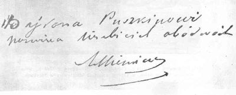
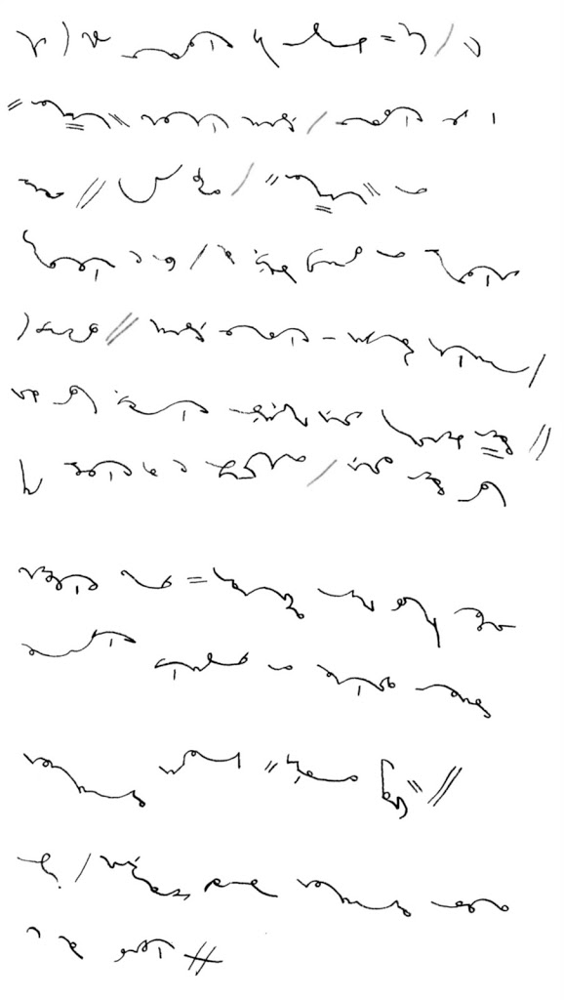
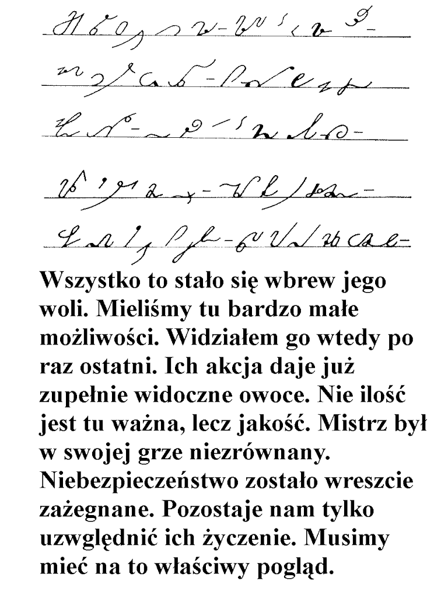

***Straciłem pierwszą wersję, piszę drugi raz:*WRRR!**

Pismo, mimo starań producentów elektroniki, wciąż nie chce wyjść z
użycia. Kartka i długopis to wciąż najprostsza technika przekazywania,
lub przechowywania danych. Jednak w wyglądzie pisma, od czasu
wynalezienia polskich systemów stenograficznych, zaszły pewne zmiany.

<!--  {width="118" height="200"}
  Odręczne pismo Kościuszki (Tadeusza) -->
  
  
  

Pismo kursywne dostosowuje się do narzędzi pisarskich i do
zapotrzebowania. W czasach, gdy nie było maszyn do pisania, ani łatwo
dostępnego druku, wiele dokumentów sporządzano odręcznie i tak już
pozostawały. Ważne zatem było, aby adepci biznesu, czy też administracji
państwowej, pisali w sposób czytelny także dla innych. W XIX wieku zatem
powstały zunifikowane, kaligraficzne literki i wszystkich przyuczano to
pisania pod jeden sztrychulec. Zasady te, z biegiem czasu i postępu
technicznego, stopniowo się rozluźniały.

 <!-- [{width="200" height="118"}]({filename}/wp-images/uploads/2011/04/wspomnienia-pismo-odreczne.png)
  Pismo człowieka kształconego w latach 30-tych XXw. -->



Dziś jednak, choć przecież cały czas uczymy się pisać w szkole, literki
się zmieniły. Zmieniły się narzędzia pisarskie, pióro wyszło z użycia
zastąpione przez długopis i różnego rodzaju pisaki, a współcześni
pedagodzy, po namyśle, jaki towarzyszy również twórcom systemów
stenograficznych, wyrysowali nowe literki, do których dzieci są
wdrażane. Nie mają one tak wymyślnych pętelek, takich łączników, pismo
nie jest pochylone. Ale przede wszystkim: nie ma wymagania pisania
kaligraficznego. Niektórzy uważają, że niesłusznie. Tak czy owak, każdy
dziś, kto jeszcze nie zapomniał sztuki odręcznego pisania, jak tylko
uciekł ze szkoły (przecież większości ostatecznie i tak potrzebny jest
tylko podpis, imię i nazwisko czytelnie, i ewentualnie data, żeby móc
wypełniać formularze w urzędach), ten może realizować swój charakter i
temperament przez własny, osobisty charakter pisma.

Upowszechnienie się komputerów, a przede wszystkim Internetu z emailem,
spowodowało spadek zużycia papieru do odręcznego pisania. Coraz więcej
ludzi woli klepać w klawisze, niż mozolnie wypisywać długopisem "trzy
kilo marchewki, ale świeżej, mleko i wiesz, co...". Przez klawisze coraz
rzadziej mamy okazję używać z takim trudem wyuczonego w szkole pisma
odręcznego. Zatem też coraz częściej posługujemy się literami
"drukowanymi", choć tak jest o wiele wolniej i ręka szybciej się męczy.
Ja sam, żeby daleko nie szukać, dopiero, gdy zacząłem nowe studia,
przypomniałem sobie, jak się pisze "pisanymi". Ale to już nie to samo
pismo. Literki zaczynają stać oddzielnie, stają się bardziej blokowe.

<!-- {width="400" height="137"}]({filename}/wp-images/uploads/2011/04/litwo.png)
  Pismo odręczne osoby nawykłej do pisania na klawiaturze
  -->



Jaki zatem powinien być system stenograficzny dla czasów współczesnych?
Zgrabne łuczki i pętelki systemów kursywnych z XIX wieku stawiają
wysokie wymagania dzisiejszym ludziom, których nie przyuczono do
kaligrafii.

O jakości systemu decyduje kilka wzajemnie od siebie zależnych
parametrów, które poszeregować należy wedle ich ważności dla twórcy
systemu. Na pierwszym miejscu zawsze znajdzie się **praktyczność
systemu** i to na poziomie elementarnym - czyli jego krótkość i łatwość
pisania, czytelność stenogramu z uwzględnieniem właściwości języka
polskiego. Drugie miejsce zająć powinna znaleźć się **łatwość uczenia**,
a zatem jego prostota, logiczność i spójność. Na trzecie miejsce położyć
trzeba **względy estetyczne**, jak wygląd znaków i całego stenogramu
oraz takie jak **aktualność systemu**, dopasowanie do współczesnego
charakteru pisma.

Pamiętać należy, że zmiana jednego z tych parametrów automatycznie
skutkować musi "przesunięciami suwaków" dla innych parametrów. Zatem
położenie większego nacisku na prostotę i logiczność systemu, a zatem
jak najmniejszą liczbę odstępstw od reguły, spowoduje zmniejszenie tempa
pisania oraz biegłości i krótkości ciągów piśmiennych. Podobnie będzie,
jeżeli większy nacisk położymy na większą zgodność z brzmieniem języka.

Z przeszłości przychodzą do nas systemy następujących typów:

**Geometryczny** - przykładem niech będzie
nasz [NPPSv01](https://blog.stenografia.pl/search/label/npss), lub np.
[system Pitmana](https://en.wikipedia.org/wiki/Pitman_shorthand). Oparty
o proste odcinki i łuki. Już wcześniej wspomniałem, że (mogę się mylić,
na co wskazują przykłady, że młodzi ludzie na własny użytek adaptują
dziś systemy geometryczne), niezbyt się nadaje do języka polskiego -
tzn. oczywiście, da się pisać, w końcu sami kiedyś stworzyliśmy
[NPPSv01](http://blog.stenografia.pl/search/label/npss) z No-qankiem, a
No-qanek nawet dalej go rozwija, jednak uważam, że można znaleźć lepsze
rozwiązanie, zgrabniejsze, a przede wszystkim - czytelniejsze.

Systemy geometryczne są proste formalnie i graficznie, a zatem łatwe do
nauki, szczególnie na samym początku. Ich znaki na tyle się różnią od
tradycyjnych liter, że umysł niejako musi uczyć się pisać od nowa, zatem
nie pojawia się konflikt odruchów. Jednak w stosunku do fonetyki języka
polskiego są ubogie w materiał graficzny, z którego można utworzyć
znaki, szczególnie, kiedy zmieniły się narzędzia i nie ma możliwości
pisania grubszymi lub cieńszymi kreskami.  

 <!-- [{width="200" height="117"}]({filename}/wp-images/uploads/2011/04/polinski-alfabet.png)
  Alfabet Polińskiego -->



**Kursywny** - przykładem niech będzie system Polińskiego, oparty o
XIXwieczną technikę pisania. Przez ponad 100 lat rozwoju znakomicie
dostosowany do języka polskiego. Pozwala na osiągnięcie prędkości
pozwalającej pisać szybciej, niż ktoś zdolny jest mówić.

A jednak trudny technicznie i formalnie, a przede wszystkim - wymagający
dyscypliny kaligraficznej, gdyż dzięki wielkiemu bogactwu materiału
graficznego pozwala twórcom na dostosowanie do wszelkich niuansów
języka. Czyni go to o wiele wygodniejszym i (jak sądzę) przyjemniejszym
w odczycie. Jednak przez to staje się trudniejszy i bardziej wymagający
w nauce. Przede wszystkim jednak - jego forma jest ściśle uzależniona od
narzędzi i techniki pisania, a zatem dziś dostępne systemy kursywne
wymagają uwspółcześnienia.

 <!--  [{width="200" height="92"}]({filename}/wp-images/uploads/2011/04/gregg_alfabet_pl.png)
  Alfabet Gregga -->
  
  
  

**Semi-geometryczny** - przykładem niech będzie system Gregga,
gdyż niewiele powstało takich metod. Linie ma jednej grubości, zatem na
tym polu dostosowany do współczesności. Jednak przenosi wady systemów
geometrycznych - dla wielosylabowych, powydłużanych (;-)) słów języka
polskiego jest niezbyt wygodny, schodzi z linii pisma i leci gdzieś, na
skos, przez kartkę, czego autor przekładu nie pokazał, prezentując
głównie słowa 2- i 3-sylabowe.

 <!--  [{width="142" height="200"}]({filename}/wp-images/uploads/2011/04/polski_gregg_przyklad.png)
  Przykładowe słówka w systemie Gregga -->



Technika pisania zbliża go do systemów kursywnych, a zatem jest bardziej
biegły i zapewne pozwoli pisać szybciej niż systemem geometrycznym.
Jednak jest w niej, podobnie jak system Polińskiego (o czym wcześniej
nie wspomniałem), zarezerwowany dla praworęcznych (a przecież dziś już
nikt nie zmusza leworęcznych do pisania prawą ręką, więc ich odsetek
rośnie i należy ich uwzględnić w rachubach), bowiem pismo pędzi daleko w
prawo. Jego wadą (powinienem chyba opublikować omówienie polskiej wersji
tego systemu) jest też konieczność zniekształcania brzmienia słów, nie
zawsze zgodnie z duchem języka (np. **e, y **oraz **i** mają ten sam
znak), czego może w jakimś hipotetycznym, innym systemie dałoby się
uniknąć. A dyscypliny kaligraficznej wymaga, wbrew pozorom, nie
mniejszej, niż systemy kursywne.

<!--  [{width="320" height="151"}]({filename}/wp-images/uploads/2011/04/Teeline-Lords-prayer.png)
  Przykład systemu Teeline - Modlitwa Pańska -->
  
  
  

W latach 70-tych XX wieku James Hill opublikował system
[Teeline](https://en.wikipedia.org/wiki/Teeline_Shorthand) - na bazie
swoich doświadczeń jako stenografa i nauczyciela systemu Pitmana i
przemyśleń, co do współczesnych potrzeb, stworzył coś, co nazwałbym
systemem alfabetycznym, gdyby nie fakt, że jest nim tylko pozornie.
Specjaliści od dzielenia wszystkiego na typy zaliczają Teeline do grupy
systemów alfabetycznych, ale moim zdaniem niesłusznie.

<!--  [{width="200" height="86"}]({filename}/wp-images/uploads/2011/04/teeline-litwo.png)
  Próbka Teeline po polsku -->
  
  

Jednak nie da się wprost przełożyć Teeline na polski - nasz język ma
wyrazy złożone z wielu sylab i takie *powydłużane i pokomplikowane
wyrażenia* wcale nie zapisują się wdzięcznie w tym systemie. Teeline
został zaprojektowany dla języka, w którym większość najczęściej
używanych słów ma jedną, najwyżej dwie sylaby. Do tego Teeline dobrze
się pisze tylko ignorując samogłoski, a to w języku polskim bardzo
utrudnia czytanie.

Zatem jaki powinien być system stenograficzny czasów współczesnych? Z
jednej strony musi być z pewnością łatwy do wyuczenia się i
niewymagający kaligraficznie, bo dziś nikomu nie chce się czekać długo
na rezultaty włożonego wysiłku. Z drugiej strony rozpowszechnienie
czcionki drukowanej zmniejsza nasze umiejętności deszyfracji różnych
bazgrołów, zatem winien być czytelny. Parametry te znacząco wpływają na
zmniejszenie tempa pisania. Odbierają zatem punkty systemom
geometrycznym i kursywnym. Dyscyplina kaligraficzna i wymóg dostępności
dla leworęcznych przekreśla też istniejący system semi-geometryczny. Czy
trzeba wymyślać coś nowego?

**Proponuję wyodrębnić nowy typ systemów stenograficznych -
półkursywnych. Tak jak semi-geometryczne są geometryczne w teorii
i kursywne w pisaniu, tak półkursywne mają być geometryczne w pisaniu,
lecz kursywne w teorii.**

Dziś nie potrzeba już prawie systemów parlamentarnych, pozwalających
pisać z prędkością mowy. Wystarczy, że pomogą zrobić notatki z
wykładów/lekcji i nawet długi czas pisania nie sprawi, że ręka odpadnie.
Czyli nacisk można położyć bardziej na systemy korespondencyjne,
notatkowe, kupieckie

Współczesny system musi być:

1.  Łatwy w nauce
2.  Dostępny dla lewo- i praworęcznych
3.  Odporny na bazgroły (czytelny)
4.  **Półkursywny** (znaki blokowe, ale nawiązujące do nawyków piszącej
    ręki, nie geometryczne)

