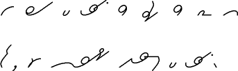
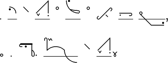
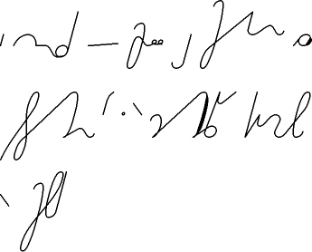

Nie pamiętam, czy o tym już pisałem, a skoro nie mogę wyszukać, znaczy,
że pewnie nie pisałem. Otóż nasz brat-Słowianin, Stanisław Jan Sarman,
wykładowca na uniwersytetach w Preszburgu i Hamburgu, uczelni
technicznej w Clausthal, wolny strzelec-programista, starszy pan i
nietuzinkowy umysł, postanowił opublikowa na swoich stronach generatory
pisma stenograficznego.

  
<!-- 
  The art of writing as fast as one can speak, is the greatest triumph of writing. -->
  

  

I opublikował. Od razu dla
[Gregga](https://steno.tu-clausthal.de/Gregg.php),
[Pitmana](https://steno.tu-clausthal.de/Pitman.php) i
[DEK](https://steno.tu-clausthal.de/) 
([Deutsche Einheitskurzschrift](http://de.wikipedia.org/wiki/Deutsche_Einheitskurzschrift)),
czyli do pisania po angielsku i po niemiecku. A nie jest to taka prosta
sprawa, bowiem systemy angielskie są fonetyczne. A angielska fonetyka
jest zawiła jak angielska ortografia. To znaczy, umysł radzi sobie z tym
bez trudu, ale jak to przekuć w zestaw sztywnych, komputerowych reguł?
Sarmanowi się to udało, co zresztą opisuje w [opublikowanej na Youtube
prezentacji](http://www.youtube.com/watch?v=ZZC_JqYkA2s), której pełna
wersja dostępna jest
[TU](http://river-valley.tv/media/conferences/tug2008/0203-Stanislav_Sarman/).

<!-- 
  The art of writing as fast as one can speak, is the greatest triumph of writing. -->



Dla nieobeznanych z językami obcymi w skrócie wyjaśniam, że najpierw
trzeba wpisać tekst w okienko. Później program bierze ten tekst i
przetwarza go bardzo mądrze, co kazał mu autor, a bardziej konkretnie,
sprawdza w słowniku, czy zna te słowa, następnie podmienia ortografię na
zapis fonetyczny, wreszcie dopasowuje do tego poszczególne znaki. Na
końcu sprawdza, czy gdzieś nie wypada specjalne połączenie, lub
znacznik, które ma zapisane w innej szufladzie. Wynik wyświetla. W
żadnym z wyszczególnionych kroków program nie popełnia błędu, ale
wcześniej programista mógł się pomylić, lub wybrać niewłaściwą metodę.

<!-- 
  Die Kunst so schnell zu schreiben als gesprochen wird ist der höchste Triumph der Schrift.-->
  


Zatem prezentowane obrazki pokazują tylko w ogólności, co potrafi
stenografia. Przede wszystkim praktycznie w ogóle nie stosują
znaczników. Bardzo to skomplikowane. Ale piękne. Aż dziw bierze, że w
szkole uczą nas jakichś prymitywnych literek, kiedy moglibyśmy stawiać
takie zgrabne znaczki.

Aha. Pierwszy obrazek to system Gregga, drugi to Pitman, trzeci to DEK.
Za każdym razem podpis oddaje, co jest napisane. Jest to stwierdzenie
wielkiego znawcy pism wszelakich, badacza starożytnych i współczesnych
alfabetów, twórcy systemu stenograficznego, Karola Faulmanna:

***Sztuka pisania z prędkością mowy jest największym triumfem pisma.***
