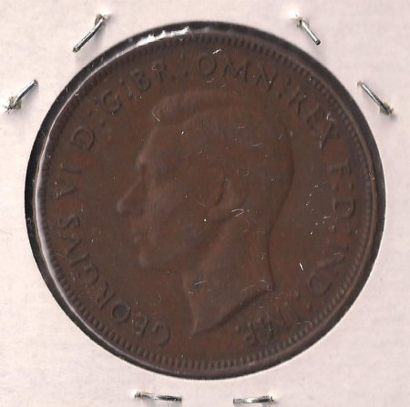

Niektórzy zapewne mieli już okazję zobaczyć film pod angielskim tytułem
"King's speech", a pod polskim, bez sensu "
[Jak zostać królem](http://www.filmweb.pl/film/Jak+zosta%C4%87+kr%C3%B3lem-2010-539270)".
Otóż okazuje się, że scena tego obrazu, kiedy nowiutki król Jerzy VI w
mękach wygłasza przemówienie koronacyjne... Ale co to ma do stenografii?

Na
podstawie 
[shorthandworld.co.uk](http://www.shorthandworld.co.uk/home/index.php/2011/05/the-kings-speech-in-shorthand/)
:
Pewnego dnia nauczycielka stenografii w 
[Sciotoville High School](http://www.greatschools.org/ohio/portsmouth/4977-Sciotoville-High-School/)
w Portsmouth, w stanie Ohio (USA, jakby się kto nie zorientował), pani
Lillick, postanowiła zadać uczniom niecodzienne dyktando. Dyktował im
osobiście król Jerzy VI za pośrednictwem podłączonego w klasie radia.
Szczęśliwie, mowa koronacyjna zbiegła się z czasem lekcji. Wszyscy,
którzy widzieli film wiedzą, że król był jąkałą, dzięki czemu tempo jego
mowy nie sprawiało takiej trudności adeptom stenografii, co tradycyjny
angielski akcent.

--------------------------------

Notka w Portsmouth Times

-----------------------------------------------------

Ale Jerzy VI w ten sposób nie wyczerpał swoich związków ze skrótowym
pisaniem. Zgodnie z tradycją wybito monetę z jego podobizną.

-----------------------

Pens australijski z profilem Jerzego VI

---------------------------------------

Napis brzmi: 
**GEORGIVS VI : D : G : BR : OMN : REX : F : D : IND : IMP**, 
co każdy łatwo przetłumaczyć może jako George VI, Dei Gratia,
Britanniarum Omnium Rex, Fidei Defensor, India Imperator, czyli Jerzy
VI, z Bożej łaski Król Wszystkich Brytonów, Obrońca Wiary, Imperator
Indii. Oto przykład współczesnego zastosowania starożytnej, rzymskiej
tachygrafii.

