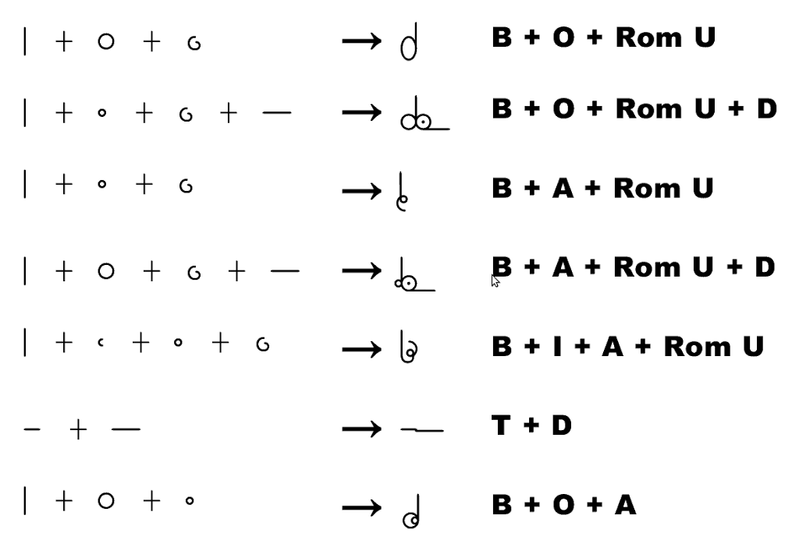
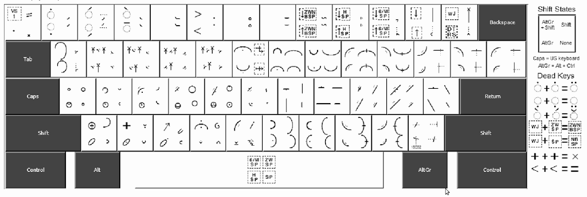
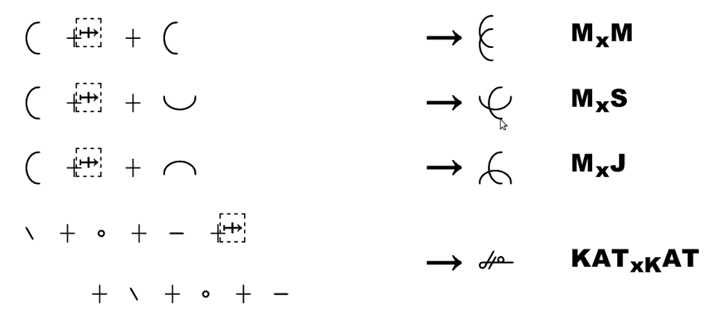
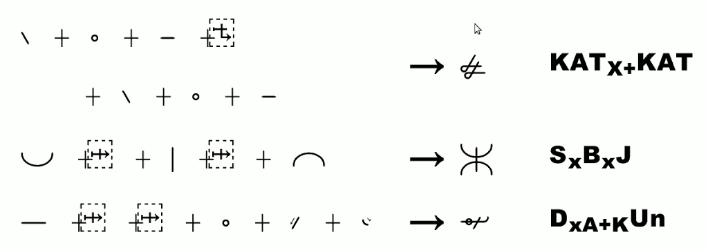

Oto sensacja, rewelacja. Chyba już pisałem o dokonaniach Jana Stanisława
Sarmana, naszego słowiańskiego brata, wykładowcy z uniwersytetów w
Preszburgu i Hamburgu, wolnego strzelca-programisty?

<!--

  Proste połączenia znaków Duploye -->
  


Tym razem mam jeszcze większe dokonanie, bo przecież w pełni zgodne ze
współczesną techniką pisania na komputerze: oto stenograficzny system
Duploye ma znaleźć swoje miejsce w Unikodzie! W tabeli [Proposed New
Characters: Pipeline
Table](http://www.unicode.org/alloc/Pipeline.html) akceptację projekt
ten otrzymał jeszcze w sierpniu 2010 roku i aktualnie jest we wdrożeniu.
Tu powinna nastąpić część, w której każdy słabo obeznany z zasadami
komputerowej typografii dostałby ataku padaczki, ewentualnie
narkolepsji, ale nie widzę powodu, żeby torturować licznych czytelników
technicznymi szczegółami przedsięwzięcia. Dla wszystkich powinno
pozostać jasne, że idea Unikodu powstała, żeby w jednej (baaardzo dużej)
regule zawrzeć wszystkie istniejące znaki wszystkich istniejących
alfabetów. Zatem musiało też kiedyś dotknąć i stenografii. W
dokumencie [Proposal to include Duployan script and Short Hand Controls
format to UCS](http://www.dkuug.dk/jtc1/sc2/wg2/docs/n3895.pdf) zawarto
więcej informacji na ten temat.

<!--
  ------------

  Plan klawiatury dla alfabetu Duploye
  ------------
  -->



W skrócie, wygląda na to, że pisanie stenograficzne przy pomocy
klawiatury nie jest takie proste. A dlaczego? A dlatego, że oprócz
stawiania poszczególnych znaków literowych jeden za drugim od lewej do
prawej (u Semitów i Arabów od prawej do lewej, a u konserwatywnych
Chińczyków od góry do dołu), występują tu jeszcze liczne przecięcia,
pozycjonowania względem poprzedniego lub następnego znaku - po prostu
stenografia, jako pismo krótkie, starała się wykorzystać możliwie jak
najwięcej możliwości, żeby szybciej pisać, kosztem zwiększonego nakładu
pracy aby opanować metodę. Okazuje się jednak, jak by wynikało z
przytoczonego wyżej dokumentu (czytałem na razie tylko po łebkach), że w
Unikodzie da się to wszystko jakoś zapisać.

<!--
  --------------

  Przekrzyżowania znaków
  --------------
-->



A z tego wynikają wnioski natury niemalże filozoficznej. Bo jeżeli aby
zapisać np. "parkiet" stenograficznie będziemy klepać w klawiaturę
sekwencję nie p,a,r,k,i,e,t (7 stuknięć), a p+a,r+Ctrl+Shift+k+t (w
zasadzie 2 stuknięcia, ale wielu znaków równocześnie), to spontanicznie
narodzi nam się nie tylko technika pisania alfabetem stenograficznym,
ale także KOD BREWISKRYPTOWY, przy pomocy którego będzie można klepać w
klawiaturę o wiele szybciej, niż dotychczas. Nie będzie potrzebna do
pisania czcionka stenograficzna, tylko prosty programik, który
zdeszyfruje odwołania do kodów stenograficznych do postaci pisma
długiego. Ręce nauczą się wszystkiego, to tylko kwestia ćwiczenia.
Ważne, żeby komputer zrozumiał, czego od niego chcemy. I tak stenografia
dostanie swoją drugą szansę.

<!--
  ------------

  Wielokrotne przekrzyżowania znaków
  ------------
-->



Ale gdzie rozważania filozoficzne? A właśnie w akapicie powyżej.
Albowiem klawiatura, która to potrafi, kosztuje na razie co najmniej
250PLN (specjalna dla graczy, musi obsługiwać każdy klawisz 
niezależnie - czytelnicy atechniczni proszę o powstrzymanie się od gryzienia blatu biurka), to po pierwsze primo. Po drugie primo, oto widzimy, jak się
dokonuje postęp techniczny. Nie przez rewolucję, a ewolucję. Ktoś
rozwiązuje problem nr 1. Inny na tej podstawie snuje jakieś rozważania.
Kolejny ma pomysł. A jego najlepszy przyjaciel robi fortunę na
rozwiązaniu problemu nr 2. A po jakimś czasie wydaje się to już tak
oczywiste, że w ogóle szkoda gadać.
