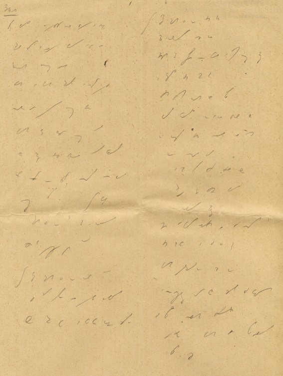

<!--
  [
  Stenogram konkursowy Władysława Cybulskiego
-->



Krasnoludki są na świecie. Dzięki nim ostatnio pojawił się i stale
puchnie porządny 
[wpis w wikipedii na temat stenografii](https://pl.wikipedia.org/wiki/Stenografia). 
Trochę przy nim
było pracy, szczególnie, że przecież wikipedia ma hysia na punkcie
poprawności praw autorskich. Trzeba było dorobić parę nowych obrazków.

Postanowiłem trochę rozwinąć dotychczasowy, kaleki wpis, albowiem mimo
moich starań polegających na wysyceniu treścią swojej strony, Wujek
Gugiel nie raczył postawić jej na pierwszym miejscu listy po wpisaniu do
okienka wyszukiwarki hasła "stenografia". A że jakieś tajemnicze
statystyki mówią, że pierwszy wpis ma największe szanse na odwiedziny,
postanowiłem wrzucić tam trochę wartościowej informacji.

A jako tradycyjną wrzutkę: stenogram konkursowy (zapewne)  Władysława
Cybulskiego. Znalazłem go wśród materiałów, które otrzymałem do
spożytkowania na rzecz strony o stenografii. Niejeden taki. Czekam na
spotkanie z fachowcem, który spróbuje to odcyfrować.
