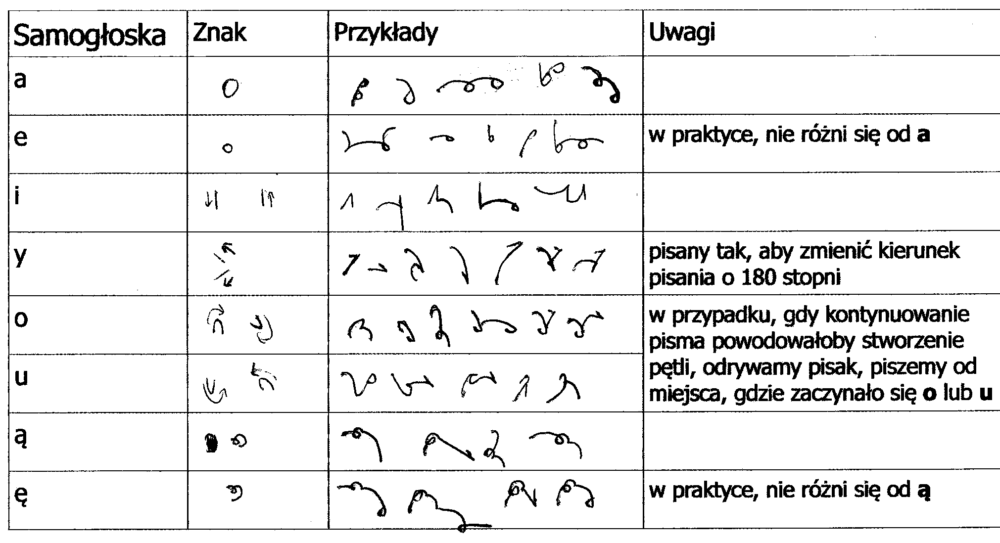
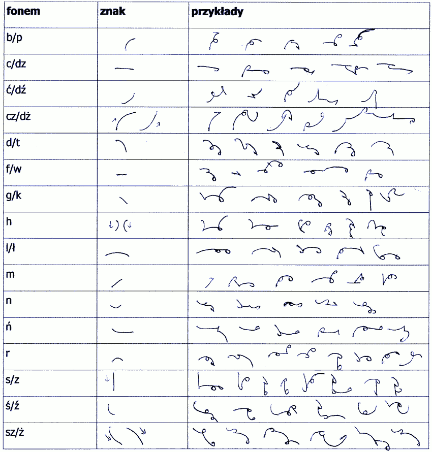
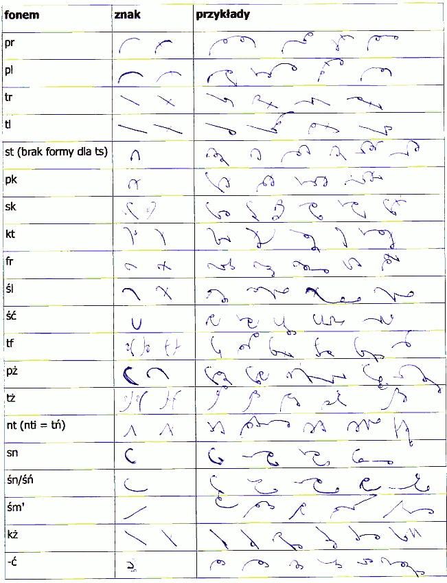
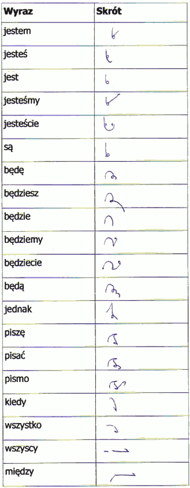

Na stronie 
[opublikowałem krótkie opracowanie](http://stenografia.pl/pmwiki/index.php?n=NPSS.NQSS) systemu
stenograficznego, który zaczęliśmy rozwijać do spółki z No-qankiem. Jego
wczesną historię opisałem onegdaj (a może nieco wcześniej), [poczynając
od tego wpisu](http://www.stenografia.pl/?p=216). Na początku sprawa
rozwijała się całkiem nieźle. Później zaczęły się dyskusje - to był
dobry znak, że jesteśmy na prawidłowym kursie - pojawiają się problemy
do rozwiązania. Ja później straciłem wiarę w metody geometryczne, na
placu boju pozostał No-qanek sam. Oto zatem jego dotychczasowe
osiągnięcia. Dodam, że zimą potrafił pisać tym systemem z prędkością 60
sylab na minutę, co daje już przecież 150% dużej prędkości pisania
pismem długim. A przecież, w przeciwieństwie do mozołu z literkami, mógł
tak pisać dłuuuugo. Systemowi temu zmieniliśmy na chybcika nazwe na
**NQSS**, akronim *NPSS* rezerwując dla całego projektu opracowania
nowej stenografii polskiej.

Prezentuję tutaj ten system, także dziękując niejakiemu X, 
który w celu podzielenia się swoimi
przemyśleniami na temat własnej adaptacji brazylijskiego 
[systemu Leite Alves](http://taquigrafialeitealves.com.br/) 
założył nawet [blog](http://twojesteno.blogspot.com/). 
Najciekawsze wpisy są w pobliżu 
[tego](http://twojesteno.blogspot.com/2011/04/maa-rozbojniczka.html).

Zapraszam zatem do oglądania, podziwiania, chwalenia i krytykowania 
(ale tylko konstruktywnie) nowego polskiego, geometrycznego systemu
stenograficznego NQSS 
([do obejrzenia TU](http://stenografia.pl/pmwiki/index.php?n=NPSS.NQSS)).

i tak dalej.