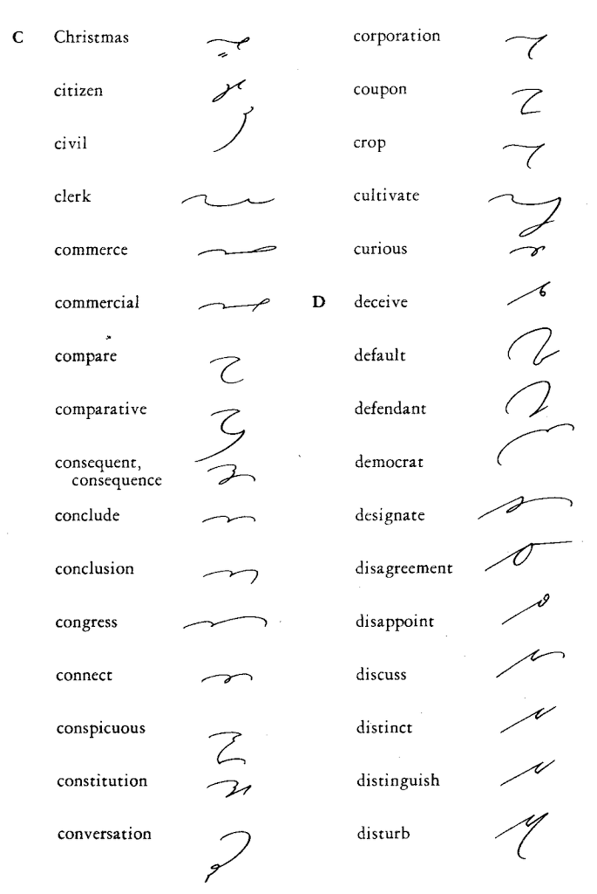
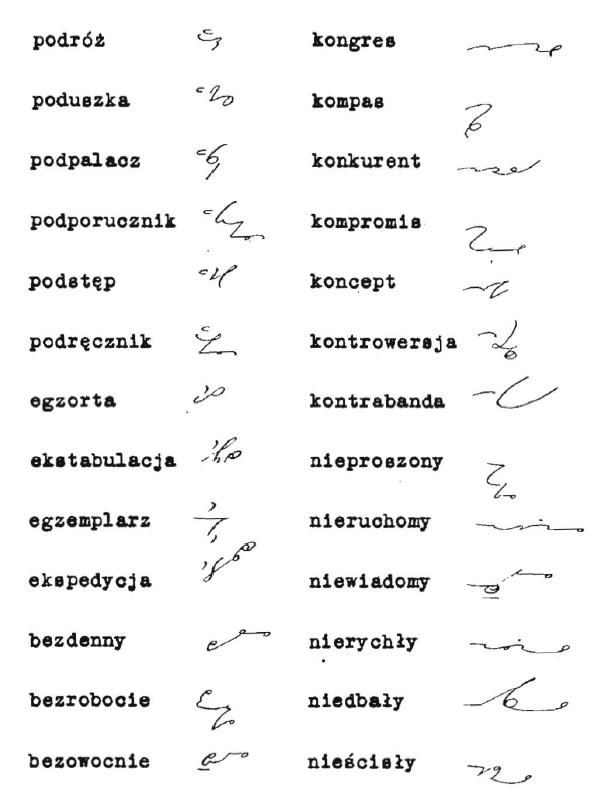
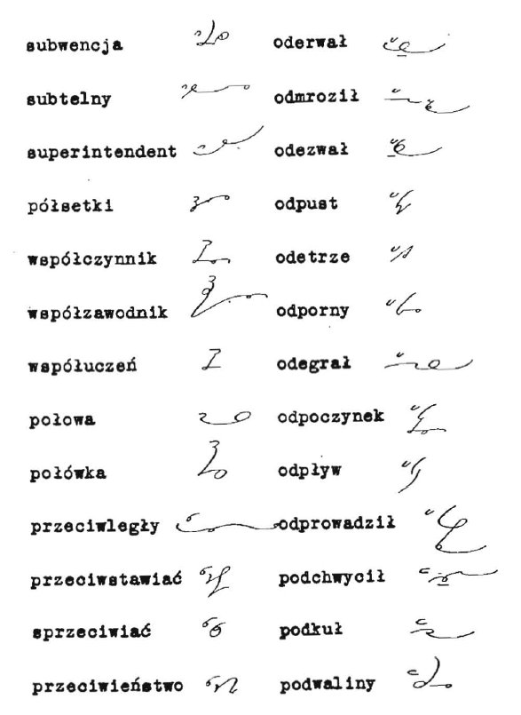

Z racji swoich zainteresowań stenografią uczestniczę w różnistych forach
internetowych, w różnych językach, acz głównie po angielsku. Chcę tu
przekazać reminiscencję, z którą się zetknąłem na forum amerykańskim nt.
stenografii Gregga. Pojawili się tam ludzie, którzy pracowali w
wydawnictwie McGraw-Hill jako pisarze stenografii. Ich zadaniem było
ładne pisanie materiałów edukacyjnych w systemie Gregga, które później
składane były w różne podręczniki i pomoce naukowe. Nie jest
najważniejsze, co tam oni sobie wspominają, ale uderzyła mnie jedna
rzecz: nabożny niemal stosunek do kaligrafii. Ich zadaniem było ładne
pisanie, do tego w możliwie identyczny sposób, żeby czytelnicy zawsze
otrzymali zunifikowany materiał do czytania podczas ćwiczeń
stenograficznych. Panowie ci wspominają Charlesa E. Zoubka, który był
ich nauczycielem ładnego pisania (sam John Robert Gregg bardzo go za to
cenił), a jednocześnie mentorem sztuki stenografii. Charles E. Zoubek w
wydawnictwie McGraw-Hill pełnił funkcję kogoś w rodzaju rewizora. Uczył
zatem innych stenografów, jak należy ładnie pisać.

Teraz, po latach, ci starsi panowie, którzy nie mają już pracy w
wydawnictwie, bo komputery i bazy danych obrazków zastąpiły ich zręczne
ręce, wspominają Charlesa E. Zoubka, jak buddyjscy mnisi swoich
mistrzów.

Kult perfekcji - dziś nieaktualne.

PS.
A tak w ogóle to spadła częstotliwość wpisów, bo znowu zajęcia domowe i
ciężko mi skoncentrować się na rzeczach naprawdę ważnych ;-)
