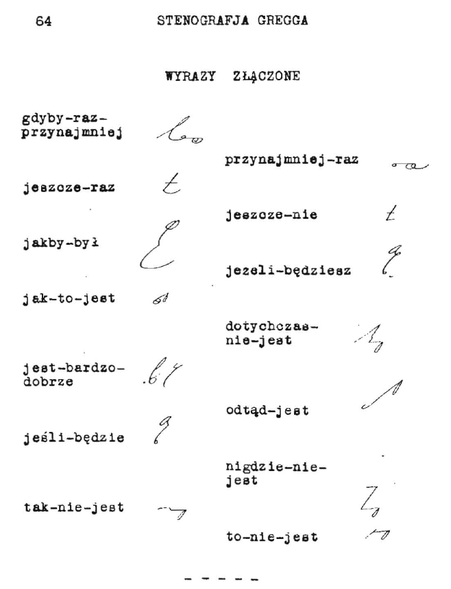

Oto kilka wskazówek dla adeptów stenografii, prosto od najwybitniejszych
nauczycieli systemu Gregga, z podręcznika dla instruktorów tej sztuki.
To nie jest tłumaczenie, raczej opracowanie na podstawie, gdyż starałem
się "unowocześnić" porady i dostosować je do potrzeb współczesnego
samouka, który jest przecież dla siebie równocześnie nauczycielem i
uczniem:

*Zamień pisanie pismem długim na stenografię*. Stałe używanie
stenografii do celów osobistych jest najlepszą metodą rozwijania
umiejętności sprawnego notowania. Uczeń stenografii, który zastosuje
metodę we wszystkich codziennych notatkach, listach zakupów,
marginaliach, zyska kolejne godziny ćwiczeń i wydatnie skróci czas
potrzebny do osiągnięcia biegłości w szybkopisaniu.

*Nie naciskaj pisakiem na papier*. Jest to jedna z najczęściej
spotykanych przyczyn, dla których ktoś nie może się nauczyć szybko
pisać. Zbyt silne przyciskanie pisaka do papieru skutkuje szybszym
zmęczeniem ręki, bólem mięśni i w efekcie utratą kontroli nad kształtem
pisma. Dla opornych remedium na nawyk: owinąć opuszek palca wskazującego
kilkoma warstwami opatrunku z gazy - na tyle ściśle, żeby nie
przeszkadzał w ruchu, ale żeby zmniejszył czucie w opuszku. Likwidacja
nawyku silnego naciskania pisakiem na papier wydatnie zwiększy komfort
pisania.

*Nie staraj się na siłę dopasować swojego charakteru pisma do wzorców z
podręcznika*. Choć warto przyłożyć się od samego początku, aby charakter
pisma stenograficznego był jak najbardziej wyraźny, oczywiste jest, że
jedni wolą znaki bardziej, inni mniej pochylone, większe, lub mniejsze.
Jakikolwiek styl pisania jest dobry, pod warunkiem, że stenogram
pozostaje czytelny przynajmniej dla jego autora.

Różnicuj zadania w swoich codziennych ćwiczeniach stenografii. Bardzo
łatwo codziennie robić to samo. Jeszcze łatwiej jest się tym śmiertelnie
znudzić. Monotonia spowalnia naukę, a przecież można zastosować
"płodozmian" dla utrzymania świeżości procesu uczenia się.

*Ćwicz koncentrację*. Psychologowie wiedzą, że przeciętny człowiek z
trudnością koncentruje się na jednym obiekcie przez czas dłuższy niż
dwie, trzy minuty. Najlepszą metodą ćwiczenia skupienia w stenografii
jest pisanie długich, dłuższych niż 5 minut, dyktand z różnymi
prędkościami. Można też starać się zapisać stenograficznie cały wykład
na uczelni.

*Zbieraj słowa w grupy.* Prędkość pisania w stenografii bierze się nie
tylko ze znaczników i skrótów, ale też z doskonałej znajomości języka.
Niektóre słowa występują w pewnych związkach frazeologicznych i
przeważnie tylko tam - warto ćwiczyć je oddzielnie. Zobacz, jak szybko
możesz zapisywać takie grupy trzech, czterech słów. Warto dążyć do tego,
żeby zmieścić się z nimi w jednej sekundzie.

*Twórz własne dyktanda.* Nagrywaj własne dyktanda z wybranych tekstów i
przysyłaj je do nas, zostaną opublikowane dla wspólnego pożytku. Dyktuj
wyraźnie i bez emocji. Kiedy później z nich skorzystasz, będziesz się
koncentrować nie na intonacji, a na znaczeniu słów, co ułatwi
ćwiczenie.

*Nie zaniedbuj odczytywania stenogramu.* Po każdym zapisaniu stenogramu
natychmiast go odczytaj. Niech to się stanie odruchem. Tylko w ten
sposób oswoisz się z nowym alfabetem, którego właśnie się uczysz.
Szukaj inspiracji i unikaj "przetrenowania". Dobieraj sobie codzienne
ćwiczenia w taki sposób, aby zawsze odczuwać satysfakcję z wypełnionego
zadania i pozostawić sobie lekki "głód stenografii" na jutro. Nie
obawiaj się, umysł cały czas się uczy. Lepiej codziennie ćwiczyć trochę
za krótko, niż co dwa dni zbyt długo.

*Szukaj wsparcia i nowych pomysłów*. W grupie pracuje się przyjemniej.
Lepsi "ciągną" mniej zaawansowanych, podpowiadają sposoby i skróty.
Wynajduj interesujące teksty, które zechcesz zapisać. Zapisuj usłyszane
w radiu teksty piosenek i dialogi z filmów.

Jak znajdę interesujące porady w innych miejscach, to też je tu wrzucę.
