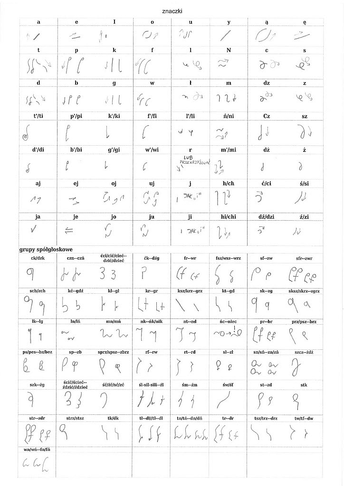
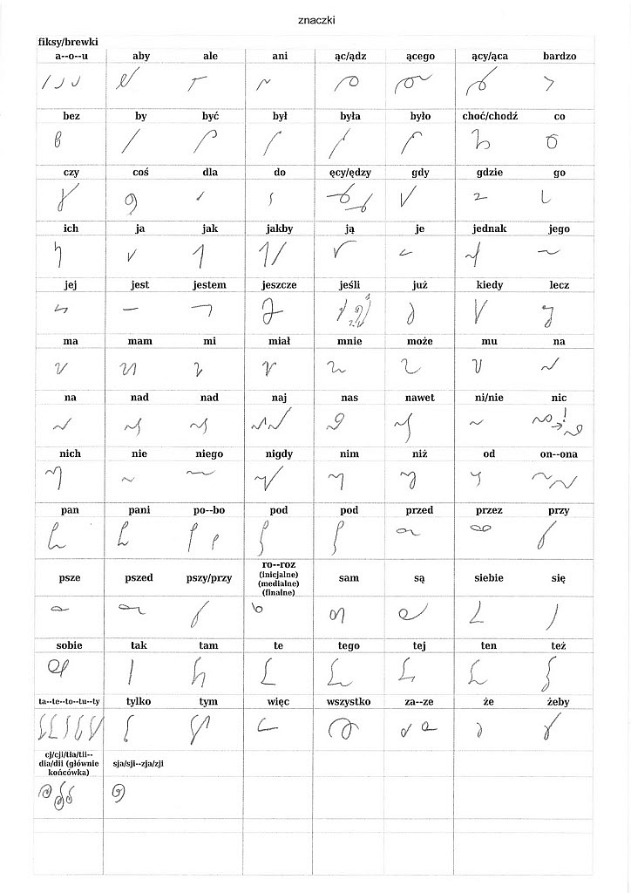
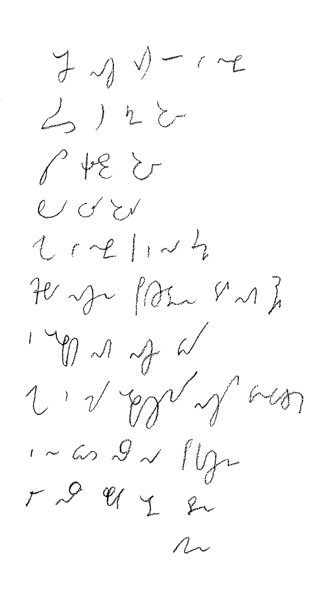
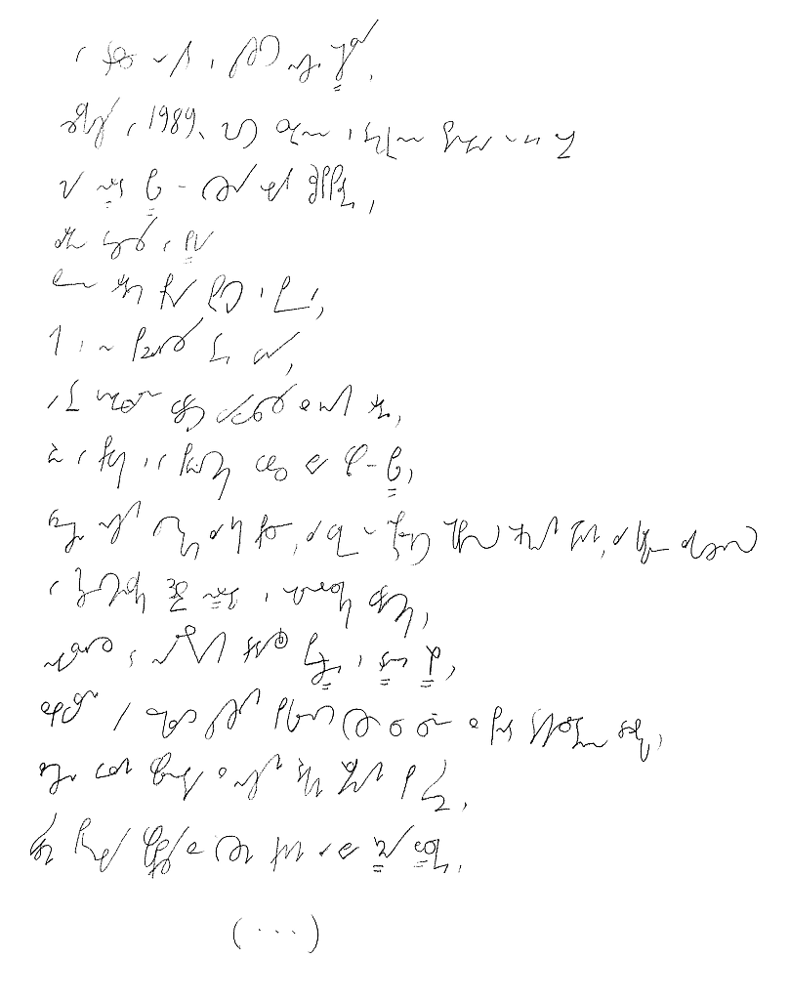

Tak się rozpisałem na temat **Ste***Mi*, że teraz nie mogę się podnieść
spod zwału maili wzywających mnie jednogłośnie do uchylenia choć rąbka
tajemnicy, jak też ten system aktualnie wygląda. A wygląda z grubsza
tak:

System ma służyć współczesnym, czyli nie uwzględnia np. tzw.
cieniowania, wszystkie znaki polegają na jednej grubości linii.
Szukam prostych reguł, dzięki którym będzie można łatwiej zapamiętać te
wężyki różne. Zatem podstawowy podział - na samogłoski i spółgłoski -
polega na tym, że samogłoski pismo podnoszą, tj. pisane są w kierunku z
dołu do góry, a spółgłoski pismo opuszczają, tj. pisane są w kierunku z
góry do dołu. Reguła ta ma zastosowanie praktycznie bez wyjątków, chyba,
że ktoś będzie się chciał sprzeczać o znaki, które dobrze się piszą
poziomo, tj. w kierunku od lewej do prawej.

Można też zauważyć, że spółgłoski dźwięczne są małe i wyglądają tak
samo, jak odpowiadające im spółgłoski bezdźwięczne.

W języku polskim mamy taką śmieszną grupę głosek, co to nie wiadomo, co
z nimi robić: R, L, Ł. O ile niewiele zdołałem poradzić na L i Ł, to R
pisze się na dwa sposoby: znaczkiem, jak na tablicy pokazano, ale
znacznie częściej **symbolizuje** się je przez przekrzyżowanie znaków.
Czyli np. słowo "warto" można napisać w-a-r-t-o, ale zupełnie nieźle da
się to zrobić tak: w-a+t-o. Ręka mniej się przesunie z lewej na prawo,
co ucieszy leworęcznych, a i na kartce więcej się zmieści. A na prędkość
nie ma to raczej wpływu.

Trochę kłopotów sprawia też zmiękczanie L. Złożenie "li" występuje dość
często, ale w aktualnym alfabecie nie ma to tak jaskrawego oznaczenia,
jak zmiękczenia pozostałych spółgłosek. Zmiękczanie R, z powodu
nasiąkania językiem angielskim teraz coraz częstsze, wciąż pozostaje
tylko na prymitywnym poziomie zestawienia R-I.

Ponieważ system ma uwzględniać potrzeby ludzi leworęcznych, do których
sam się zaliczam, a jednocześnie nie ma ambicji rozwijania kosmicznych
prędkości, zatem dopuszcza się bezliniowość pisma, czyli "ucieczkę"
pismem z linii pisania, hej w góry, lub hań w dół. To się może zdarzyć -
i zdarzy się szczególnie podczas pisania wyrazów długich,
wielosylabowych.

Podstawową metodą pisania systemem **Ste*Mi*** jest **sylabizowanie**.
Pierwszym stopniem wtajemniczenia jest wprawne pisanie wszystkich sylab
(fachowcy oceniają, że jest ich około 2000, więc niemało). To, czy
wielosylabowy wyraz napiszemy w całości razem, czy też skleimy z dwóch,
lub więcej, części, pozostaje kwestią drugorzędną. Czyli pisząc
poszczególne słowa budujemy je z sylab, a nie liter: Ma-ło-pol-ska,
Ma-zow-sze, Śląsk, pro-li-fe-ra-cja, a-ko-mo-da-cja,
kon-stan-ty-no-poli-tań-czy-ko-wia-necz-ka. Metoda ta uzupełniona o
pewną liczbę znaczników dla najczęściej używanych słów (zastanawiam się,
ile ich powinno być, Angole całe systemy budują ze znaczników, czyli
mają ich tysiące, ale wydaje mi się, że około dwustu by wystarczyło)
powinno pozwolić pilnemu adeptowi potroić prędkość pisania w ciągu pół
roku ćwiczeń.

Poniżej prezentuję dwie próbki tekstu. Sentymentalnie nawiązując do
rzeszy poprzednich twórców systemów stenograficznych i składając im w
ten sposób hołd, jako pierwszy przykład Modlitwa Pańska (czyli Ojcze
Nasz), jako że jest to najczęściej używany tekst do pierwszej
prezentacji systemu stenograficznego. W tym wypadku oczywiście jest
napisany po polsku (taką mam nadzieję):

Drugi przykład to pierwsze słowa aktualnie (rok 2011) obowiązującej
konstytucji, uchwalonej 2 kwietnia 1997 roku. Wybrałem ten tekst również
z powodów sentymentalnych (jak wyżej, twórcy o nastawieniu ateistycznym
zwykle cytowali jakiś akt prawny, np. konstytucję USA, zatem czemu
nie?), bo przecież nie dydaktycznych - słowa użyte w preambule nie
należą do grupy najczęściej używanych, czy to w mowie potocznej, czy to
podczas wykładów uniwersyteckich. 

Jednakowoż system mój projektowany jest z myślą, aby zdolen był
zanotować wszystko, na prawach normalnego pisma długiego, zatem każdy
przykład, im trudniejszy, tym lepszy, się nadaje.

*W trosce o byt i przyszłość naszej Ojczyzny,*

*odzyskawszy w 1989 roku możliwość suwerennego i demokratycznego stanowienia o Jej losie,*

*my, Naród Polski - wszyscy obywatele Rzeczypospolitej,*

*zarówno wierzący w Boga*

*będącego źródłem prawdy, sprawiedliwości, dobra i piękna,*

*jak i nie podzielający tej wiary,*

*a te uniwersalne wartości wywodzący z innych źródeł,*

*równi w prawach i w powinnościach wobec dobra wspólnego - Polski,*

*wdzięczni naszym przodkom za ich pracę, za walkę o niepodległość okupioną ogromnymi ofiarami, za kulturę zakorzenioną w chrześcijańskim dziedzictwie Narodu i ogólnoludzkich wartościach,*

*nawiązując do najlepszych tradycji Pierwszej i Drugiej Rzeczypospolitej,*

*zobowiązani, by przekazać przyszłym pokoleniom wszystko, co cenne z ponad tysiącletniego dorobku,*

*złączeni więzami wspólnoty z naszymi rodakami rozsianymi po świecie,*

*świadomi potrzeby współpracy ze wszystkimi krajami dla dobra Rodziny Ludzkiej,*

*(...)*

Kto spróbował odcyfrować, któryż to wężyk uzurpuje sobie prawo do
reprezentowania którego słowa, mógł zauważyć, że niektóre znaki nie
oddają pełni brzmienia naszego pięknego języka. Otóż stenografia to nie
tylko sprytny alfabet, ale też znaczniki, czyli na stałe przyjęte znaki
reprezentujące pewne, zwykle najczęściej używane słowa, oraz reguły
tworzenia skrótów na bieżąco. Od razu powiem, że w powyższych
przykładach tej drugiej metody praktycznie nie ma, gdyż jeszcze nie
powstała. Warto przy tej okazji zwrócić uwagę, że podobnież nie powstała
dla wielu polskich systemów z przeszłości, gdzie ich autor prezentował
tom pierwszy i obiecywał wkrótce tom drugi, ale niedługo później
bankrutował, lub zniechęcał się. Ponieważ tym razem system powstaje jako
praca hobbystyczna, nie nastawiona na zysk, a raczej na radość
tworzenia, zatem i na zniechęcenie szansa jest, mam nadzieję, mniejsza.
Chciałbym cały system zaprezentować w jednym tomie, ale może z powodu,
że metody skrótowania po polsku są zawiłe i trudne, przeniosę je do tomu
drugiego. To się jeszcze zobaczy.

Tak w ogóle to nie jestem wciąż z niego zadowolniony - jeżeli ktoś
wpadnie na pomysł, jak w ramach opisanych wyżej reguł pisać znaki T oraz
D, będę wdzięczny.

No i jak się podoba aktualna wersja?