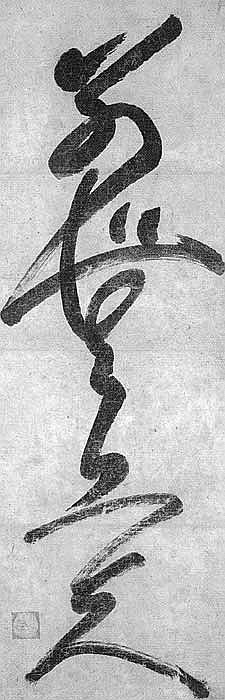

Wrzucę taką krótką refleksję, zainspirowany filmem, który własnie
obejrzałem, a na nim przykładową lekcję stenografii w szkółce przy
rosyjskim MSZ.



Otóż w zagajeniu Pani Nauczycielka wypowiada się na temat, który chodzi
mi po głowie właściwie od samego początku, jak się zainteresowałem
stenografią: komu to do cholery potrzebne, skoro pismo odręczne znajduje
się w głębokim odwrocie i być może moje wnuki już w ogóle nie będą go
znać? Tym bardziej 
**stenografia w wersji pisanej, która jest bodaj szczytowym osiągnięciem sztuki pisania**, 
przecież dziś już prawie
wymarła w większości krajów alfabetu łacińskiego.

Kto trochę po świecie pojeździł, ten wie, że różne są alfabety, a zatem
i na różne sposoby wykorzystywane. Np. pisma pochodzące z Indii, choć
przecież znakomicie dostosowane do swoich języków, przecież strasznie
niewygodne w użyciu. Praktyczni Tybetańczycy, kiedy zaadaptowali
[Devanagari](http://pl.wikipedia.org/wiki/Pismo_dewanagari) do swojego
języka, wkrótce stworzyli coś około trzech niezależnych metod
pozwalających w miarę szybko pisać odręcznie. Jedna z nich nazywa się
ma-le, czyli "bez główki", jak można by nazwać poziomą kreskę bazową
występującą 
[w górnej części prawie każdej litery ich alfabetu](https://pl.wikipedia.org/wiki/Pismo_tybeta%C5%84skie). 
Zatem w
niektórych krajach pismo odręczne ma się dobrze. Wystarczy przytoczyć
przykład krajów, które przyjęły "alfabet" chiński - Chiny, Japonię i
okolice. Sprawne pisanie krzakami na komputerze oznacza konieczność
opanowania zupełnie nowej umiejętności, nie mającej praktycznie związku
z kaligrafowaniem ich na papierze. W szkołach tamtejszych nadal
obowiązkowym przedmiotem jest kaligrafia.

Fachowcy na całym świecie są zgodni, że umiejętność pisania odręcznego
wpływa bardzo korzystnie na inteligencję. Wykonywano pomiary oraz inne
badania, o których pisałem na stronie głównej oraz gdzie indziej, z
których wynika, że podczas pisania odręcznego angażuje się o wiele
więcej partii mózgu, niż podczas klepania w klawiaturę - pisanie
odręczne wymaga zarówno dobrego procesorka od abstrakcji (praca na
różnych symbolach, zaszyfrowanie treści przy pomocy tych symboli), jak i
od konkretu (podobnie jak w klawiaturze, grafika, orientacja
przestrzenna, kontrola ręka-oko). Jednocześnie uczniowie, którzy nie
utracili jeszcze zdolności pisania pismem kursywnym (czyli pisanymi),
lepiej wypadają w sytuacjach, kiedy trzeba się "wysłowić", czy to w
mowie, czy piśmie. Ich zapas słownictwa jest większy, znajomość
ortografii i gramatyki lepsza, bieglej posługują się słowem, niż ich
rówieśnicy, którzy już tylko klepią w klawisze, a na kartce stawiają
kulfony zwane "drukowanymi".

Jak będzie wyglądać nasza cywilizacja, kiedy umrze tak stara i
pożyteczna umiejętność, a zatem kiedy osłabią się też związane z tym
funkcje umysłu? Dziś widzę podział dość groteskowy, bo ludzie starszej
daty utrzymują i przepisują swoje notesy, a klepią z mozołem w
klawiatury w tempie średnio rozgrzanego ślimaka, z konieczności
oczywiście lakonizując swoje wypowiedzi na ekranie. Z drugiej strony
młodzież zaczyna odczuwać awersję do pisaków i kartek, które nigdy w
przeszłości nie były tak tanie, tak dobre i w takim wyborze, za to
świetnie się czuje podczas klepania w klawisze. Młodsi zatem mają coraz
więcej problemów z pisaniem odręcznym, co być może jest składnikiem
współczesnej sytuacji, kiedy rodzice wywalczają im różniste
zaświadczenia o "dysgrafii", "dysleksji", "dysortografii", czy wręcz
"dyskalkulii". Na razie jeszcze nie widać ścisłego związku między
umiłowaniem klawiatury a utratą podstawowych zdolności komunikacyjnych,
nie wiadomo, czy kiedykolwiek, ktokolwiek zrobi takie badania i uzyska
wiarygodne wyniki. Jednakowoż, skoro powoli wkraczam w wiek zgredowski,
pozwolę sobie na taki wniosek:

Zmierzch pisma odręcznego oznaczać będzie również głębokie przemiany
społeczne w zakresie inteligencji, czyli sumy wiedzy i umiejętności jej
wykorzystania. Obawiam się, że raczej wrócimy do przeszłości, kiedy
pewien procent społeczeństwa po prostu nie umiał pisać, czytać, lub obu
tych rzeczy, takoż więc nie uczestniczył w budowaniu trwałych elementów
kultury - bo ich życie i zawód nie będą tego od nich wymagać. Na
pierwszy ogień pójdzie umiejętność pisania. Czytanie wciąż wydaje się
bardzo potrzebne, w końcu formularze w urzędach zapisane są jakimś
alfabetem. Ale komputeryzacja może to zmienić, choć zapewne nieprędko.
Już dziś wielu ludzi co najwyżej potrafi się w miarę sprawnie podpisać.
Emaile wycięły praktycznie korespondencję pisaną, więc ludzie, którzy
kiedyś w bólach wysłali pocztówkę na święta, dziś najwyżej wklepują SMSa
i robią "wyślij do wszystkich".

Zatem prorokuję, że społeczeństwo znowu powróci do stanu podobnego do
płaskiej piramidy, gdzie na górze znajdzie się niewielka garstka
"gramotnych", a na dole ogromna masa "niegramotnych". A stąd zapewne
również w stronę średniowiecznego sposobu myślenia skręci świadomość
ludzi. I nie mam tu na myśli "mroków", a raczej większe zaufanie do
wyjaśnień prostych, opartych na wierze, lub zaufaniu do autorytetów,
unikanie budowania własnego osądu. Niegramotni podzielą się na
ambitnych, z których wyrośnie warstwa służebna, gotowa dla awansu dzieci
pracować i służyć gramotnym, ufających swoim szefom i podziwiająca ich,
pozostali staną się mierzwą, utrzymywaną z państwowej jałmużny, mięsem
armatnim i rekrutami w gangach oraz politycznych machlojkach. Na górze
za to zapanuje oligarchia potężnych, bogatych, wykształconych,
trzymających w rękach nie tylko środki, jak wskazywał ongi Marks, ale
też wiedzę, jak te środki produkować i pożytkować. To oni będą toczyć
między sobą walki z wykorzystaniem dołów, którym będzie można wmówić
wszystko, bo różnica poziomów będzie niemalże jak między bogiem a
wyznawcą.

A to wszystko z powodu wyjścia z mody długopisu? Temat na opowiadanie
SF?

Pożyjemy, zobaczymy.
