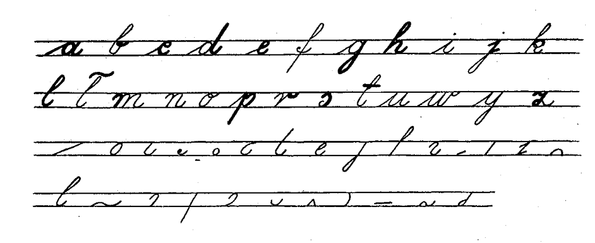
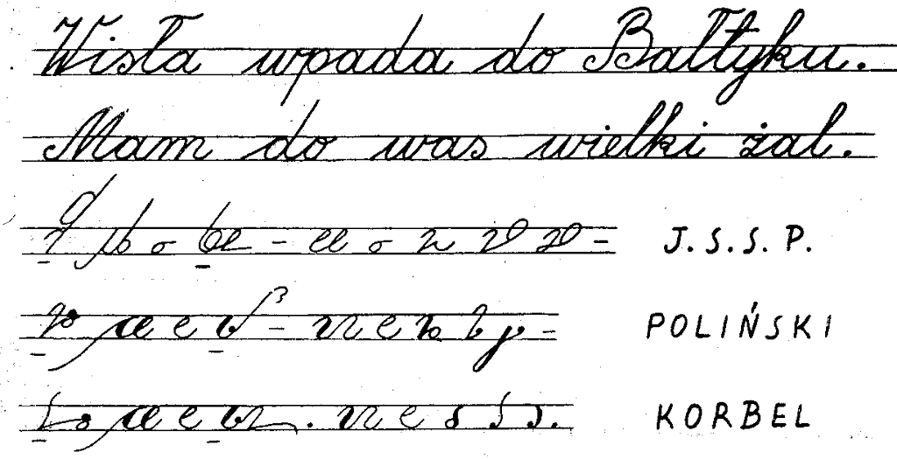

W dzisiejszym wpisie zaprezentuję artykulik autorstwa Jerzego
Krupińskiego, którego podręcznik do stenografii wydany w latach 70-tych
osiągnął zapewne największe nakłady. Sądzę tak na podstawie obserwacji
ofert podręczników do tej szlachetnej sztuki, jakie pojawiają się na
allegro.pl.
Komentarz do artykułu pozwolę sobie zamieścić w następnym wpisie.

## Kaligrafia - wstępem do stenografii

Mechanizacja w pisaniu - przede wszystkim w postaci używania w coraz
większym stopniu maszyn do pisania - jes tbezsprzecznie pozytywnym
zjawiskiem. Przyspiesza tok wielu prac, ułatwia je i umożliwia pisanie
tekstów jednocześnie w wielu egzemplarzach. Stały postęp w tej
dziedzinie **spycha jednak na dalszy plan pismo zwykłe**, co w
konsekwencji powoduje lekceważenie i nieprzestrzeganie zasad kaligrafii.
Dziś **rzadko kto**, mając do dyspozycji maszyny do pisania, powielacze,
drukarnie itp., **liczy się z dokładością i precyzją pisma ręcznego**.
Przystępując w tej sytuacji do nauki stenografii natrafia się na duże
trudności. **Trzeba je od razu przezwyciężyć**, bowiem zasady budowy
pisma stenograficznego są zaprzeczeniem jakiejkolwiek niedokładności,
czy dowolności graficznej. O co tu chodzi?

Każdy polski podręcznik stenografii podaje na wstępie, że znaki
stenograficzne zbudowane są z elementów graficznych pisma zwykłego. **Są
to elementy kaligraficzne zwykłego pisma kursywowego**. Z elementów tych
zbudowane zostały systemy prostych, krótkich znaków, którym nadano
określone znaczenia dla dźwięków spółgłoskowych i samogłoskowych, i z
kolej - przez ich specjalne łączenie - dla całych grup spółgłoskowych i
zgłoskowych. Jeżeli dodamy do tego zasady symbolizacji samogłosek
(obniżanie, odsuwanie, czy podwyższanie znaków spółgłoskowych), budowę
stałych skrótów (znaczników) i szereg innych kobinacji graficznych ,to
wynika stąd jasno, iż owe proste elementy kaligraficznego, zwykłego
pisma kursywowego, podlegające następnie szerokiej rozbudowie, z natury
rzeczy **muszą być kreślone z wielką dokładnością**. Dokładności tej nie
wolno ani na chwilę tracić z pola widzenia nie tylko w czasie nauki, ale
również przy posługiwaniu się stenografią w praktyce. Nawet przy
największych szybkościach. W przeciwnym razie pismo stanie się
nieczytelne, a tym samym bezwartościowe.

Pismo stenograficzne jes zatem **kaligrafią najwyższego rzędu**. Stąd
przy rozpoczynaniu nauki stenografii konieczne jest **cofnięcie się na
chwilę do elementarza**, by uświadomić sobie prawidłowości graficzne
podstawowych elementów, których szerokim i wszechstronnym rozwinięciem
są systemy stenograficzne.

Szereg zawartych w powyższych literach elementów graficznych
(zakreślonych grubą linią i następnie wypisanych oddzielnie poniżej)
wchodzi bezpośrednio do każdego graficznego systemu stenograficznego,
stanowiąc jego podstawę obudowaną całym zespołem znaków pokrewnych i
kombinacji logicznych.

Można więc powiedzieć, że kaligrafia jest wstępem do nauki stenografii.
Zasady kaligrafii - doprowadzone w piśmie stenograficznym do najwyższej
precyzji - rządzą nim niepodzielnie. Nieprzestrzeganie tych zasad może
spowodować, że **cały wysiłek** włożony w naukę stenografii pójdzie na
marne.

Stenografia stertuje od elementarza. **Jest to jednak tylko czas
startu**. A sztuka graficzna połączona z krótkością pisma pozwala - po
zdobyciu maksymalnej wprawy - dorównać biegowi żywego słowa.

Krótkość pisma stenograficznego w stosunku do pisma zwykłego można by
zilustrować poniśzym zestawieniem, biorąc za podstawę trzy najbardziej
rozpowszechnione polskie systemy stenograficzne. Widać tu, że trud
włożony w naukę stenografii **nie jest bezowocny**.

Jerzy Krupiński

*Stenograf Polski, nr 1(95), rok XIX,
I-II 1965*
