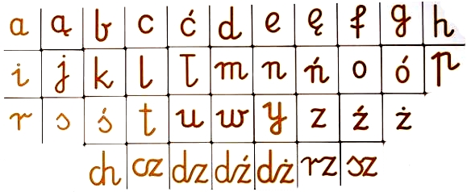
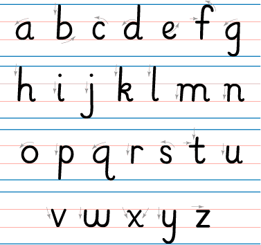
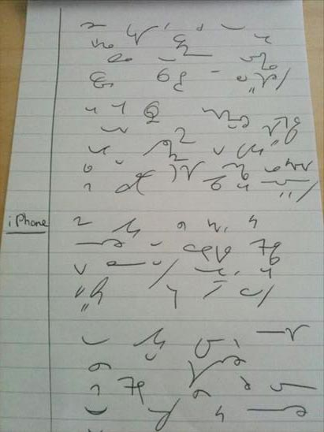

Komentuję niżej artykuł, który zamieściłem w poprzednim wpisie, nt.
znaczenia kaligrafii dla nauki stenografii.

Nie sposób polemizować z tezami zawartymi w tym artykule. Autor,
zasłużony stenolog, modyfikujący system Polińskiego, dopasowujący go do
czasów współczesnych, słusznie oczekuje, że zarówno podczas ćwiczeń, jak
i w codziennej praktyce stenograficznej, adept tej sztuki włoży wiele
wysiłku i starania w jak najdokładniejszy zapis tych tajemniczych
wężyków. Kaligrafia będzie mu bardzo pomocna (temu adeptowi), gdyż
dzięki temu nie musi już od początku wykonywać żmudnych ćwiczeń, które
"przystosują jego rękę" do sztywnych dość reguł danego systemu
stenograficznego, bez których znowuż nie ma mowy o odczycie stenogramu -
a bez tego w ogóle nie da się mówić o stenografii. Czyli oczekiwanie Imć
Pana Krupińskiego, że student stenografii przypomni sobie elementarz z
czasów, kiedy uczył się pisać, należy uznać za zasadny.  
A zatem - od kaligrafii do stenografii.  
A przecież (każdy to wie), że dziś w szkole kaligrafii nie tylko nie
uczą, ale i nie wymagają. Żądają jeno, by tekst napisany ręcznie dał się
odczytać przez osoby trzecie, np. panią od polskiego, a to niemało.
Jednak zarówno kształty liter, jak i ich metody łączenia od dawnych
czasów nieco się zmieniły. Dziś obowiązuje forma znacznie uproszczona,
łatwiejsza do nauki i związana ze zmianą narzędzi piśmienniczych.

Literki te nie mają już tak szerokiego zastosowania prawoskrętności,
mają znacznie mniej różnistych pętelek. Są proste. Przy ich pisaniu
można, a nawet trzeba, podnosić rękę i odrywać pisak od papieru. Po
dojściu do wprawy piszący i tak tworzy własne formy, których nikt mu nie
podpowiedział, a które wynikły z wieloletniego treningu. O kaligrafii
jednak nie ma tu mowy.

Zatem nie ma ćwiczeń z kaligrafii. A zatem i współczesny system
stenograficzny, aby nie stanowić wyzwania tylko dla najzdolniejszych
graficznie, powinien to uwzględniać. Powinien nie być zanadto
wymagający. Jak to osiągnąć, jeżeli, w przeciwieństwie do liter pisma
długiego, znaki stenograficzne mają być możliwie jak najprostsze, a
przede wszystkim możliwe do wypisania już nie tylko bez odrywania pisaka
od papieru, ale też jednym, oczywistym ruchem?

-   Trzeba się przyjrzeć współcześnie używanym literom i polegać na
    nawykach ręki, która uczyła się pisać właśnie w ten sposób. 
-   System musi się składać ze znaków o oczywistym i niewątpliwym
    kształcie, łatwym do odróżnienia od innych.

Poza tym współcześnie już coraz mniej potrzeba stenografii ściśle
parlamentarnej, zdolnej osiągać kosmiczne prędkości zapisu. Cały czas
jednak może się przydać stenografia typu notatkowego, dla studentów,
dziennikarzy, wykładowców, lekarzy i wszystkich, którzy wciąż posługują
się notesem i w dającej się przewidzieć przyszłości - będą. A
stenografia notatkowa jest uzupełnieniem sztuki notowania, pozwala
notować bardzo szybko - ale przecież już nie z prędkością myśli. Zatem
nie musi też obfitować w tak wiele różnych trudnych oznaczeń i
symbolizacji, które są niezbędne, aby pisać z prędkością mowy - a zatem
też może być mniej wymagająca kaligraficznie.

 Niech inspiracją będzie tutaj brytyjski system Teeline, zaprojektowany
z myślą o lekarzach, a ostatecznie rozpowszechniony wśród dziennikarzy
Commonwealth. Ci, którzy go opanowali, bardzo to sobie chwalą. Ci,
którzy się go nie nauczyli, twierdzą, że jest niepotrzebny. Niech to
każdy sądzi podług siebie. Pewne jednak jest, że jeżeli nie będziemy
mieć sensownego, polskiego systemu stenograficznego, zgodnego ze
współczesnymi potrzebami, nikt nie będzie miał wyboru - a zatem i
szansy, by móc to według siebie osądzić. Taką rolę, mam nadzieję, spełni
system [Ste*Mi*](http://www.stenografia.pl/?p=116), którego budową
zajmuję się już od jakiegoś czasu, i o którym już pisałem.
