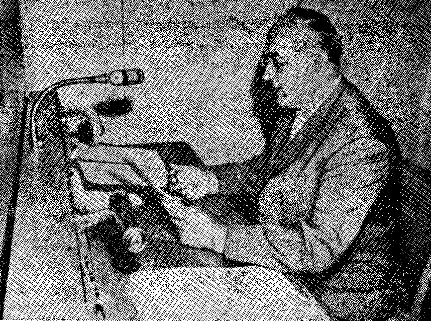

W latach 60-tych ubiegłego wieku stenografia była wciąż tak potrzebna i
rozpowszechniona, że w cywilizowanych krajach chętni do jej nauki byli
wprost otoczeni wspomagaczami nauki. Dziś nikt o tym nie pamięta, a
jeżeli pamięta, to nie opowiada.

A tymczasem w takiej np. Austrii, pod numerem 15-17 abonent mógł
usłyszeć dyktando stenograficzne odtwarzane z taśmy. Nadawano je z
prędkością od 100 do 180 sylab na minutę (spm), co tydzień z inną tak,
że można było sobie wybrać odpowiednią, zależnie od stopnia
zaawansowania w nauce. Inicjatorem tej usługi był ówczesny honorowy
przewodniczący [Intersteno](http://www.intersteno.org/) prof. Wilhelm
Zorn. Był on również lektorem w tych dyktandach.

<!--  [ -->

<!--  Prof. Zorn ze stoperem w ręku nagrywa tekst dyktanda stenograficznego. -->

