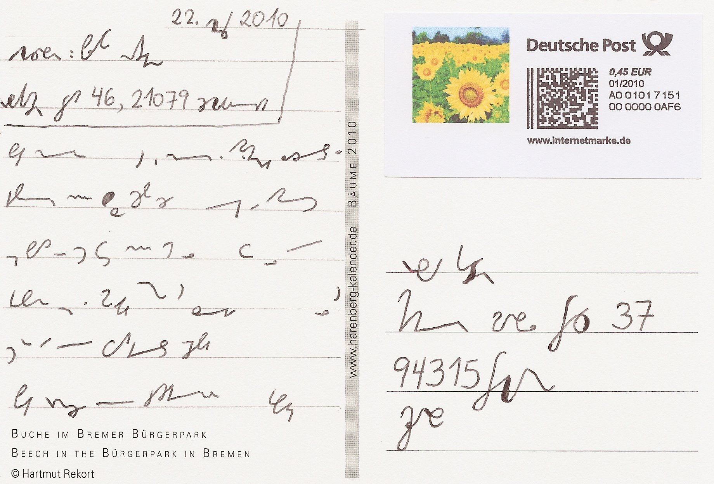
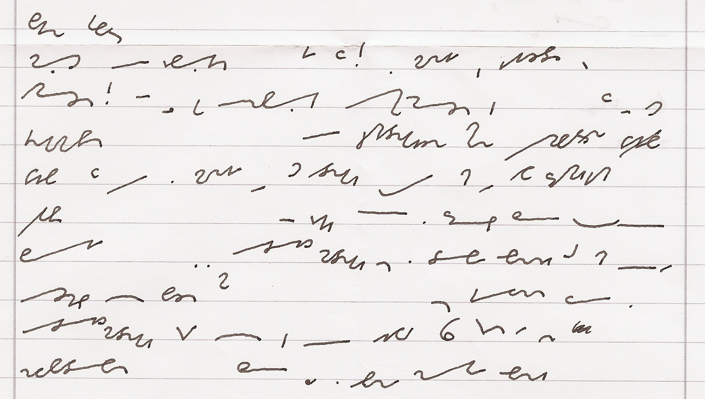

Poniższa historyjka daje do myślenia na wielu poziomach. Po pierwsze
primo, że nauczanie stenografii, choćby korespondencyjne, ale jednak
wciąż jest żywe u naszych zachodnich sąsiadów. Opisana niżej historia
wydarzyła się we wrześniu 2010 roku, czyli niedawno. Po drugie primo, że
wciąż jest wielu, naprawdę wielu Niemców, którzy potrafią te wężyki
czytać, a być może i pisać. A po trzecie primo, jest interesująca ze
stenograficznego punktu widzenia:

Oto pewien [blogger z Niemiec](http://pne.dreamwidth.org/) uczy się
stenografii w odmianie
[Stiefografie](http://de.wikipedia.org/wiki/Stiefografie). Postanowił
wysłać swojemu nauczycielowi eksperymentalną kartkę pocztową: w całości
zapisaną systemem Stiefografie, a zaadresowaną oficjalnym, jednolitym
niemieckim 
[systemem DEK](http://pl.wikipedia.org/wiki/Deutsche_Einheitskurzschrift).

Komentatorzy pod wpisami zgłaszali wątpliwości, czy na poczcie w ogóle
ktokolwiek rozpozna to jako stenografię, a nie potraktuje jak jakiś
kawał, albo bełkot chorego idioty... A tymczasem, jak wynika z dalszej
części relacji, kartka pocztowa doszła, że tak powiem, śpiewająco!
Nauczyciel odpowiedział klasycznym listem, zaadresowanym pismem długim,
ale treść zapisał w systemie Stiefografie:

*Drogi Filipie,*

*trudno w to uwierzyć, ale to prawda! Kartka naprawdę dotarła! Kiedy
wróciłem ze swoich wakacji, czekała w mojej skrzynce pocztowej.
Przyklejona do niej była odręczna notatka w piśmie długim z moim
adresem. Zatem na poczcie naprawdę są jeszcze ludzie, którzy uczyli się
w szkole Zunifikowanego Systemu Stenografii Niemieckiej
(Einheitskurzschrift, DEK) w szkole i stąd potrafią przynajmniej jeszcze
go odczytać. Być może wiesz, że DEK był nauczany w szkołach realnych
Bawarii jeszcze sześć lat temu. (...)*

Czy taka historia mogła by się wydarzyć u nas? Chyba już nie. Porównajmy
szybko popularność stenografii po naszej i po ich stronie Odry: u nas w
tej chwili działa jedna, umierająca organizacja zrzeszająca (a właściwie
mająca to w statucie, a nie faktycznie co robiąca) stenografów. Tam do
dziś aktywnych jest ponad 200 takich organizacji. Tym optymistycznym
akcentem pozwalam sobie zakończyć dzisiejszy wpis.
