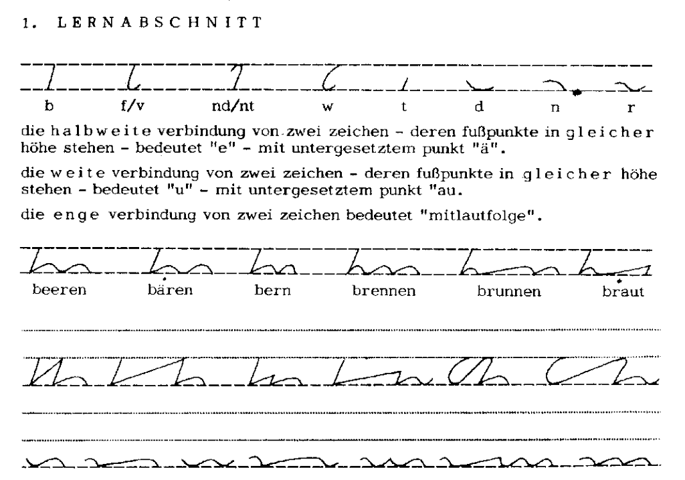

W dzisiejszym odcinku fascynujących przygód stenografii zaprezentujemy
system Stiefografie autorstwa Helmuta Stiefa. 
 
Helmut Stief urodził się na początku XXw., ukończył następnie szkoły, do
jakich posłali go rodzice. W tym czasie po mistrzowsku opanował [system
DEK](http://pl.wikipedia.org/wiki/Deutsche_Einheitskurzschrift) (pisał z
prędkością nawet 440 sylab na minutę). 
Wreszcie wszedł w rodzinny biznes - meblarstwo. 
Jednak nie odnalazł w tym zawodzie swojego przeznaczenia i
wkrótce przerzucił się na dziennikarstwo i nauczanie stenografii, czym
zajmował się, aż powołano go do Wehrmachtu w 1943 roku. Z powodu
znakomitej znajomości szybkopisania nie powąchał prochu, lecz pracował
za biurkiem.  

Po wojnie zatrudniono go jako rzecznika prasowego sejmu Turyngii, a
wkrótce został jego dyrektorem. W 1948 roku sowieckie władze okupacyjne
oskarżyły Helmuta Stiefa o szpiegostwo i inne zbrodnie, w efekcie wyrok
sumarycznie opiewał na 130 lat więzienia. Odsiedział z tego 8,5 roku w
Bautzen, gdzie wreszcie miał czas przenieść na papier (po serze,
własnoręcznie wykonanym z drewna piórem) swoje przemyślenia dot.
stenografii. Stworzył swój system i nauczył go 200 spośród
współwięźniów, którzy zaczęli się tym posługiwać jak tajnym pismem.  
Możliwe to było dzięki niezwykłej prostocie systemu. Na podstawowym
poziomie składał się on z zaledwie 25 znaków (DEK ma ponad 60) i 9
podstawowych reguł (wzrosło do 12). Opanowanie podstaw wymagało kilku
godzin koncentracji, a czasu więźniowie mieli sporo.

Po wyjściu z więzienia w 1956 roku niezwłocznie wyjechał do Frankfurtu
nad Menem, gdzie został stenografem parlamentarnym w parlamencie
Bawarii. W tym czasie zajmował się rozwojem i propagowaniem swojego
systemu. W efekcie w roku 1966 narodził się nowy system stenograficzny
pod nazwą Stiefografie, którego popularność w momencie śmierci autora w
roku 1977 przekroczyła 40 tysięcy adeptów. 
[System ten](https://translate.googleusercontent.com/translate_c?hl=pl&ie=UTF8&prev=_t&rurl=translate.google.com&sl=de&tl=en&twu=1&u=http://www.oekobuero.de/vrst.htm&usg=ALkJrhhuFMlMllD_7BqYoV1JJviW_9TtsQ)
jest wciąż 
[nauczany korespondencyjnie](http://www.oekobuero.de/vrst.htm).
