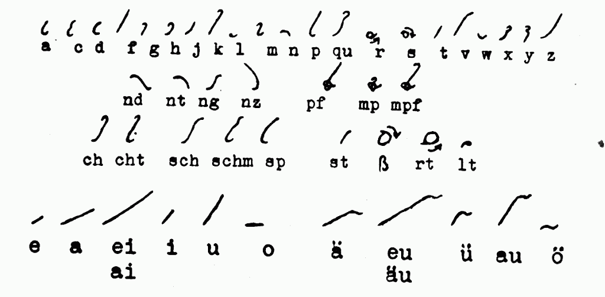
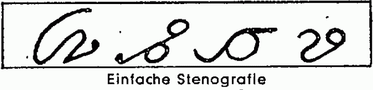

Poprzednio prezentowałem system wciąż znany w Niemczech. Dziś chcę
przedstawić inny, również ułożony z myślą o jak najmniejszej trudności
nauki (a zatem jak największej łatwości ;-)). Niestety, nawet głębsze
poszukiwania w Internecie nie przynoszą nic poza tekstowymi opisami - w
dzisiejszych czasach, kiedy książki bez obrazków czytają już tylko
twardziele, to naprawdę zadziwiające, szczególnie, że na niemieckiej
Wikipedii jest całkiem uczciwy wpis na temat życie twórcy "Einfache
Stenografie", czyli "Łatwiej Stenografii".

Karl Otto w młodości nauczył się systemu Stolze-Schrey. W gimnazjum, w
roku 1924, czyli tuż po pierwszej publikacji, opanował także system DEK
(Deutsche Einheitskurzschrift - Jednolity System Niemiecki). Według jego
opinii, DEK był znacznie trudniejszy w nauce, niż Stolze-Schrey. W tym
czasie już publikował artykuły nt. teorii stenografii, pozytywnie
przyjmowane przez starszych kolegów - zawodowych stenografów.

Podczas studiów prowadził notatki w systemie Stolze-Schrey i doszedł w
nim do wielkiej wprawy. Aktywnie udzielał się w pracach swojego
macierzystego klubu stenograficznego w Ballenstedt prowadząc zajęcia i
kółka dla młodzieży. Podczas wojny pracował w różnych miejscach, uczył
stenografii w kobiecych oddziałach Organizacji Todta, przemyśle ciężkim,
jako protokolant sesji psychologicznych - oczywiście jako stenograf.

***Tutaj dygresja**: Jak na razie
zauważyłem, że żaden, powtarzam, żaden z ówczesnych stenografów, którzy
zapisali się choć troszeczkę w historii, nie ma epizodu frontowego z
okresu wojny. Daje mi to do myślenia, że fach ten był zbyt cenny, żeby
narażać go na ryzyko, a jednocześnie zbyt pożyteczny, żeby nie
przechwycić i nie zatrudnić do celów wojennych. Zatem: pacyfiści powinni
się być może zastanowić, czy nie nauczyć się stenografii?*

Po zajęciu Bawarii przez Amerykanów zafascynował się systemem
Scheithauera, szczególnie łatwością nauki.

Przez następne lata uczył stenografii systemu Stolze-Schrey w różnych
miastach i korespondował z Karolem Scheithauerem, twórcą nowego systemu.
Wkrótce rozpoczął prace nad własnym, w którym zamierzał zawrzeć swoje
przemyślenia z przeszło trzydziestoletniej pracy stenograficznej.

System nazwał "Einfache Stenografie", czyli "Łatwa Stenografia", bo taka
miała być w swoich założeniach.

<!-- 
  Alfabet Einfache Stenografie -->



Opisuję na podstawie gazety "Stenografische Rundschau" z r. 1963:

System Einfache Stenografie (ES) ogłoszono stenografią przyszłości. Na
pocz. 1964 r. miał się ukazać podręcznik do nauki jednolitej stenografii
ES. System ten miał nie wymagać cieniowań, liniatury i być łatwym do
opanowania. Posiadał 48 znaków, 11 reguł i 70 znaczników, a więc o 60%
mniej tworzywa niż DEK. System ES miał 37 spółgłosek i 11 samogłosek.

Jeszcze w Der Spiegel z 31 października 1966 roku ukazał się dość
obszerny (jak na tą gazetę) artykuł o starciu nowoczesnych systemów
stenograficznych (Notizschrift, Einfache Stenografie, Stiefografie) ze
swoimi protoplastami (Gabelsberger, Stolze-Schrey, DEK). A później na
temat tego systemu ucichło. A szkoda, bo graficznie był bardzo
interesujący - prostszy od Scheithauera, a chyba nie mniej wydajny.
Niżej tylko próbka pisma skopiowana z tegoż artykułu:

<!-- 
  Spiegel Leser wissen mehr -->
  

