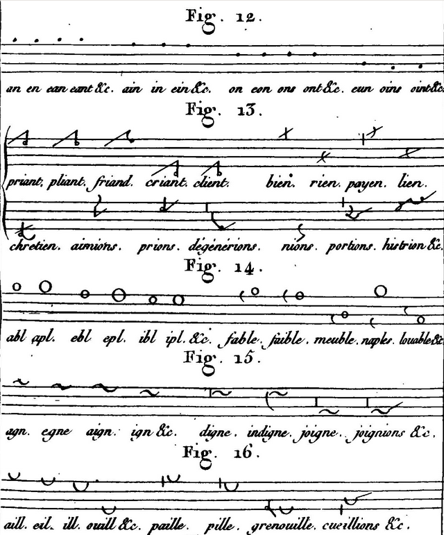

Przeglądanie pozyskanych od Pani Ety Zaręby Stenografów Polskich zaczyna
przynosić efekty. Ostatnie kilka wpisów to jeden z nich. Inny to
możliwość odtworzenia materiałów historycznych, do których dziś już nie
ma dostępu, a jeszcze 40 lat temu były one w posiadaniu, czy to
[SSiM](https://spis.ngo.pl/194939-stowarzyszenie-stenografow-maszynistek-i-sekretarek), czy stenografów,
stenologów - pasjonatów. Tych będzie, jak liczę, sporo.

Tak właśnie rozszerzył się artykuł o 
[początkach polskiej stenografii ze strony głównej](http://stenografia.pl/pmwiki/index.php?n=HistoriaPolska.Poczatki)
o artykuł na temat stenografii 
[Kazimierza Krupskiego](http://stenografia.pl/pmwiki/index.php?n=HistoriaPolska.KrupskiKazimierz)
autorstwa [Lecha Klewżyca](http://www.stenografia.pl/?p=112). W
przygotowaniu podobne teksty o stenografii Józefa Pysza i Feliksa Saxe.
A inne - w miarę napływu danych.

Zapraszam do lektury.
