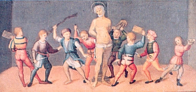
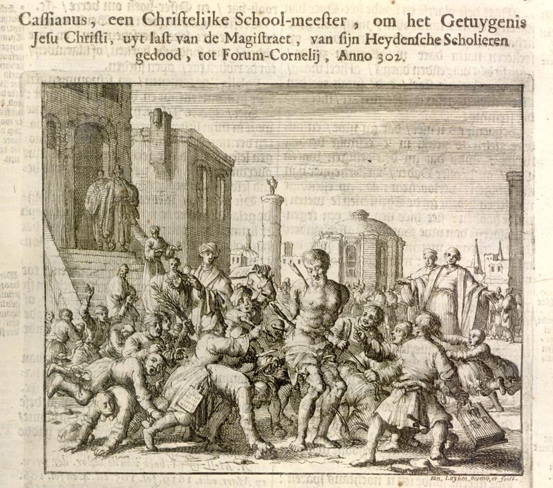

Święty chrześcijaństwa, [Kasjan z
Imoli](http://pl.wikipedia.org/wiki/Kasjan_z_Imoli) był biegłym
tachygrafem i nauczycielem tej sztuki. Jak to można zobaczyć na
ilustracji, w roku 304 n.e. został zabity przez swoich uczniów przy
pomocy stylusów, czyli rylców do tabliczek woskowych - tabletów, na
których wówczas notowano. A dlaczego to został tak niecnie zabity? A
podobno dlatego, że był bardzo surowy i zbyt wiele (w każdym razie ich
zdaniem) wymagał od uczniów.

Nie bez powodu. Rozwijające się już od bez mała 400 lat noty tyrońskie
przełamały barierę, jaką im postawił Seneka Młodszy i obrosły w kolejne
10 tysięcy znaczników, w ten sposób licząc już ich ponad 13 tysięcy
(liczbowo: 13000). Stanowiły one ogrom materiału, który trzeba było w
rozsądnym czasie przyswoić bez wyrafinowanych pomocy naukowych
dostępnych współcześnie, bez metodologii nauczania, raczej zwyczajnie -
pamięciowo. Tylko maksymalnym wysiłkiem można było osiągnąć cel.

Widocznie uczniowie Kasjana do orłów nie należeli, skoro wybrali
rozwiązanie, które, jak dziś wiadomo, niczego nie rozwiązuje: pozbyli
się nauczyciela, zamiast zdać egzamin - by mieć święty spokój.

[Aureliusz Prudencjusz Klemens](https://pl.wikipedia.org/wiki/Aurelius_Prudentius_Clemens) napisał taki oto hymn, odszukany w zbiorze
jego twórczości w tłumaczeniu ks. dr A. Kanteckiego przez byłego
stenografa parlamentarnego i pasjonata-stenologa Tadeusza Zglińskiego:

*Był przełożony szkoły - i licznym orszakiem \
Młodzieży otoczony, w naukach ją ćwiczył, \
Każdy wyraz potrafił w krótkie ująć znaki, \
Za najbieglejszym nawet zdążył pisać mówcą - \
Ostre niekiedy słowa i smutne wypadki \
W niedorostkach budziły nienawiść i trwogę...*  
  
  
*Zdarto z niego odzienie, związano mu ręce, \
I wydano w moc chłopców, w ostre zbrojnych rylce. \
Ile każdy tajonym nienawiści gniewiem \
Płonął, tyle go wylał folgując swej złości, \
Jedni mu w twarz dredniane rzucają tablice - \
A trzeszczące deszczułki uderzywszy w czoło \
Rozpryskują się w sztuki, część ukwiła w licach... \
Drudzy miotają rylce z ostrego żelaza, \
(którymi wiersz po wierszu na wosku się pisze \
A napisane znaki wygładziwszy składnie \
Z popisanej powierzchni znów równą się czyni)*

 
*(...)*

  
*"Precz jęczysz, Profesorze - (jeden z chłopców woła) \
Wszakże sam tym żelazem dłoń nam uzbroiłeś?! \
Otoć dziś oddajemy tych znaków tysiące, \
Których się niegdyś we łzach uczylim od Ciebie! \
Nie masz się o co gniewać, boś sam nakazywał, \
Byśmy bez przerwy w ręku ostre mieli rylce! \
Nie prosimy o wolną rekreacji chwilę, \
Którejś nam, skąpiąc zawsze, tylekroć odmawiał! \
Tak urągali chłopcy dręcząc mistrza ciało, \
A on żył mimo długiej i straszliwej kaźni. \
Wreszcie się nad nim Chrystus niebieski zlitował, \
I kazał porozrywać związki duszy z ciałem.*

(...)
