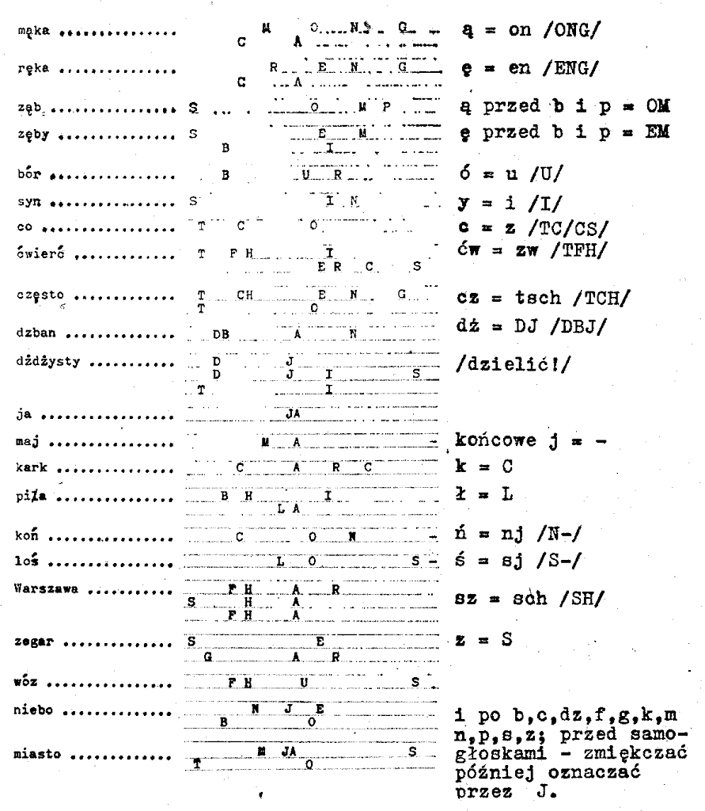
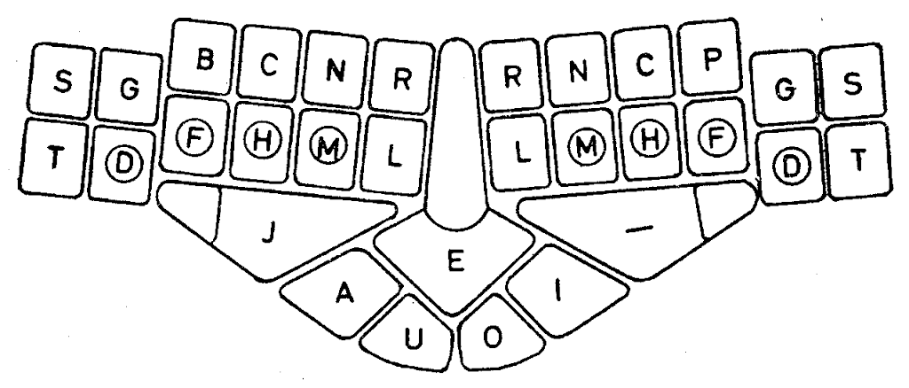
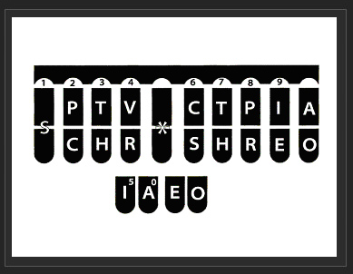

Przeglądam zasoby Google w poszukiwaniu firmy lub marki Silma produkcji
niemieckiej - i słabo, słabiutko mi idzie. Znalazłem projektory Silma,
co by pasowało logicznie do profilu, bo mam tu zamiar mówić o maszynie
stenograficznej Silma - a zatem również wyrafinowany, mechaniczny (w
latach 60-tych tylko mechaniczny) sprzęt.

Otóż w Stenografie Polskim z roku 1967 nr 6(117) znalazłem arcyciekawy
artykulik o maszynie stenograficznej SILMA, 
pt. "*Jak pracuje maszyna do stenografowania?*".

Jest to świetna okazja, by zademonstrować "polski stenogram" z takiej
maszyny. Każdy, kto tu trafił, nie będzie miał najmniejszego kłopotu,
żeby wyobrazić sobie, że te rozstrzelone literki komputer bez trudu
potrafi skleić w całość i poprawnie zinterpretować.

<!--  -->



Maszyna SILMA
pracowała na tej samej zasadzie, co amerykańskie 
maszyny stenograficzne - wypluwała w jednym rządku zestaw naciśniętych czcionek, z których
każda miała swoje stałe miejsce na taśmie papierowej określonej
szerokości. Jak widać powyżej, jeden rządek znaków to jedno naciśnięcie
zestawu (akordu) klawiszy. W tym wypadku regularnie składają się one na
sylaby. Brak niektórych liter/głosek kompensuje się arbitralnie
zaplanowanymi złożeniami. W każdej linijce jest zatem jedna sylaba (za
wyjątkiem specjalnego i jedynego w swoim rodzaju wyrazu "dżdżysty").
Łatwo sobie wyobrazić skróty niektórych wyrazów, żeby z dwóch kliknięć
zrobić jedno.

<!--

  Układ klawiatury SILMA -->



***A oto klawiatura, na której zostały wystukane wyżej ukazane słowa.***
Została zaprojektowana do języka niemieckiego, zatem zapewne wymagałaby
pomniejszych korekt. Jak widać z porównania z amerykańskim układem
klawiszy, miała cokolwiek więcej przycisków, a zatem przy wyższych
wymaganiach manualnych mniejsze wymagania wobec pamięci stenotypisty
(lub stenotypistki), który (która) musiał(a)by zapamiętać inną liczbę
arbitralnych znaczników.

***Trochę o sposobie używania tej klawiatury***. Dzieli się (we
wszystkich takich wypadkach, czy SILMA, czy Stenograph, czy GrandJean)
na połowy lewą i prawą, czyli inicjalną i finalną. Lewa ręka wciska
spółgłoski zaczynające sylabę, kciuki wybierają samogłoski, wreszcie
prawa ręka wciska spółgłoski kończące sylabę, o ile takie występują. I
tu otwiera się pole do popisu dla stenografii, albowiem w języku polskim
znaczna większość sylab jest otwarta, czyli kończy się spółgłoskami - w
takim wypadku prawa ręka mogłaby sprytnie i ukradkiem wstukiwać w akord
stenograficznie streszczone sylaby kolejne. W tej sposób wyraz
czterosylabowy dałoby się wstukać może trzeba, a nawet dwoma
uderzeniami, co znacznie przyspieszyłoby zapis.

<!--

  Włoski układ klawiatury na amerykańskich klawiszach -->



***Można to uznać za utraconą szansę polskiej stenotypii***. Niewielkie
zmiany w układzie klawiszy (w stenotypii, podobnie jak w stenografii,
nie ma co marzyć o uniwersalnej klawiaturze dla wszystkich narodów
świata) dla zwiększenia szybkości i łatwości pisania - i mielibyśmy
polski stenotyp.

Tu pozwolę sobie ***wywnętrzyć się***: ale tak to już jest, że dotowana
z państwowych pieniędzy organizacja o szczytnych nawet celach (i
możliwych do osiągnięcia) nie wykazała ani grama chęci, aby na serio, a
nie tylko publicystycznie, zająć się problemem - nie przełamano
obojętności wysokich urzędników partyjnych, a dziś - to już w ogóle
wszystkim jest wszystko jedno.

Dlatego właśnie nazwałem to utraconą szansą. Dziś, aby nawet na bazie
powyższego, opracować prototyp, prace wszystkie trzeba zaczynać od nowa.
Od zera praktycznie.

Ale nie czas płakać. ***Pierwsze pytanie***, jakie się nasuwa, skoro
musimy zaczynać od zera, czy nie rozsądniej byłoby projektować układ pod
amerykańskie klawisze? Oto jest pytanie. Przydałby się ktoś ze smykałką
do rozwiązywania prostych problemów przy pomocy komputera, żeby na to
pytanie odpowiedzieć - albowiem wymagałoby to prostych badań
statystycznych: czy na amerykańskim układzie jest dosyć klawiszy po
każdej stronie, żeby można było pisać właśnie po polsku? Albowiem
głosownia polska jest nieporównanie bogatsza od angielskiej,
francuskiej, czy włoskiej. Kto wie?
