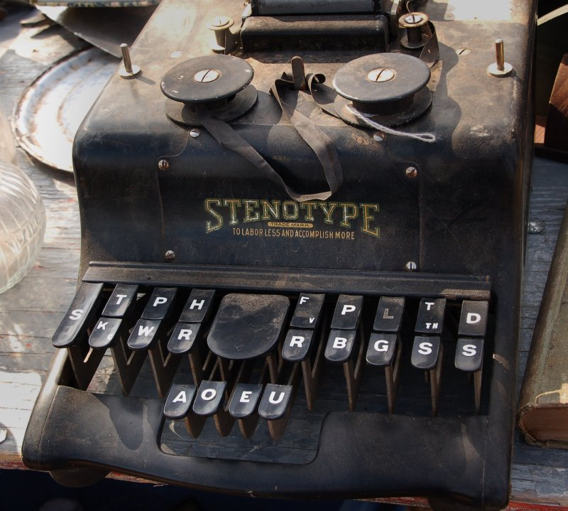
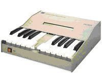
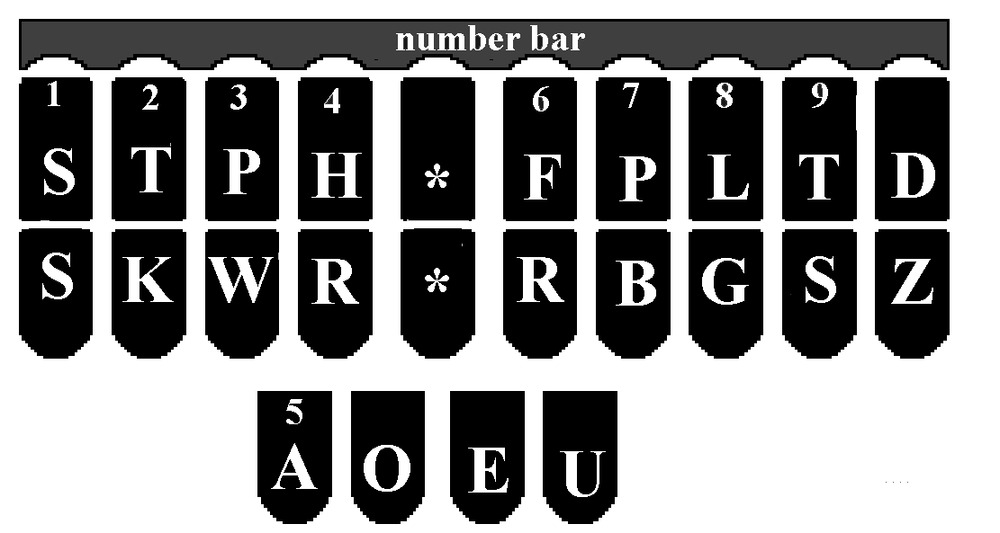
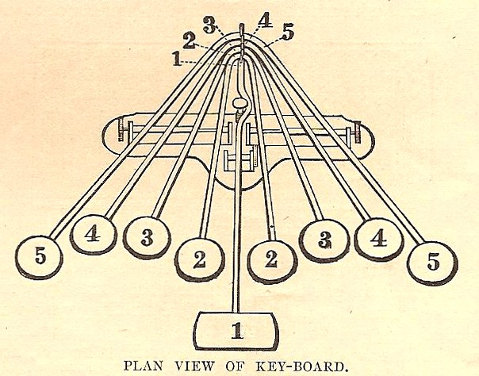
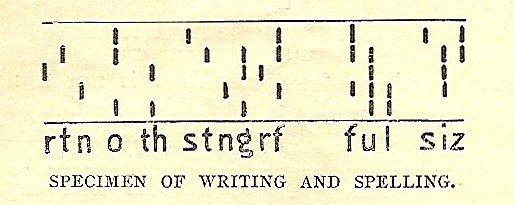
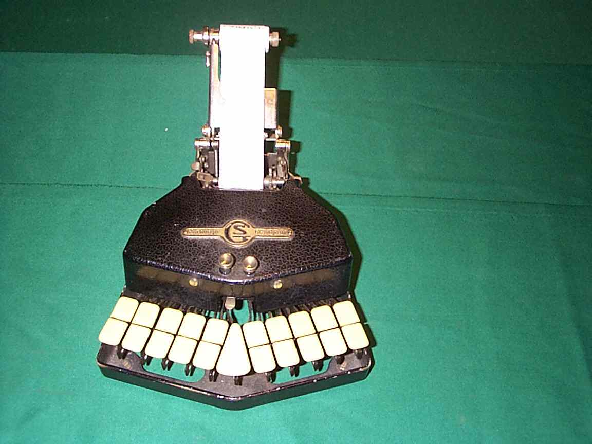
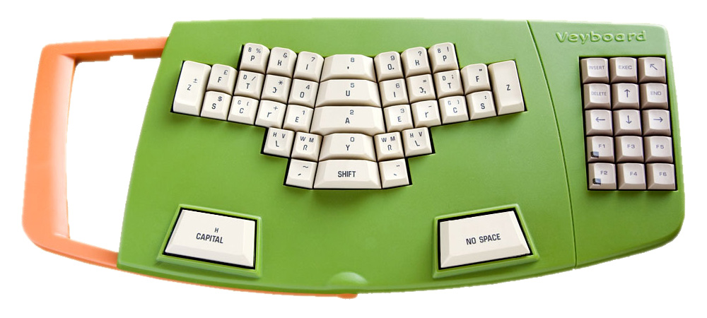
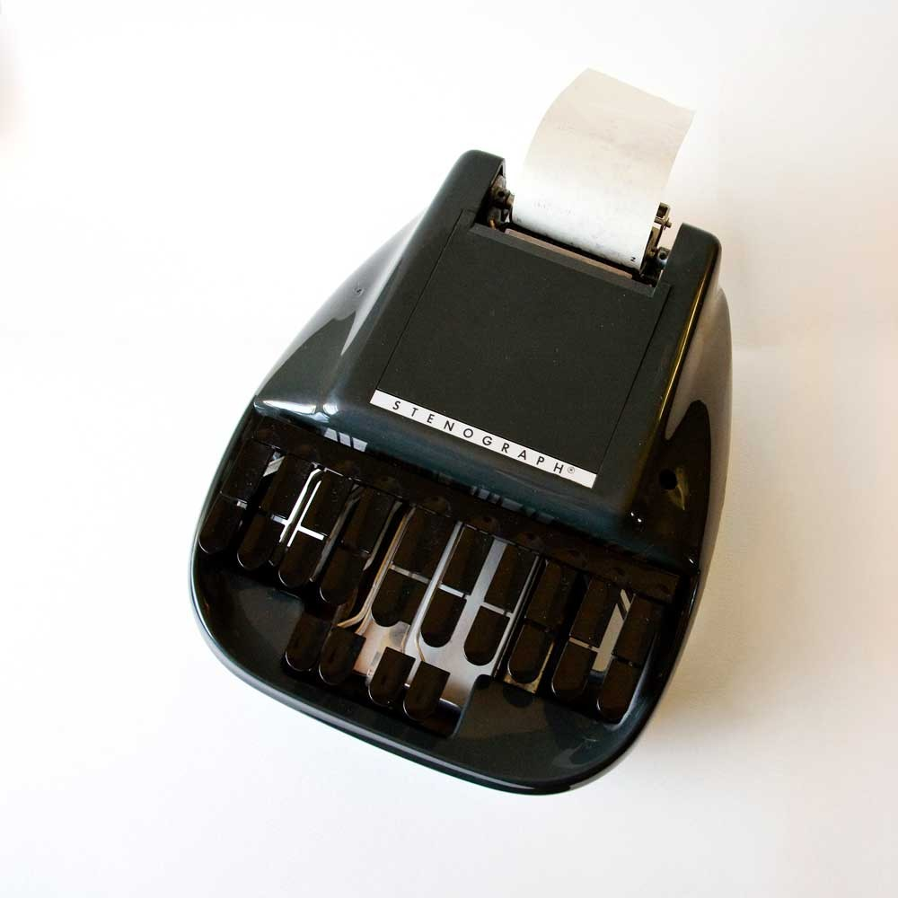

Pierwsza porcja rozmyślań, jakie przydarzają nam się z No-qankiem na
temat stenotypii, czyli stenografii maszynowej, czyli klepanej w
klawiaturę:

Najsampierw przydałoby się wyjaśnić szanownym czytelnikom, cóż to za
cudo, ona stenotypia? Czy można jeszcze szybciej stukać w klawiaturę niż
czyni to Helena Matouskova, czy Vaclav Mikula, czyli ponad 900 uderzeń
na minutę? Pewnie po odpowiednim dopingu, da się, ale po co?



Prezentują oni bowiem iście kosmiczne prędkości, możliwe do osiągnięcia
już nie samym treningiem, ale jeszcze niecodziennym talentem. A przecież
ich tempo i tak dalej nie wystarcza, bez specjalistycznego
oprogramowania 
[Jaroslava Zaviacicia](http://www.intersteno.it/materiale/CVEducationMembers/CVZaviacic.html),
do bieżącego notowania nawet dość sennego wykładu.

A zatem trzeba wdrożyć steno- czyli właśnie ścisnąć tekst do zapisania.
Mamy tutaj, w wypadku stenografii literowej, dwie metody. Jedna, to
opisywany przeze mnie wcześniej
[brewiskrypt](http://blog.stenografia.pl/search?q=czeski+brewiskrypt),
który ma tę zaletę, że nie każe kupować dedykowanych urządzeń - a zatem
był tani w produkcji, a zatem jest i tani w zakupie. Druga metoda, to
wynalazek braci naszych Amerykanów, który upowszechnił się także w paru
innych krajach cywilizowanych, niestety, gadających językami o głosowni
prostszej niż aparat mowy polskiego dwulatka, a zatem niemożliwych do
łatwego wdrożenia u nas - trzeba trochę się przyłożyć. O drugiej
metodzie tutaj słów parę.

Stenografia maszynowa, czyli stenotypia (wbrew błędnemu rozumieniu tego
słowa) to sztuka pisania na specjalnie dedykowanej klawiaturze (o czym
już
[wspominałem](http://blog.stenografia.pl/search?q=stenografia+maszynowa)).
Przycisków jest na niej mniej niż na klawiaturze tradycyjnej,
pochodzącej z maszyny do pisania, więc stosuje się triki, polegające na
tym, że rzadziej spotykane litery i grupy głosek zastępuje się
specjalnymi zgrupowaniami wybranych klawiszy. Co jeszcze istotne,
przyciski nadusza się równocześnie, a rejestracja wpisu następuje w
momencie uniesienia rąk. W ten sposób wygląda to trochę do wygrywania
akordów na pianinie. Zresztą jedna z metod włoskich tak właśnie wygląda:

<!--

La macchina per stenografare -->



Ale nie o takiej tu będziemy mówić, jeno o takiej hamerikańskiej, do
której Włosi już ułożyli sobie układ klawiatury.

 Wygodnie, prawda? Zmieniasz tylko przypisanie i masz: szast, włoska
klawiatura, szast, angielska:

Klawiatura amerykańska powstała po latach testów i eksperymentów z
różnymi maszynami i układami.

<!--
{width="200" height="156"}](1899_Stenograph_Keyboard_BK.03.99.jpg)
Jeden z pierwszych układów stenotypicznych amerykańskich
-->



<!-- 
{width="320" height="127"}](1899_Stenograph_Specimen_BK.03.99.jpg)
i stenogram wynikowy -->



<!--
 -->



<!--
[{width="198" height="320"}](http://www.verbatimreporting.co.uk/images/keyboard_and_laptop_new.jpg)
Brytyjski Palantype -->



<!--
{width="320" height="240"}](Grandjean-20Steno.jpg)
Francuski Grandjean -->



<!-- 
{width="320" height="144"}](Velotype.jpg)
Holenderski Velotype czyli Veyboard -->



<!--
{width="320" height="320"}](il_fullxfull.235819420.jpg)
Amerykańska maszyna Stenograph -->



Ta właśnie wygrała, zapewne z powodu swojej elastyczności i podstaw
metody, które zgodne są z tym, czego uczymy się w szkole: zapamiętujemy
słowa jak obrazy.

I tak, po krótkim przeglądzie (na dłuższy każdy może się wybrać
samodzielnie) dochodzimy wreszcie do pytania z tytułu wpisu:

Jaka stenotypia dla języka polskiego?

Co się rozbija na:
1. Czy powinniśmy wymyślić całkiem nową klawiaturę (jak francuski
Grandjean)? To z pewnością fascynujące przedsięwzięcie, ale też
kosztowne i wymagające naprawdę dużo badań i testów. Ergonomia,
wytrzymałość, wygoda, to kluczowe elementy dobrego stenotypowania.
2. Czy jednakowoż powinniśmy stworzyć system na klawiaturę amerykańską,
co się rozbija na:
     - czy powinniśmy, jak Włosi, stworzyć własną mapę klawiatury, czy
     - użyć gotowej, amerykańskiej, męczyć się z dziwnymi znaczkami, ale za
to importować gotowe urządzenia prosto ze Stanów?

Ostatnia opcja nie podoba mi się. Reszta rozmyślań w następnym wpisie.
Do zobaczenia.
