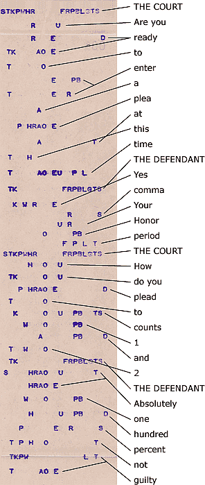

Zrzucam z przemyśleń, które toczymy z No-qankiem.

Wyobraźmy sobie, że sami ułożymy klawiaturę. Będzie ona miała po 5
klawiszy w szeregu, dwa szeregi oraz klawisze samogłoskowe. Na przykład
mogłaby wyglądać tak:

| 1 | 2 | 3 | 4 | 5 | * | 6 | 7 | 8 | 9 | 0 |
|---|---|---|---|---|---|---|---|---|---|---|
| S | K | H | N | R | * | R | K | P | A | E |
| T | P | F | L | H | * | W | S | T | O | Y |
|   |   | A | E | Y | * | O | U | I |   |   |

Sztuczka
z amerykańskiej klawiatury: klawisze powyższe ułożone są jakoś, ale na
wydruku mają zawsze tę samą  pozycję w pojedynczym, długim szeregu,
powiedzmy, że takim:

S T K P H F N R L H \* A E Y \* O U I \* R K W S P T E A O Y \* 1 2 3 4 5 6 7 8 9 0


````
S T K P H F N R L H \* A E Y \* O U I \* R K W S P T E A O Y \* 1 2 3 4 5 6 7 8 9 0
````


Pomysł
został wzięty z taśmy, która wychodziła z drugiej strony amerykańskiej
maszyny. W zasadzie zatem przypisanie liter klawiszom jest czysto
umowne, liczy się i tak, co zostanie przeczytane z kodu, który znalazł
się na taśmie, jak na przykładzie z Ameryki poniżej:



Jak
widać, jak pisałem wcześniej, ręce stenotypisty unoszą się znad
klawiszy, a maszyna wstukuje na taśmę, co tam wyszło. Następnie przewija
taśmę o jedną linijkę, zatem jeden akord, który czasem oznacza część, a
czasem całe słowo, zostaje w oddzielnej linijce. Dla znaków
przestankowych, podobnie jak dla rzadziej spotykanych liter, czy głosek,
przewidziano kombinacje. Dziś oczywiście nie ma potrzeby, by taka
maszyna wstukiwała kod na papierową taśmę. Zatem wklepuje to prosto do
komputera, gdzie siedzi program, który od ręki tłumaczy na język ludzki,
co odbiera połowę roboty stenografowi, który poprzednio nie tylko musiał
umieć to pisać, ale na dodatek czytać. Po posiedzeniu np. sądu, siadał z
maszynistką i dyktował, a taśma jako załącznik wędrowała do akt. Dziś
zapisuje się gotowy protokół na dysku, z którego można go wydrukować, a
co strony mówią, można rzucić nawet na telebim przed sądem, stronę
internetową, dolny pasek informacyjny w telewizorze, czy dokądkolwiek,
gdyby sprawa miała szersze zainteresowanie.

Oczywiście,
nie musi to być protokół z sądu, może to być wykład na uniwersytecie,
przemówienia polityków, kaznodziejów, komików, dyskusje, debaty, listy
dialogowe z filmów na żywo, na ekran, dla niesłyszących, po podłączeniu
do syntezatora mowy jako metoda wypowiadania się dla niemych...

Tak
czy owak, wyżej pokazany układ klawiatury to nawet nie jest propozycja,
a jedynie natchniona ilustracja, która ma pokazać potencjał tej metody -
po polsku. Albowiem spontanicznie, w trakcie pisania listu do No-qanka,
ułożyłem klawiaturę, a następnie dla ilustracji zapisałem jedno zdanie
złożone o brzmieniu ni mniej, ni więcej, tylko:

**"Innymi słowy, choć w stenografii odręcznej chętnie bym widział takie uniwersalne klucze, w stenotypii wolę pisać kombinacje liter, które zapamiętam w ośrodku mowy, a nie wzroku."**

Na "taśmie" wyglądało by tak:


| S | T | K | P | H | F | N | R | L | H | \* | A | E | Y | \* | O | U | I | \* | R | K | W | S | P | T | E | A | O | Y | \* | 1            |
|---|---|---|---|---|---|---|---|---|---|----|---|---|---|----|---|---|---|----|---|---|---|---|---|---|---|---|---|---|----|--------------|
|   |   |   |   |   |   | N |   |   |   |    |   |   |   |    |   |   | I |    | R |   |   |   | P |   |   |   |   | Y | \* | innymi       |
| S |   |   |   |   |   |   |   | L | H |    |   |   |   |    | O |   |   |    |   |   |   |   |   |   |   |   |   |   |    | sło          |
|   |   |   |   |   | F |   |   |   | H |    |   |   | Y |    |   |   |   |    |   |   |   |   |   |   |   |   |   |   |    | wy           |
| S |   | K |   | H |   | N | R |   |   | \* |   |   |   |    |   |   |   |    |   |   |   |   |   |   |   |   |   |   |    | przecinek    |
|   |   |   |   | H |   |   |   |   |   |    |   |   |   |    | O |   |   |    | R | K | W | S |   |   |   |   |   |   |    | choć         |
|   |   |   |   |   | F |   |   |   | H |    |   |   |   |    |   |   |   |    |   |   |   |   |   |   |   |   |   |   |    | w            |
| S | T |   |   |   |   |   |   |   |   |    |   | E |   |    |   |   |   |    |   | K |   |   | P |   |   |   | O |   |    | steno        |
|   |   | K |   | H | F |   | R |   | H |    |   |   | Y |    |   |   | I |    |   |   |   |   |   |   |   |   |   |   |    | grafii       |
|   |   |   |   |   |   |   |   |   |   |    |   |   |   |    | O |   |   |    |   |   |   |   |   | T |   |   |   |   |    | od           |
|   |   |   |   |   |   |   | R |   |   |    |   | E | Y |    |   |   |   |    |   | K |   | S | P | T |   |   |   |   |    | ręcz         |
|   |   |   |   |   |   | N |   |   |   |    |   | E |   |    |   |   | I |    |   |   |   |   |   |   |   |   |   |   |    | nej          |
|   |   |   |   | H |   |   |   |   |   |    |   | E | Y |    |   |   |   |    |   |   | T |   |   |   |   |   |   |   |    | chęt         |
|   |   |   |   |   |   | N |   |   |   |    | A | E |   |    |   |   |   |    |   |   |   |   |   |   |   |   |   |   |    | nie          |
|   |   |   | P |   |   |   |   |   | H |    |   |   | Y |    |   |   |   |    |   | K |   |   | P |   |   |   |   |   |    | bym          |
|   |   |   |   |   | F |   |   |   | H |    |   |   |   |    |   |   | I |    |   |   |   |   |   |   |   |   |   |   |    | wi           |
|   | T |   | P |   | F |   |   |   | H | \* | A |   |   |    |   |   |   |    | R | K |   |   |   |   |   |   |   |   |    | dział        |
|   | T |   |   |   |   |   |   |   |   |    | A |   |   |    |   |   |   |    |   | K |   |   |   |   | E |   |   |   |    | takie        |
|   |   |   |   |   |   |   |   |   |   |    |   |   |   |    |   | U |   |    |   |   | W | S |   |   |   |   |   | Y |    | uni          |
|   |   |   |   |   | F |   |   |   | H |    |   | E |   |    |   |   |   |    | R |   |   |   |   |   |   |   |   |   |    | wer          |
| S |   |   |   |   |   |   |   |   |   |    | A |   |   |    |   |   |   |    |   |   |   |   |   |   |   | A | O |   |    | sal          |
|   |   |   |   |   |   | N |   |   |   |    |   | E |   |    |   |   |   |    |   |   |   |   |   |   |   |   |   |   |    | ne           |
|   |   | K |   |   |   |   |   | L |   |    |   |   |   |    |   | U |   |    |   | K |   | S | P | T | E |   |   |   |    | klucze       |
| S |   | K |   | H |   | N | R |   |   | \* |   |   |   |    |   |   |   |    |   |   |   |   |   |   |   |   |   |   |    | przecinek    |
|   |   |   |   |   | F |   |   |   | H |    |   |   |   |    |   |   |   |    |   |   |   |   |   |   |   |   |   |   |    | w            |
| S | T |   |   |   |   |   |   |   |   |    |   | E |   |    |   |   |   |    |   | K |   |   | P |   |   |   | O |   |    | steno        |
|   | T |   |   |   |   |   |   |   |   |    |   |   | P |    |   |   |   |    |   |   |   |   | P |   |   |   | O | Y |    | typii        |
|   |   |   |   |   | F |   |   |   | H |    |   |   |   |    | O |   |   |    | R | K |   |   |   |   | E | A |   |   |    | wolę         |
|   |   |   | P |   |   |   |   |   |   |    |   |   |   |    |   |   | I |    |   |   |   | S |   | T |   |   | O | Y |    | pisać        |
|   |   | K |   |   |   |   |   |   |   |    |   |   | Y |    | O |   |   |    |   | K |   |   | P | T |   |   |   | Y |    | kombi (kąbi) |
|   |   |   |   |   |   | N |   |   |   |    | A |   |   |    |   |   |   |    | R |   | W | S |   |   | E |   |   |   |    | nacje        |
|   |   |   |   |   |   |   |   | L |   |    |   |   |   |    |   |   | I |    |   |   |   |   |   |   |   |   |   |   |    | li           |
|   | T |   |   |   |   |   |   |   |   |    |   | E |   |    |   |   |   |    | R |   |   |   |   |   |   |   |   |   |    | ter          |
| S |   | K |   | H |   | N | R |   |   | \* |   |   |   |    |   |   |   |    |   |   |   |   |   |   |   |   |   |   |    | przecinek    |
|   | T | K |   |   |   |   |   |   |   |    |   |   |   |    |   | U |   |    | R |   |   |   |   |   | E |   |   |   |    | które        |
| S |   |   |   |   |   |   |   |   | H |    | A |   |   |    |   |   |   |    |   |   |   |   | P |   |   | A |   |   |    | zapa         |
|   |   |   |   | H |   | N |   |   |   |    |   | E | Y |    |   |   |   |    |   |   |   |   |   |   |   |   |   |   |    | mię          |
|   | T |   |   |   |   |   |   |   |   |    | A |   |   |    |   |   |   |    |   | K |   |   | P |   |   |   |   |   |    | tam          |
|   |   |   |   |   | F |   |   |   | H |    |   |   |   |    |   |   |   |    |   |   |   |   |   |   |   |   |   |   |    | w            |
|   |   |   |   |   |   |   |   |   |   |    |   |   |   |    | O |   |   |    |   |   | W | S |   | T |   |   |   |   |    | oś           |
|   |   |   |   |   |   |   | R |   |   |    |   |   |   |    | O |   |   |    |   |   |   |   |   | T |   |   |   |   |    | rod          |
|   |   | K |   |   |   |   |   |   |   |    |   |   |   |    |   | U |   |    |   |   |   |   |   |   |   |   |   |   |    | ku           |
|   |   |   |   | H |   | N |   |   |   |    |   |   |   |    | O |   |   |    |   |   | W |   |   |   |   |   |   | Y |    | mowy         |
| S |   | K |   | H |   | N | R |   |   | \* |   |   |   |    |   |   |   |    |   |   |   |   |   |   |   |   |   |   |    | przecinek    |
|   |   |   |   |   |   |   |   |   |   |    | A |   |   |    |   |   |   |    |   |   |   |   |   |   |   |   |   |   |    | a            |
|   |   |   |   |   |   | N |   |   |   |    |   |   |   |    |   |   |   |    |   |   |   |   |   |   |   |   |   |   |    | nie          |
| S |   |   |   | H | F |   | R |   | H |    |   |   |   |    | O |   |   |    |   | K |   |   |   |   |   | A | O |   |    | wzroku       |
| T |   |   | P |   | F |   |   | L | H |    |   |   |   | \* |   |   |   |    |   |   |   |   |   |   |   |   |   |   |    | kropka       | |

Oczywiście, choć
napisanie tego trochę mi zajęło, jednak to tylko zabawa, która od razu
pokazała pewne wady, ale i potencjał układu. Nie zostały w nim
uwzględnione najpopularniejsze litery, ani najkorzystniejsze złożenia. A
jednak coś widać: taki sposób składania słów jest szkolny, naturalny.
Wygląda na to, że będę mógł się nauczyć układów pochodnych dla głosek
prawdopodobnie w kilka pierwszych sesji (a co dopiero młodsze umysły).
Ten układ klawiatury jest tylko przykładem, zabawką, którą ułożyłem w
chwilowym natchnieniu, bo słoneczko jeszcze świeciło i było bardzo
przyjemnie. Trzeba go poddać modyfikacji zgodnie ze statystykami
(częstsze litery na wierzch, rzadsze do kombinacji).

Jak widać, da się to
czytać nawet w formie "surowej", a komputer nie będzie miał z
przetłumaczeniem najmniejszego kłopotu.

O następnych
związanych z tym problemach - w następnych wpisach.