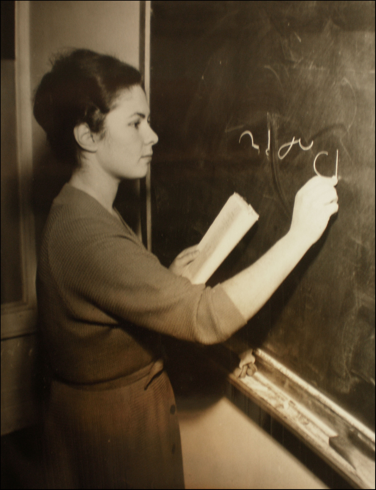

Zapewne nie wszyscy wiedzą, że Egipt był brytyjskim protektoratem, nie
zaś zwykłą kolonią. Posiadał swojego króla. Ów nazywał się Faruk, tak samo
jak Freddie Mercury. Podobno był bardzo lubiany. I kochał swoją
najstarszą córkę, która urodziła się do wtóru salw armatnich. Niestety,
dokonał złego wyboru politycznego i wsparł nazistów, przez co w 1942
roku został zmuszony przez Brytyjczyków do abdykacji. Nieciekawy klimat
wokół dynastii skłonił w końcu byłego króla do emigracji, więc w 1952
roku z całą rodziną zapakował się na jacht i popłynął do Włoch. Jego
najstarsza córka, Feriala, miała wtedy 13 lat.  
Zamieszkali w Rzymie. Księżniczka Feriala dostała od ojca pozwolenie na
pracę nauczycielki w szkole dla sekretarek w Lozannie - pod warunkiem,
że nie zdradzi swojego pochodzenia.

Nauczała tam m.in. stenografii. Do końca wiodła życie skromne i na
uboczu, oddana rodzinie, nie ujawniając swojej królewskiej krwi, o ile
to nie było konieczne. Zmarła w 2009 roku.
