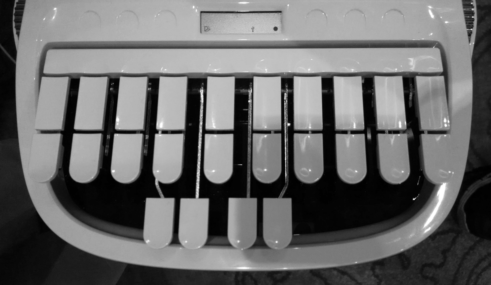
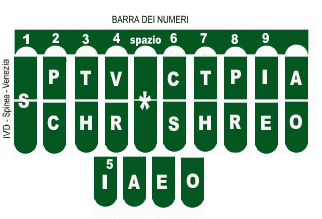
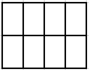
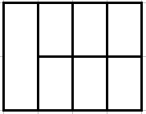
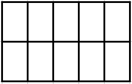
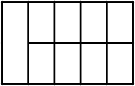

W poprzednim wpisie zadałem doniosłe pytanie: "[Stenotypia - ale
jaka?](../2011-07-16_stenotypia-ale-jaka/)". Dziś, z perspektywy miesiąca,
czyli czasu (krótkiego, ale jednak) muszę nieskromnie przyznać, że było
to znakomicie postawione pytanie.

Na końcu tamtegoż wpisu ukonkretyzowałem to przedwstępnie do problemu,
czy istniejące już urządzenia odpowiadać będą specyfice polskiej
stenografii? Dziś, po pewnej liczbie testów, wiem, że - niestety nie.
Konkretnie, z żalem prawdziwym, muszę to powiedzieć o maszynach
amerykańskich, tj. o amerykańskim układzie klawiatury. A czemuż to,
zapytacie? A temuż, że na przeszkodzie stoi matematyka, konkretnie
kombinatoryka. Amerykański układ klawiatury, zwany onegdaj (a nawet
nieco wcześniej) Stenotype, składa się z trzech sekcji:

LEWA - inicjalna, jak mówią Amerykanie, fachowo trzeba by ją nazwać
**nagłosową**, bo odpowiada za spółgłoski inicjujące sylabę i wyraz.
Składa się z ośmiu klawiszy w dwóch rzędach po cztery.

ŚRODKOWA - znajdująca się niżej i obsługiwana przez kciuki, składająca
się z czterech klawiszy sekcja odpowiadająca za samogłoski, czy też
śródgłos sylaby. Czyli sekcja **śródgłosowa**.

PRAWA - finalna, jak mówią Amerykanie, fachowo nazwać wypada ją
**wygłosową**, bo odpowiada za spółgłoski finalizujące sylabę i wyraz.
Składa się z dziesięciu klawiszy w dwóch rzędach po pięć.

W wersji włoskiej (czy też romańskiej, bo ten sam układ używany jest też
do hiszpańskiego, portugalski ma własną mapę klawiatury) układ ten uległ
pewnej komplikacji, tj. w sekcji wygłosowej części klawiszy (sztuk 4,
słownie: cztery) nadano wartość samogłosek. Przyczyny powinny być
oczywiste: więcej 
[otwartych sylab](http://pl.wikipedia.org/wiki/Sylaba), więcej wyrazów
wielosylabowych, więcej form gramatycznych każe stenografom poszukiwać
możliwości wyklepania większej liczby sylab za jednym akordem, czyli
jednoczesnym, pojedynczym naciśnięciem sekwencji klawiszy. W końcu to
stenografia, a nie szkółka niedzielna.

Jednakowoż, albowiem, ponieważ, sądzę, że do języka polskiego
amerykański układ klawiatury nie będzie pasował. A dlaczego? Jak
rzekłem, kombinatoryka. Na razie w badaniach zatrzymałem się na
nagłosowej części sylaby polskiej i o nagłosowej części klawiatury
zamiaruję tu mówić. Dzięki skryptom No-qanka i swoim wyszło mi, że grup
spółgłoskowych, bez rozdzielania na etymologicznie sensowne składniki, a
po prostu zlepków spółgłosek jest w języku polskim około 400. Około -
bowiem język jest wciąż żywy i wciąż adaptuje i tworzy nowe słowa i
formy. Co kilka lat temu było wyrazem obcym, dziś jest tylko
obcobrzmiącym, podlega odmianie i zostało dołączone do narodowego
dziedzictwa. Grupy spółgłoskowe nagłosowe to wszelkiego rodzaju
kombinacje, od prostych, jak ***K (kat), T (tok), B (bat), W (wał)***, 
przez trudniejsze ***KR (krata), TR (trup), BR (brak) WR (wrak), WZ
(wzajem), KRZ (krzyż), TRZ (trzeci), BRZ (brzeg)***, po zupełnie
trudne ***KRZT/KSZT (krztusić się, kształcić), WZN (wznosić), WZR (wzrok), PRZT (prztyczek), PSTR (pstro), WSTRZ (wstrzyknąć, wstrzymać)***.

Ile klawiszy liczy amerykańska sekcja nagłosowa (patrz wyżej)? 8
(słownie: osiem) w dwóch rzędach po 4. W rzeczywistości jest ich
zaledwie 7 (słownie: siedem), bo skrajne S składa się z dwóch klawiszy,
zamiast jednego - tylko w celach estetycznych. Odwołajmy się zatem do
kombinatoryki i zadajmy pytanie, ile kombinacji-akordów z od jednego do
czterech palców można wybić na tym układzie, zakładając, że można
naciskać też po dwa klawisze równocześnie?

Jeżeli te wyliczenia są błędne, proszę, niech mnie ktoś poprawi.

Dla 8 klawiszy i 4 palców:

(8!)/(1!\*(8-1)!)+(8!)/(2!\*(8-2)!)+(8!)/(3!\*(8-3)!)+(8!)/(4!\*(8-4)!)+(8!)/(5!\*(8-5)!)+(8!)/(6!\*(8-6)!)+(8!)/(7!\*(8-7)!)+(8!)/(8!\*(8-8)!)
= **255**

Jako się rzekło, w rzeczywistości jest to 7 klawiszy i 4 palce:

(7!)/(1!\*(7-1)!)+(7!)/(2!\*(7-2)!)+(7!)/(3!\*(7-3)!)+(7!)/(4!\*(7-4)!)+(7!)/(5!\*(7-5)!)+(7!)/(6!\*(7-6)!)+(7!)/(7!\*(7-7)!)+(7!)/(7!\*(7-7)!)
= **128**

Prawie dwukrotnie mniej. Ale zaledwie trzykrotnie więcej, niż wynosi
liczba głosek w języku polskim. W ogólności. 

Czyli jeszcze mniej. A, jak powiedziałem wyżej, potrzebujemy co najmniej 400 kombinacji.

Zatem spróbujmy z 10 klawiszami po 5 rzędzie,
zakładając, że na raz będziemy naciskać najwyżej 8 klawiszy:

(10!)/(1!\*(10-1)!)+(10!)/(2!\*(10-2)!)+(10!)/(3!\*(10-3)!)+(10!)/(4!\*(10-4)!)+(10!)/(5!\*(10-5)!)+(10!)/(6!\*(10-6)!)+(10!)/(7!\*(10-7)!)+(10!)/(8!\*(10-8)!)
= **1 012**

Tu mamy jakiś zapas. Jeżeli założymy, że poniżamy mały paluszek i
używamy go jak najrzadziej, to kombinacji w zapasie i tak pozostaje
**847**. A jeżeli uznamy, że mały paluszek jest niepełnosprawny i nie
odróżni dwóch klawiszy, i przydzielimy mu pojedynczy (ergo będziemy mieć
9 klawiszy, jak po lewej stronie w klawiaturze amerykańskiej), dalej
mamy do dyspozycji aż **510** kombinacji!

Powiecie (nie powiecie, to taki chwyt retoryczny), że można w
stenografii redukować grupy spółgłoskowe do ich wspólnej reprezentacji,
jeżeli nie powoduje to problemu z odczytem (w tym wypadku np. komputer
nie powinien mieć takich wątpliwości, na przykład przy pomocy
rozbudowanego słownika, w którym konfliktowe wyrazy zostałyby zapisane w całości). Mam tu na myśli np. 

MR i MRZ/MŻ: mrówka, mżawka, mruk, umrzyk, mrągowo, mrozy, mrzeżyno etc. 

Konflikt **raczej** się nie pojawi. Ale popatrzmy wyżej. Jeżeli komplet grup
spółgłoskowych nagłosowych wynosi np. 400, to trzeba by dla połowy z
nich znaleźć niekonfliktujące pary (trójkąty lub czworokąty też mogą
być) - bardzo wątpię, żeby się to udało. Co prawda wiele z tych nagłosów
występuje bardzo rzadko, np. 

MDL - mdli, MGL - mgliście, MGŁ - mgła, MKN - mknie. 

Tych bardziej rozbudowanych jest ponad setka, czyli całkiem
sporo, ale dla porządku w umyśle trzeba przecież znaleźć dla nich pary
zgodnie z jakąś regułą, a nie po prostu na pamięć. Mam wątpliwości, czy
redukcja w takiej skali nie sprawiłaby, że ostatecznie CAT (computer
aided transcription) nie sprowadziłoby się do prostego dopasowywania
**wszystkich** wklepanych akordów do wyrazów w słowniku. Oznaczałoby to
znowuż konieczność wygenerowania słownika na kilkaset tysięcy, o ile nie
kilka milionów słów.

Weźmy jako przykład takie oto grupy:

**WZ** → **WZG** → **WZGL**

WZ = wzajem, wzór (ergo: wzur), wzejście, wzorem itp.

WZG = wzgarda, wzgórza itp.

WZGL = wzgląd, względnie itp.

Wydaje się, że *WZGL* obsługuje tylko słowo *wzgląd* i pochodne od
niego. Zredukujmy zatem *WZGL* do *WZG*:

WZ = wzajem, wzór (ergo: wzur), wzejście, wzorem itp.

WZG = wzgarda, wzgórza itp. oraz **wzgąd, wzgędnie**...

Nie ma pomyłki. Pójdźmy dalej i zredukujmy *WZG* do *WZ*:

WZ = wzajem, wzór (ergo: wzur), wzejście, wzorem itp. oraz
**wzarda**, **wzórza**, oraz ***wząd***, ***wzędnie***...

Dało radę? Dało. Benedyktyńska robota, automagiem tego się nie załatwi
inaczej, jak w drodze eksperymentu. Warto zbadać ten odcinek, a nuż,
widelec...

O wiele łatwiej jednak, i dla piszącego, i dla komputera, jeżeli
powstaną jasne w użyciu akordy dla grup spółgłoskowych i samogłosek,
które w toku pisania będzie można sklejać w sylaby i stopniowo robić to
coraz prędzej. Znaczy, tak mi się wydaje.

Znaczy, wydaje mi się, że lepiej, kiedy piszący będzie myślał, jak przy
odręcznych systemach stenograficznych, czyli, kiedy zechce napisać
*strzykwa*, jego umysł dokona translacji tego rodzaju:

**strzykwa** → **strzyk** / **fa** →
\[*i rozbija na ręce*\]
*LEWA*: **strz** *KCIUKI*: **y** *PRAWA*: **k**
\[*unieść ręce i znowu*\]
LEWA: **f** KCIUKI: **a**

I już.

Ale to stenografia, nie szkółka niedzielna, nie teatr i nie boisko. A
zatem trzeba będzie zbadać możliwość redukcji grup spółgłoskowych i
ewentualne utworzenie odpowiedniego słownika. Ot co.
