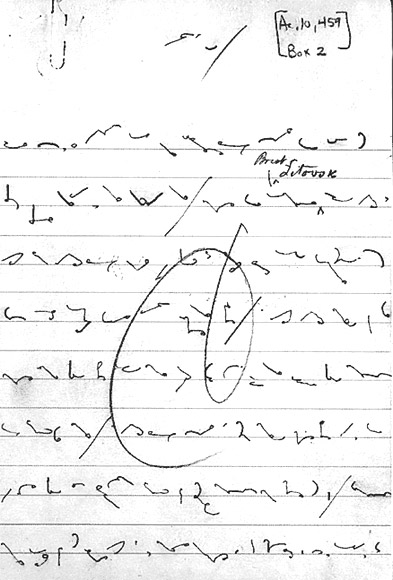
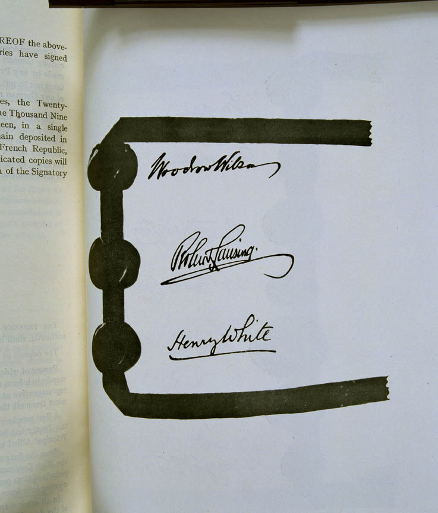

Dwudziesty ósmy prezydent USA, Woodrow Wilson, zasłużony dla polskiej
niepodległości polityk, znany był ze swojej stenograficznej pasji. Pisał
systemem Grahama, "ulepszoną" wersją stenografii Pitmana. Korzystał z
niej codziennie w prywatnych notatkach. Opanował tę sztukę jeszcze na
studiach i wtedy też zamówił sygnet z wyrzeźbionym w kamieniu imieniem i
nazwiskiem zapisanym stenograficznie. Już jako prezydent zatrudniał w
swoim biurze najlepszych stenografów w kraju - zwycięzców konkursów
szybkiego pisania.

<!--  [{width="216" height="320"}](jb_reform_wilson_3_e.jpg)

Prawdopodobnie przemówienie dotyczące 14 punktów Wilsona
-->



W styczniu 1918 roku przedstawił w Kongresie USA cele, jakie Stany
Zjednoczone winny zrealizować przystępując do I Wojny Światowej. Tezy te
znane są dziś jako 
[14 punktów Wilsona](https://pl.wikipedia.org/wiki/Czterna%C5%9Bcie_punkt%C3%B3w_Wilsona)
i stały się podstawą 
[traktatu wersalskiego](https://pl.wikipedia.org/wiki/Traktat_wersalski). Mało kto,
a właściwie nikt nie jest świadom ciekawostki, jaką wygrzebał pewien
pasjonat. Otóż Woodrow Wilson, użył pieczęci z sygnetu pod traktatem
wersalskim, najważniejszym dokumentem tamtego czasu.

<!--
  -------
  [{width="128" height="320"}](WilsonShorthandSeal.png)
  Powiększ, żeby przeczytać.
  -------
-->



Sensacji oczywiście nie przegapili dziennikarze. Wtedy nie było
telewizji, więc można było sobie pozwolić na wyszukiwanie naprawdę
ciekawych tematów.

<!--
  [{width="272" height="320"}](cth10_72_signature1_1919.jpg)

Jakaż szkoda, że na tej reprodukcji nie widać rysunku pieczęci Wilsona!
-->



Artykuł zwraca uwagę na ewenement: prezydent Wilson zapieczętował podpis
sygnetem ze swoim imieniem i nazwiskiem zapisanymi stenograficznie - to
była jego osobista, prywatna pieczęć. A miał przecież na stanie również
swoją pieczęć urzędową, państwową, której powinien był użyć. Czy
zaznaczał w ten sposób fakt, że Kongres USA odrzucił traktat i właściwie
podpisywał się pod nim nie w pełni reprezentując Stany Zjednoczone?
Artykuł z epoki wyjaśnia to inaczej. Otóż jest to pozostałość po czasach
średniowiecza, urzędowe pieczęci składano na końcu dokumentu, ale
ratyfikują traktat osoby jako takie i winny pieczętować się swoimi
osobistymi znakami.  

Cóż, stworzył w ten sposób precedens. 26 lat później generał MacArthur
do ostatniego podpisu pod aktem kapitulacji Japonii użył pióra
należącego do żony, zamiast podawanego mu przez adiutanta służbowego
pióra Marynarki. Ośmielam się sądzić, że jego intencje jednak nie były
aż tak eleganckie, jak byłego prezydenta. 35 lat później Lech Wałęsa
podpisał Porozumienia Sierpniowe gigantycznym, czerwonym długopisem,
który podobno należał do jego syna. Jego też nie podejrzewam go o
eleganckie intencje.
