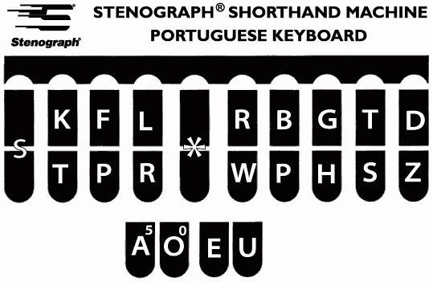
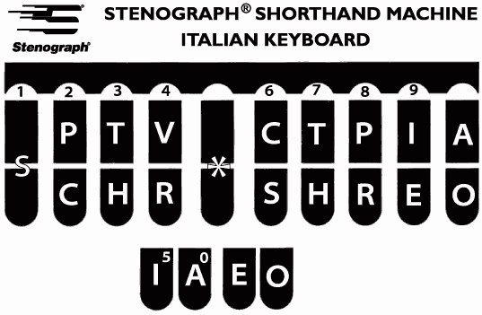
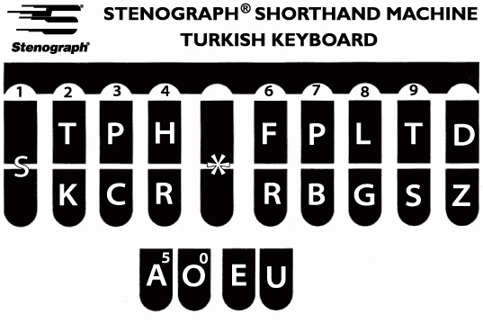
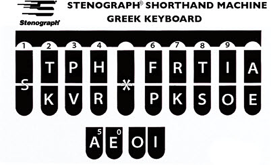
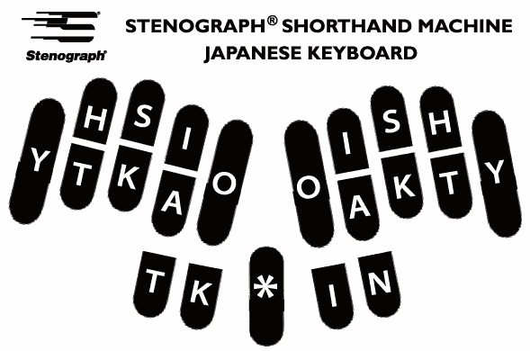
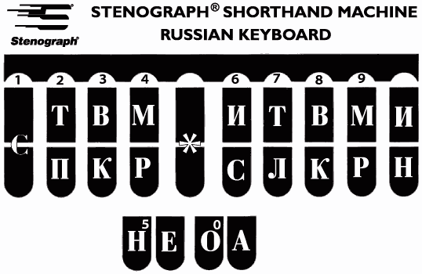
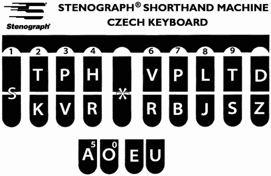
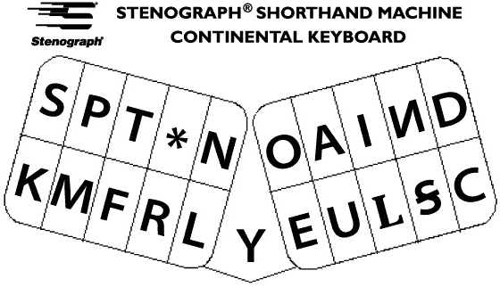
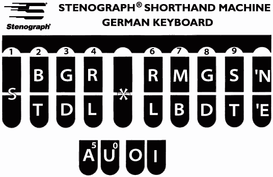
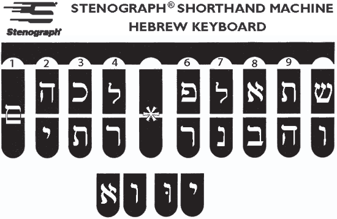

Wpis ten traktuję bardziej jako własne archiwum do prac. Okazuje się, że
firma *Stenograph*  wyprodukowała klawiatury dla różnych języków i
narodów. O ile ukazana matematyka w poprzednim wpisie wciąż mnie trzyma,
to jednak do celów naukowych, pomocowych i ściągactwa podpowiedziowego
zamierzam przyjrzeć się układom, w końcu wygłosowa część tych klawiatur
ma 10 klawiszy.

 <!--
{width="320" height="208"}](key_portuguese.gif)
  Klawiatura portugalska
-->



Fakt, że Włosi i Portugalczycy mają odmienne mapy klawiszy dowodzi, jak
nawet niewielkie różnice pomiędzy językami mogą wpłynąć na skuteczność
przekładu narzędzi stenograficznych z jednego języka na drugi.  

<!--
{width="320" height="209"}](key_italian.gif)
  Klawiatura włoska
-->



<!--
{width="320" height="213"}](key_turkish.gif)
  Klawiatura turecka
-->



Jak przypuszczam, turecki jest tak odległy od polskiego, że ta mapa
zapewne niewiele mi pomoże.  

<!--
{width="320" height="194"}](key_cyprus-greek.gif)
  Klawiatura grecka
-->



Doprawdy, jeżeli jest język, którego nie znam w sposób doskonały, to
jest nim greka (parafraza księcia Wellingtona).

<!--
{width="320" height="211"}](key_japanese.gif)
  Klawiatura japońska
-->



Dla bogatych Japończyków to nawet można było wyprodukować wersję
ergonomiczną i z innym układem klawiatury.

<!--
{width="320" height="208"}](key_russian.gif)
  Klawiatura rosyjska
-->



Oho! I oto jest coś, co może się przydać w badaniach. Klawiatura
rosyjska powyżej i czeska poniżej. Warto tutaj przytoczyć filmik:



W tym miejscu ośmielę się zdementować plotki, jakoby Polacy stali
kulturowo wyżej od Rosjan.

<!--
{width="320" height="208"}](key_czech.gif)
  Klawiatura czeska
-->



Klawiatura czeska jest przykładem, jak z różnych powodów pojawiają się
rozliczne rozwiązania tego samego problemu. Już w latach 50-60-tych
niejaki Jarosław Vratny opracował klawiaturę dla języka czeskiego:

<!--

{width="320"
height="185"}](klawisze-czeskie.png)
-->



Może coś było pomiędzy nimi, nie miałem okazji się dowiedzieć. Tak czy
owak przedstawił to odpowiednim władzom, że to nasze, rodzime, czeskie,
działa, co pokazał klepiąc osobiście... Ale, jak to w komunie, nikomu
nie chciało się tym zająć na serio. Podobnie u nas, przez 40 lat dużo
gadano o stenotypii, ale nic w tym kierunku nie zrobiono.

<!--
{width="320" height="184"}](key_continental.gif)
  Klawiatura francuska (Grandjean)
-->



Klawiatura kontynentalna, jak to wyzłośliwiają się Anglosasi, ma też
dwie sekcje po 10 klawiszy - znaczy, można.

<!--
{width="320" height="208"}](key_german.gif)
  Klawiatura niemiecka
-->



Od paru lat również Niemcy cieszą się amerykańskimi maszynami do
stenografowania. Ten układ o tyle może się przydać, że język polski ma
pewne związki historyczne z niemieckim. Nie na wiele się to zda.

<!--
{width="320" height="208"}](key_hebrew.gif)
  Klawiatura hebrajska
-->



I oto przykład, że jak się chce, to można. Pismo hebrajskie, pisane od
prawej do lewej, zaadaptowano do klawiatury nie przenosząc układu na
odbicie lustrzane.
