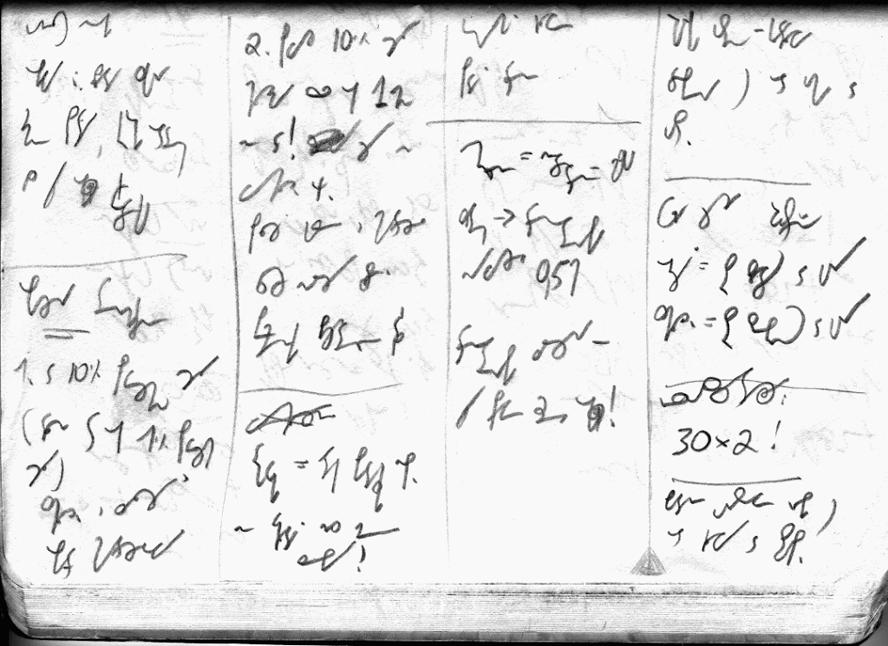

W poradach dla początkujących stenografów strawestowałem onegdaj (a może
nieco wcześniej) [artykuł starego
praktyka](../2011-06-03_porady-dla-adeptow-stenografii/). Stało w nim mianowicie, iż (cytuję):

*Zamień pisanie pismem długim na stenografię*. Stałe używanie stenografii do
celów osobistych jest najlepszą metodą rozwijania umiejętności sprawnego
notowania. Uczeń stenografii, który zastosuje metodę we wszystkich
codziennych notatkach, listach zakupów, marginaliach, zyska kolejne
godziny ćwiczeń i wydatnie skróci czas potrzebny do osiągnięcia
biegłości w szybkopisaniu.(koniec cytatu)

Otóż
i sam postanowiłem (już dawno) zastosować się do tej rady. I co? I teraz
trudno mi czasem wyobrazić sobie, że mógłbym wrócić do tych nieporadnych
literek, którymi tak długo trzeba skrobać "2 kg marchewki, 2 chleby, 3
masła, 4kg ziemni, żer sółty...". Podręczne notatki stenograficznie
kreśli się niejako mimochodem, prawie bez patrzenia na kartkę. Co nie
znaczy, że nie wymaga to pewnej koncentracji, jednak prostsze znaczki
tym razem pozwalają nawet rzucać na boki spojrzenia (czasem jest na co
popatrzeć) i nie przerywać pisania.

Ale
o czym to ja?

Oto
moje notatki ze szkolenia z przedratownictwa niemedycznego. Stroniczka -
wystarczy, żeby się wczuć. Można zobaczyć, co spontanicznie się działo,
kiedy zapisywałem niewygodne słowa - nie starałem się szukać skrótów.
Tak naprawdę, to na razie skrótowanie włącza mi się dopiero po pierwszej
godzinie usilnego notowania, o czym miałem się okazję przekonać tego
lata, gdy notowałem trwający 4 godziny wykład. Po prostu - chciałem
zdążyć.

A
co pisze (czyli jest napisane) na powyższej stroniczce? Muszę
przeczytać, żeby nie było lipy, że to takie oszukane znaczki, a tak
naprawdę jakby dwulatek tatę naśladował? Oto i przekład z błędami i
dzieleniem na linijki, żeby można się było zorientować, co
gdzie:

/KOLUMNA 1/

objawy: blada skóra

zimne poty, krótki oddech

bo przy okazji krwotoku

-------------------

obażenia termiczne

1. do 10% powierzchni ciała

(dłoń to ok 1% powierzchni ciała)

schłodzić i założyć

opatr hydrożelowy

/KOLUMNA 2/

2. powyż 10% ciała

chłodzimy przez ok 1 min

nie wc! żeby nie 

wychłodzić org.

położyć gazę i hydrożel

zawsze należy zdjąć

pierścionki biżuterię itp

----------------

xxxx

drgawki = atak padaczki np.

nie wkładać nic między 

zęby!

/KOLUMNA 3/

trzymać głowę

podać tlen

----------------

omdlenie = niedotlenienie
mózgu

zatem -&gt; tlenoterapia

nawyżej 0,5h

tlenoterapia zalecana jest

przy prawie każdej okazji!

 
/KOLUMNA 4/
 

rurka ustno-gardłowa

dobiera się od ucha do

ust.

--------------

folia życia dwustronna

ogrzać = str złotą do góry

schłodzić = str srebrną do
góry

-------------

resuscytacja:

30x2!

---------------

badanie urazowe robi się 

od głowy do stóp

 
/KONIEC/
 
Przez 4 godziny szkolenia takich stroniczek,
bez zmęczenia ręki i wielkiego problemu uzbierało się 6 (słownie:
sześć).

