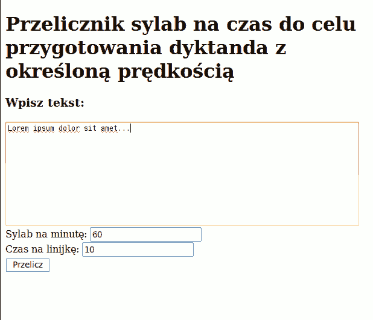

Wreszcie. No-qanek mi o tym przypominał już chyba od roku. Wreszcie
sobie przypomniałem we w miarę odpowiedniej chwili, zebrałem się i
opublikowałem.

[Tak powstała strona, na której będę zamieszczał nagrania czytanek z różnymi prędkościami.](../../repo/dyktanda/)
Nie ma lepszego treningu, niż stenografowanie pod dyktando. Warto każdą
czytankę powtarzać tak długo, aż z zupełną swobodą będzie można zapisać
jej treść bez opóźnień i zawahań.

[Zapraszam do korzystania **← TUTAJ**](../../repo/)

Obym nie zapomniał. Jeżeli ktoś z Was czuje choćby śladowy pociąg do
nagrywania swojego głosu i ma czasem chwilkę, aby pomóc, zapraszam do
tworzenia nowych czytanek. [Przysyłajcie je do
mnie](mailto:flamenco108@stenografia.pl?subject='nagrania'), zostaną
opublikowane na stronie, ku pożytkowi wszystkich. Sztuka jest dosyć
prosta. Podstawą liczenia czasu są sylaby. Nie potrzeba żadnego
wyrafinowanego sprzętu, wystarczy zegarek z sekundnikiem i [nasz
skrypt](http://stenografia.pl/skrypty/dyktando_sylaby.php).

1.  Wybieracie tekst, np. taki, który szczególnie cenicie i uważacie, że
    warto, aby inni się z nim zapoznali.
2.  [**Wchodzicie na stronę skryptu**](../../skrypty/dyktando_sylaby.php)
    i wklejacie wybrany tekst do dużego okienka.
3.  W okienku "**Sylab na minutę**" wybieracie prędkość.
4.  W okienku "**Czas na linijkę**" wybieracie podziałkę, z jaką
    wygodnie Wam będzie czytać. Czyli co ile sylab będzie wstawiany
    znacznik czasu (trzeba to wstawić).

Znacznik czasu wskazuje liczbę sekund, które muszą upłynąć, zanim
zaczniecie czytać dalej. Po kilku próbach przestanie to sprawiać
jakikolwiek kłopot.

Po naciśnięciu przycisku **"Przelicz**" wyświetli się tekst przygotowany
do odczytu z określoną prędkością. Jednocześnie na górze dowiecie się,
ile czasu mniej więcej trwać będzie dyktando, z ilu się będzie składać
sylab i słów. Warto te informacje przeczytać, aby słuchacz wiedział, z
czym pracuje, zanim powiecie "3... 2... 1... 0 - START" i zaczniecie
dyktować.

Jednocześnie zapraszam do tworzenia na początek czytanek z bardzo małymi
prędkościami: 20, 25, 30, 35 sylab na minutę.

Miłej zabawy!
