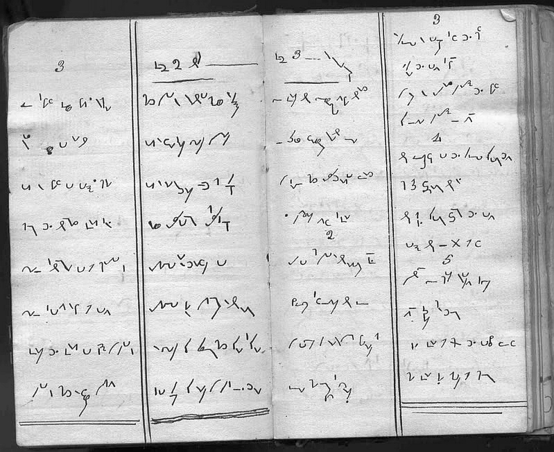

Czy stenografia stała się już martwą sztuką? Kto wie? Z poniżej
zamieszczonego tłumaczenia-trawestacji
[artykułu](http://www.associatedcontent.com/article/395545/gregg_shorthand_not_a_dead_skill.html?cat=3),
wynika, że jeszcze nie całkiem. I nawet nie to jest najbardziej
interesujące, że mogą wciąż być firmy i instytucje zainteresowane
pracownikami potrafiącymi stenografować, ale... najpierw przeczytajcie
artykuł.

> Jeszcze w latach 80-tych XX wieku system
> Gregga, czy Pitmana wciąż były nauczane niemalże w każdym liceum w
> USA. W latach 90-tych, wraz z nadejściem komputerów osobistych wiele
> szkół zaprzestało oferowania kursów stenografii, sądząc, że uczniowie
> nie będą zainteresowani rozwijaniem takich umiejętności. Niestety, w
> ten sposób wiele osób straciło możliwość znalezienia ciekawej pracy.
> Firmy w całym USA, łącznie z USPS - pocztą amerykańską, potrzebują
> pracowników potrafiących stenografować z prędkością 80 słów na minutę.
> Jeżeli wciąż tego wymagają, dlaczego szkoły nie chcą uczyć
> stenografii?

> W dzisiejszych czasach mamy dwie drogi
> do wyboru. Kto potrzebuje nauczyć się stenografii, może zapisać się na
> kursy on-line, przez Internet - trudne, ale możliwe. Może też
> spróbować opanować sztukę przy pomocy zakupionych podręczników. Oto
> tajemnica on-line'owej metody nauczania: musisz być oddany nauce.
> Zamiast polegać na nauczycielu, który wciąż zagląda przez ramię,
> musisz wziąć odpowiedzialność za postępy, codzienne ćwiczenia,
> skanowanie wypracowań i wysyłanie do internetowego nauczyciela,
> zadawanie pytań przez email, a w tym celu także posiadanie komputera
> podłączonego do sieci i mogącego odtworzyć nagranie z dyktandem.
> Opuścić jeden dzień ćwiczeń jest łatwo, ale może to kosztować znacznie
> dłuższym czasem potrzebnym na nadrobienie zaległości. Raz zaniedbana
> lekcja łatwo staje się nawykiem wagarowania.

> Stenografia polega na systemowym
> rozkładaniu słów na sylaby i głoski, a następnie pisaniu prostych
> znaków dla oddania tych dźwięków. Słowo "fotografia" mogłoby się
> składać z symboli "f"+"o"+"t"+"o" i znacznika końcówki "grafia".
> Oprócz licznych symboli dla głosek, grup spółgłoskowych i sylab mamy w
> stenografii również tak zwane "znaczniki", czyli stałe skróty
> przyspieszające pisanie. Znaczniki powstają dla powszechnych,
> najczęściej używanych pojęć, jak np. "albo", "przed", "przez", "pan",
> "pani" itp. Połączenie alfabetu stenograficznego i znaczników pozwala
> pisać z prędkością nawet 150 słów na minutę. A wszystko, co jest do
> tego potrzebne, to pisak i papier - i oto mamy przydatną w pracy
> umiejętność, odporną na wirusy komputerowe i zaniki napięcia. Oto
> dlaczego wiele firm wciąż preferuje zatrudnianie pracowników, którzy
> potrafią szybko notować przebieg zebrania, a dopiero później dokonać
> transkrybcji notatek.

> Choć w większości szkół już zaprzestano
> prowadzenia kursów stenografii, zachowało się jeszcze kilka w trybie
> wieczorowym - o ile szkoła zdoła znaleźć mieszkającego w pobliżu
> wykwalifikowanego nauczyciela. Firma Universal Class oferuje kurs
> on-line, a wiem o tym, bo przez cztery lata sama tam uczyłam. Do
> sukcesów mogę zaliczyć kobietę, która ćwiczyła godzinę dziennie, a
> następnie zdała państwowy egzamin ze stenografii i podjęła pracę w
> samorządzie lokalnym. Wielu próbowało i przegrało, ponieważ nie
> zdołali przyzwyczaić się do reżymu codziennej praktyki, choćby przez
> pół godziny, nawet w weekendy. Ci, którzy zakończyli kurs z sukcesem,
> wspominali, że to była męka, walka z samym sobą i czasem, ale
> sprawiała wielką satysfakcję.

> Czy stenografia naprawdę już umarła? Nie
> sądzę. Otrzymywałam liczne prośby, od ludzi z całego świata, o
> przetłumaczenie notatek i pamiętników zmarłych przodków, pisanych
> stenograficznie. Widziałam wiele tekstów, od najbardziej osobistych
> wspomnień romansów, po zwykłe zeszyty z dawnych kursów
> stenografii.

> Jeżeli chcesz się nauczyć stenografii,
> szczerze doradzam po prostu zaopatrzenie się w podręcznik i
> poświęcenie każdego dnia dłuższej chwili na naukę. Zapamiętanie
> wszystkich tych tajemniczych symboli jest kluczem do sukcesu!

<!--

  [Stary pamiętnik z XVIII wieku?](http://answers.google.com/answers/threadview/id/776727.html)
-->


... Otóż to: **archeostenografia**. U ilu z Was zalegają gdzieś na
strychu zeszyty zapisane tajemniczymi wężykami? Może nawet przez chwilę
zainteresowaliście się, czy nie dałoby się tego odcyfrować? Otóż  w
większości wypadków - da się. Trzeba tylko umieć. Niektórzy potrafią.
