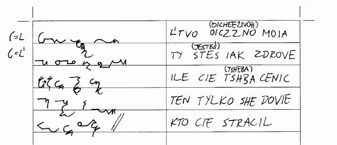

Minął dokładnie rok od opublikowania pierwszego wpisu na tym blogu, pora
więc na małe podsumowanie.

[Stronę główną](https://www.stenografia.pl/), od dnia jej przenosin na
nową platformę, czyli od16 maja 2011 roku odwiedziło prawie 1500
internautów. W dniach od 10 sierpnia 2010 do 15 maja 2011, czyli starą
stronę na platformie Googla odwiedziło ponad 3800 unikalnych
odwiedzających, którzy spędzili na moich stronach średnio od 2 do 6
minut, znakiem tego wielu nie tylko tam wpadło, ale i coś przeczytało. W
obu wypadkach stosunek nowych i pojedynczych odwiedzin do wielokrotnych
wynosi 65 do 35, czyli razem daje to prawie 4000 internautów, którzy
przynajmniej raz odwiedzili tę stronę, co daje, o dziwo, całkiem sporo,
bo prawie 100 osób dziennie. To obliczenie wydaje się cokolwiek
fałszywe, bo z drugiej strony system analiz systematycznie pokazywał, że
na te strony wchodzi około 30-40 osób dziennie. Ale może w sumie tyle by
się nabiło - blog i strona główna? Zatem podzielmy to na pół. I tak
wynik jest całkiem niezły: 2000 (słownie: dwa tysiące).
Tyle wskazuje [system analiz Google](http://www.google.com/analytics/).

Znaczy, o tyle osób wzrosła liczba mających świadomość, że stenografia,
że co to jest, z kim i o co. Mogę śmiało założyć, że podwoiłem liczbę
świadomych polskiej stenografii. No, śmiało: **to jest sukces**.

Opublikowałem **134 wpisy blogowe**. Łącznie z tym. Od pewnego momentu,
konkretnie od opublikowania wspomnień o [konkursie na nowy jednolity
system stenografii
polskiej](http://blog.stenografia.pl/search/label/alfabety-systemy?updated-max=2011-01-22T17%3A42%3A00%2B01%3A00&max-results=20),
starałem się trzymać reżim jednego wpisu na dwa dni. Udało mi się tylko
połowicznie.

Zdigitalizowałem przynajmniej 15 polskich książek na temat stenografii.
Skromnie licząc - wzrost o 200%. Co to znaczy skromnie? To znaczy, że
pierwsza książka to wzrost o 100%. Druga - już o 50%, bo pierwsza plus
druga dają nowe 100%. Czyli trzecia to wzrost o 25%, i tak dalej:

| 1  | pierwsza   | 100,00%         |
|----|------------|-----------------|
| 2  | druga      | 50,00%          |
| 3  | trzecia    | 25,00%          |
| 4  | czwarta    | 12,50%          |
| 5  | piąta      | 6,25%           |
| 6  | szósta     | 3,13%           |
| 7  | siódma     | 1,56%           |
| 8  | ósma       | 0,78%           |
| 9  | dziewiąta  | 0,39%           |
| 10 | dziesiąta  | 0,20%           |
| 11 | jedenasta  | 0,10%           |
| 12 | dwunasta   | 0,05%           |
| 13 | trzynasta  | 0,02%           |
| 14 | czternasta | 0,01%           |
| 15 | piętnasta  | 0,01%           |
|    | **SUMA:**  | **199,99390%**  |

Czyli "prawie" 200%. Limes tam się znajduje... ;-)

Książki polskie o stenografii opublikowałem na 3 serwisach publicznych,
w celu zarchiwizowania ich i dania dostępu każdemu, kto tego zechce.
Jeden 
[to mój osobisty](https://stenografia.pl/repo/),
drugi [to www.chomikuj.pl](https://chomikuj.pl/flamenco108/stenografia),
trzeci 
[to www.archive.org](https://www.archive.org/search.php?query=stenografia).

Tutaj, jak sądzę, wciąż nie powiedziałem ostatniego słowa.

Założyłem, a właściwie zamieniłem je w opis z prawdziwego zdarzenia,
hasło "**stenografia**" w polskiej
[Wikipedii](http://pl.wikipedia.org/wiki/Stenografia). 
To hasło, przynajmniej u mnie, pojawia się jako pierwsze w 
[wyszukiwarce Gugla](https://www.google.pl/search?aq=f&sourceid=chrome&ie=UTF-8&q=stenografia).

Moja strona główna za to awansowała na miejsce drugie i uważam, że to
całkiem dobre miejsce. Ten blog zajął miejsce trzecie. Ciekawe, czy to
tylko u mnie jest tak bogato, czy u innych również?

Wraz z No-qankiem opracowaliśmy 2,5 kompletnego systemu
stenograficznego. To znaczy, na początku pracowaliśmy razem, a później,
jak to w Polsce, nasze drogi się rozeszły (w języku poprawnych
politycznie programistów: sforkowały) i każdy zaczął realizować własne
idee. No-qanek pracował nad systemem geometrycznym, którego mocno
skrócone kompendium opublikował jako
[NQSS](../2011-05-19_nqss-ostatnia-wersja-dawniejszego-npss/).

Ja zatonąłem w ponownie przez siebie odkrytym świecie stenografii
kursywnej. Mój system przyjął ostatecznie nazwę SteMi, choć wcześniej
nazywał się np. SuchMir, albowiem powstał na bazie systemu Mirosława
Sucheckiego. Z tego Mirosława ostatecznie pozostało tylko tajemnicze
"*Mi*".

Prace nad systemem **Ste*Mi***  osiągnęły stan taki, że sam już piszę tym
systemem. Pracuję nad kompendium, czyli dokumentem systemowym, w którym
znajdą się wszystkie jego cechy, od tych koniecznych po oczywiste,
wynikające z podstawowych reguł - ale pokazane jako recepty. Pracy dużo,
ale też i mnie samemu system dzięki temu w głowie lepiej się układa.
Okazuje się, że parę rzeczy zapomniałem, niektóre uznałem za nieważne -
dokument systemowy te sprawy prostuje. Mam już 11 stron zapisanych
czcionką rozmiaru 10 - a wciąż jestem na początku pracy.**

**Wspomniałem wyżej o reżimie 2 dni
na 1 wpis.** Myślę, że tą oto rocznicową notką pozwolę sobie odejść od tej
dyscypliny, której i tak nie udało mi się utrzymać dłużej niż przez
połowę zadanego czasu. Pisanie notek blogowych wbrew pozorom jest
wyczerpujące - goni mnie czas, a przecież jest tyle ciekawych rzeczy do
zrobienia.

**Ucierpiała na tym moja praca
badawcza, tj. przekopywanie się przez pamiątki po 
[Władysławie Cybulskim](http://blog.stenografia.pl/search?q=cybulski).**

**Ucierpiały na tym moje plany
nakręcenia
[filmów inspiracyjnych wzorem stenografów z innych krajów](http://www.youtube.com/watch?v=o17Uu364yu8).**
Z własnego
doświadczenia wiem, że nic tak dobrze nie motywuje do nauki, jak
obejrzany na własne oczy przykład. W bardziej odległych planach była
także seria filmów instruktażowych nt. stenografii.

**Ucierpiała na tym moja praca nad
kompendium Ste*Mi.***

**Ucierpiała na tym nasza wspólna z No-qankiem praca nad stenotypią**
(oczywiście, znowu się sforkowaliśmy, ale mniejsza o to).
Ucierpiał na tym płodozmian. Tak dalej nie może być. To ma mi
sprawiać radość. A radość sprawia mi zajmowanie się to tym, to znowuż
tamtym, w tempie, które mi odpowiada i w takiejż intensywności.

A zatem postanowiłem, że będę zamieszczał notki blogowe jak
najczęściej - ale bez żadnej dyscypliny, żadnego rytmu. Będzie 
materiał - będą notki. Nie będę się jednak napinał, żeby koniecznie coś wrzucić.
To jednak cały czas jest tylko hobby i to bardzo, bardzo niszowe, bo
przeciętny Polak więcej wie (a w każdym razie tak mu się wydaje) o
tureckim tańcu brzucha, niż o polskiej stenografii.

Zmiany zatem nie będą drastyczne - po prostu autor prosi o litość.
I dziękuję z góry. Polecam się łaskawej lekturze w przyszłości.
