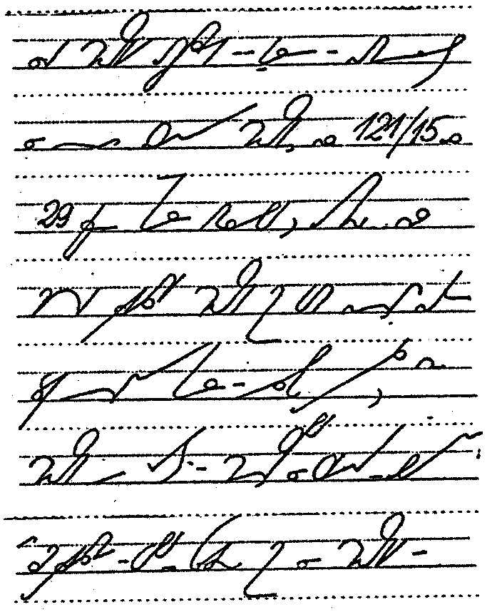

W konkurencji z tym tekstem:  
<http://www.asystentka.pl/pages/posts/czym-jest-stenotypia-i-stenografia-61.php>  
moje strony co jakiś czas przegrywają w hierarchii wyszukiwania po haśle
"stenografia". Z pewnością jest to godna konkurencja, ponieważ autorka
prezentuje doświadczenie z pierwszej ręki i nie szczędzi ostrzeżeń dla
zapaleńców.

Chciałbym tutaj zamieścić kilka zdań nie tyle polemiki, co może raczej
uzupełnienia:  
Autorka artykułu prezentuje stenografię jako sztukę arcytrudną, co jest
prawdą. Zwraca uwagę, że aby dojść do biegłości pozwalającej na bieżący
zapis mowy w języku polskim potrzeba lat ciężkiej pracy. To również jest
prawda. Dyscyplina dla osiągnięcia takiego poziomu musi być tytanowa,
żelazna nie wystarczy. Ale czy dziś rzeczywiście potrzebujemy zapisywać
***dokładnie*** bieżącą mowę? Moim zdaniem - nie. Stenografia wciąż może
być przydatna, jako uniwersalny przyspieszacz zapisu. W ciągu kilku -
już nie lat! - miesięcy zdyscyplinowanych ćwiczeń można dojść do
biegłości, która pozwoli **notować odręcznie** z prędkością, z jaką
doświadczona sekretarka (potrafiąca pisać bezwzrokowo) klepie w
klawiaturę. To ogromne osiągnięcie i bardzo przydatna umiejętność,
jeżeli rozważymy liczby:

-   maksymalna prędkość pisania pismem długim, którą zdołamy utrzymać
    przez krótki czas (kilka zdań), to najwyżej 60 sylab na minutę
    (spm), czyli ok. 20 słów na minutę (wpm). Zaznaczam, że prędkość tą
    można utrzymać tylko przez bardzo krótki czas,
-   prędkość klepania sekretarki to ok. 30-60 wpm, czyli ok. 60-120 spm,
    zależnie od doświadczenia,
-   standardowa prędkość, jakiej dziś wymaga się od absolwentów rocznego
    kursu stenografii na wydziałach dziennikarstwa uniwersytetów
    brytyjskich wynosi 80-100 wpm, czyli w przeliczeniu na nasze
    60-80 wpm.

Znakiem tego nawet podwojenie prędkości pisania to znaczące osiągnięcie
pozwalające na nie zagubienie żadnej istotnej treści notowanego wykładu,
a nawet zapisanie dygresji i anegdot. Do tego należy dodać, że **ręka
piszące pismem stenograficznym znacznie mniej się męczy**.

<!-- {width="163" height="200"}]({filename}/wp-images/uploads/2011/09/jssp.png) -->

<!--  JSSP -->

Autorka opisuje w artykule cechy tylko jednego systemu stenograficznego,
mianowicie [Jednolitego Systemu Stenografii Polskiej](https://pl.wikipedia.org/wiki/Stenografia#Jednolity_System_Stenografii_Polskiej).
Jest to znakomita próba stworzenia nowoczesnego systemu stenografii dla
języka polskiego. System ten spotkał się z krytyką zawodowych
stenografów - mianowicie parlamentarnych, mistrzów prędkości - że nie
tak doskonale pozwala na zapis bieżącej mowy, jak tradycyjny, bo
rządzący rynkiem [system Polińskiego](https://pl.wikipedia.org/wiki/Stenografia#Stenografia_J.C3.B3zefa_Poli.C5.84skiego).
Zwróćmy jednak uwagę na takie drobne fakty, iż dziś nie potrzebujemy tak
bardzo stenografii parlamentarnej, jak notatkowej, czyli nie kosmiczne
prędkości nas interesują, a możliwość wygodnego odczytu tych notatek - a
to nigdy nie zostało osądzone w przypadku JSSP. Po drugie, jest to
ostatni, wciąż nauczany
([www.ogrodowa.edu.pl](https://ogrodowa.edupage.org/)) system stenografii.
Na aukcjach internetowych wciąż dostępne są jego podręczniki. I mam
nadzieję, że jeden będzie dostępny także na tych stronach.

Wreszcie jej definicja stenotypii: jest to sztuka szybkiego
przepisywania stenogramu na literki, przy pomocy klawiatury. Oczywiście,
jest to definicja nieprawdziwa, która narodziła się gdzieś w głębinach
mrocznego socjalizmu, kiedy, być może, wyszło, że stenografowie nigdy
nie zdobędą funduszy na badania i zbudowanie polskiej klawiatury do
stenotypii. Bo stenotypia to to samo, co stenografia, ale z użyciem
klawiatury, czyli różni się przede wszystkim tym, że nie jest kursywna,
a drukowana. Tak to generalnie wygląda. A sztuka przepisania stenogramu
na literki - to cały czas jest stenografia i nic więcej. Bo stenogram
jest tylko środkiem do celu, jakim jest zapisanie, opracowanie i
przekazanie informacji. Dopóki stenograf notuje wyłącznie dla siebie,
nie ma takiej potrzeby, ale kiedy chce/musi się podzielić wiedzą - musi
dokonać transkrybcji stenogramu na tekst pismem długim, najczęściej przy
pomocy klawiatury komputera.

