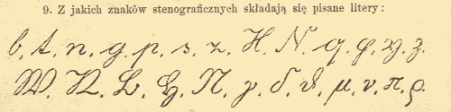
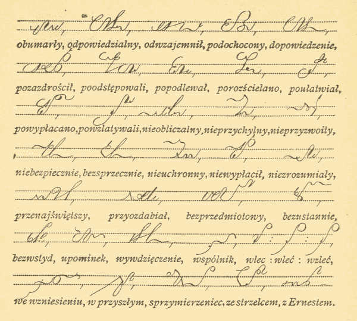

Dla lubiejących czytać podręczniki stenografii: opublikowałem kolejną
zdigitalizowaną książkę. Autorem jest Karol Czajkowski, wydana w 1908
roku. Podręcznik do systemu Polińskiego - ale zmodyfikowanego wg
widzimisię autora.

Karol Czajkowski ukończył Uniwersytet Lwowski na Wydziale Filozofii, co
uczyniło go matematykiem i fizykiem (tak! To były wszystko nauki
ścisłe!). Uczył w wielu gimnazjach i szkołach, a przy okazji również
kaligrafii i stenografii. Jego podręcznik chwalono za matematyczną
systematyczność, przejrzystość i logikę.

[Zapraszam do lektury](https://www.scribd.com/doc/68599898/Czajkowski-Nauka-Stenografii-Polskiej-Syst-ego).
Wkrótce także będzie się wyszukiwać na
[www.archive.org](https://www.archive.org/search.php?query=stenografia).
