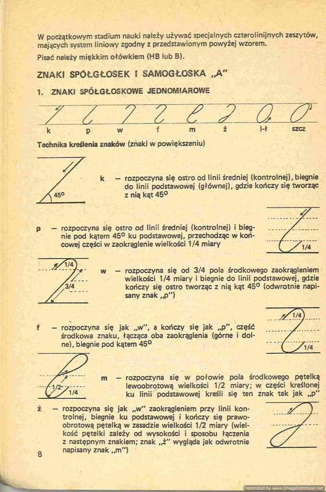
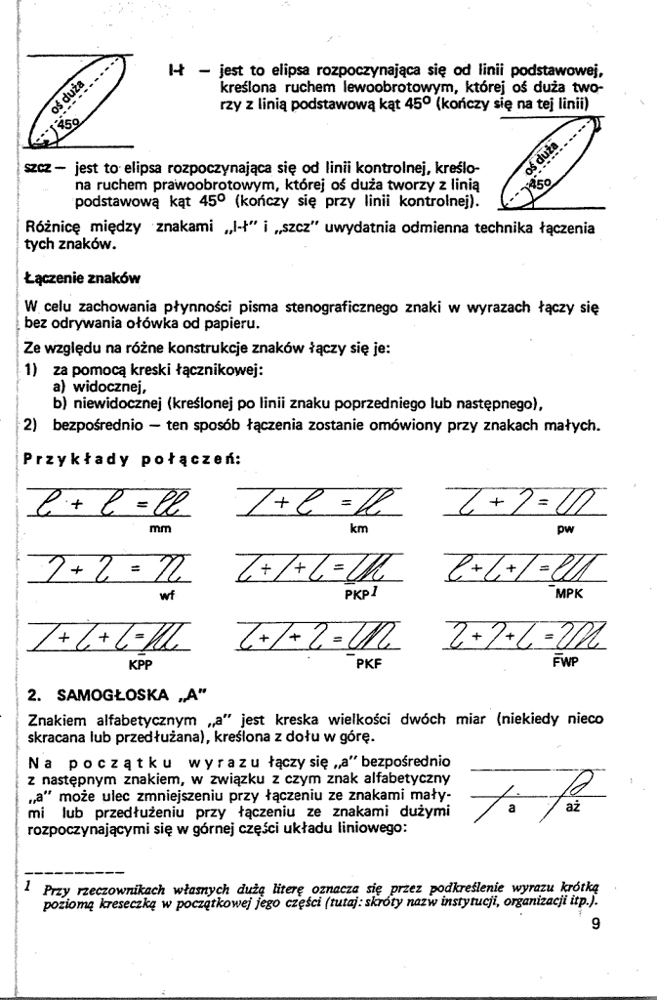
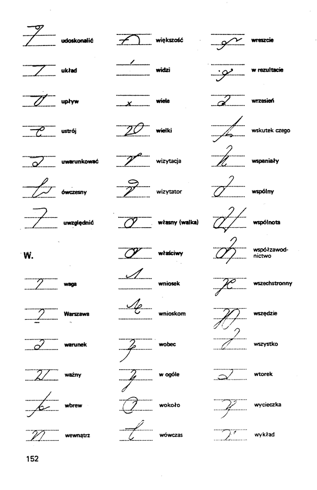
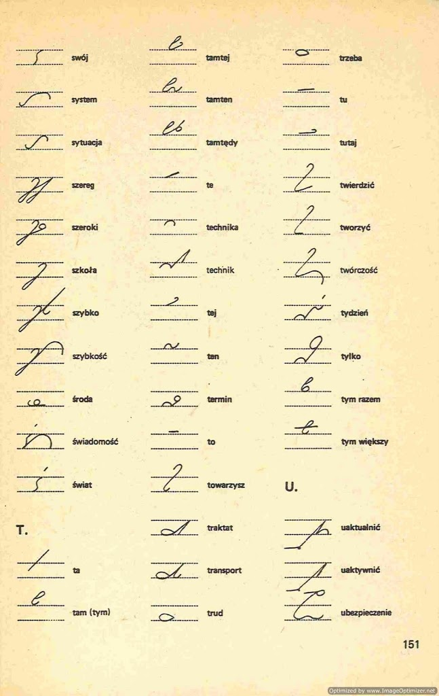

A
właściwie podręcznik do niego. Już jest.

Jak pisałem wcześniej, ubiegałem się o zgodę spadkobierców praw
autorskich do podręcznika do JSSP - i ją dostałem. W każdym razie od
domniemanych spadkobierców. To domniemanie wydaje się jednak być bardzo
bliskie pewności - to znaczy, wszelkie wątpliwości w tej materii
wyrazili właśnie oni, nie ja.

Wytęsknionych oczekiwaczy zapraszam na 
[**archive.org (wersja kolorowa,
ok. 145MB)**](https://www.archive.org/details/Stenografia1), lub
[**archive.org (wersja czarno-biała,
ok.10MB)**](https://www.archive.org/details/Stenografia1Bw) lub na
**[chomika
(kolor)](https://chomikuj.pl/flamenco108/stenografia/Stenografia_1-Lazarski_Ryszard,1098630224.pdf),
[chomika
(czarno-białe)](https://chomikuj.pl/flamenco108/stenografia/Stenografia_1-Lazarski_Ryszard_czb,1098630225.pdf)**.
Wersja czarno-biała dostępna jest także na
[**scribd.com**](https://www.scribd.com/doc/69429734) dla tych, co nie
lubią pobierać i chcą czytać online.

Po raz pierwszy się wziąłem i włożyłem trochę więcej pracy w
przygotowanie książki - już nie tylko zeskanowałem i zszyłem to w PDF,
ale też pokroiłem na oddzielne strony. Dzięki temu, jak mniemam,
aplikacje do czytania ebooków będą czuły się bardziej komfortowo z tym
materiałem. Myślę, że jak znowu nie będę miał co robić w życiu, to potnę
i pozostałe książki. A na razie - może znajdzie się chętny i zrobi to za
mnie?

Miłej lektury, a właściwie miłej nauki - bo to niezły system jest i
warto się go nauczyć (bo w ogóle warto się nauczyć stenografować).
