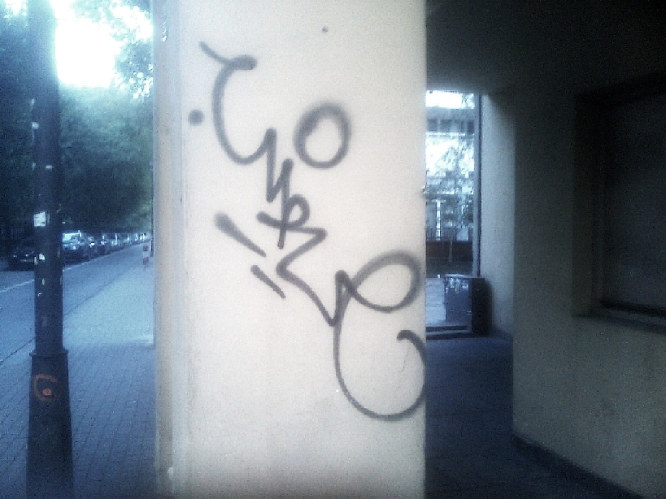
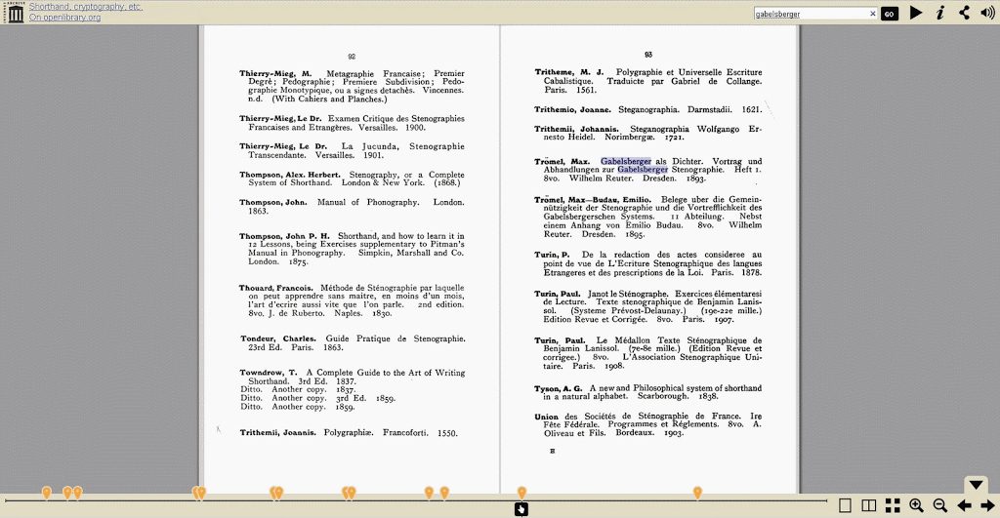

[Kolega po blogu](http://twojesteno.blogspot.com/) opublikował, co
prawda bez słowa komentarza, link do bardzo interesującej (dla badacza,
nie tłoczcie się w przejściu) książki, pt. "[Catalogue of books on
Shorthand, Cryptography
etc.](https://www.archive.org/stream/cu31924029486259#page/n3/mode/2up)".
Pozycja to interesująca, a to z tego np. powodu, że pokazuje, jak wiele
napisano w ciągu ostatnich kilku wieków na temat, którego większość
Polaków w ogóle nie jest świadoma, że kiedykolwiek coś takiego było.

Tak przy okazji anegdotka: przeszukując cyryliczny internet (wpisując do
gugla hasło стенография) mam okazję zobaczyć, jak to jest tam - już
wcześniej o tym wspominałem, ale wtedy nie powiedziałem, że muszę
przekopywać się przez sterty filmików z popisów graficiarzy (BTW. [o
potencjalnych związkach graffiti i stenografii wspomniałem już dawno
temu](http://www.stenografia.pl/?p=207)), bo *стенография* bez żadnych
sztucznych odwołań wymawia się *scjenografija*, a *scjena* to po naszemu
*ściana*.

Ale wracając do książki.Dzieło to liczy sobie bez mała 160 stron i
najsampierw wylicza książki, a później porządkuje je chronologicznie, co
pokazuje, że w XIX wieku ukazywało się po kilkanaście-kilkadziesiąt
różnych podręczników rocznie. Trochę na tej liście zamieszania
wprowadzają prace domorosłych kryptografów, ale nie bardzo, jak miało
okazję prześledzić.

Dodajmy, że katalog ten jest bardzo chromy, skoro pominął w całości
twórczość polską (a kończy wyliczankę w 1912 roku), której wszak do daty
wydania trochę było. Cóż, jak to Anglosasi, żyją we własnym świecie - i
dobrze im tak, w końcu katalog wydali u siebie i mieli prawo napisać w
nim, co im się żywnie podobało. A podobało im się wyliczyć w nim dzieła
swoje, francuskie, trochę hiszpańskich... Zawieruszyły się tam nawet 2
sztuki rumuńskie, zauważyli podręcznik włoskiego Delpino i paru Niemców,
ale przecież nie tych najważniejszych, jak Gabelsberger i Stolze - za to
wyliczyli podręcznik do włoskiego systemu Gabelsberger-Noe oraz książkę
wyliczającą stenografów systemu Stolze autorstwa Maxa Troemela.

Tak czy owak można nabrać wyobrażenia, że stenografia zajmowała ważne
miejsce w życiu, nauce i biznesie w swoich czasach, choć zapewne katalog
ten opisuje może połowę (lub mniej) twórczości światowej na ten temat.
