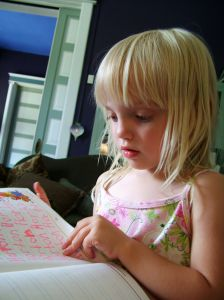

Moja starsza córka właśnie weszła w etap silnej fascynacji zdolnością
pisania. Obserwuję jej postępy nie tylko jako dumny tata, ale też
zadziwiony stenolog. Otóż potwierdzają się wszelkie obserwacje moje na
temat starożytnych alfabetów, współczesnych metod stenograficznych, jak
również dobre rady mistrzów.

Wśród owych dobrych rad i wskazówek bodaj najważniejsza to: ***każde
napisane ćwiczenie przeczytaj, przynajmniej raz. Umiejętność pisania to
nie to samo, co umiejętność czytania. Obie trzeba równie intensywnie
ćwiczyć.***

Otóż okazuje się, że moja najstarsza z córek coraz lepiej radzi sobie z
pisaniem. Zapamiętuje coraz to nowe literki, a największą przyjemność
sprawia jej pisanie pod zapisem wzorcowym - powtarza znak po znaku i ma
z tego kupę frajdy. A jednak, gdy przychodzi do odczytania wypocin, woli
zwrócić się do starszych:

 \- Tatku, co ja tu napisałam? \
 \- Tak jak kazałem, napisałaś "krowa", tylko przez "ó", a to się czyta
"u", a nie "o". Trzeba było pisać bez kreseczki. \
 \- To ja napiszę "Zuzia"... Zy, Ó... Tatku, a co dalej? \
 \- Słoneczko, "ó" piszemy wtedy, kiedy zamienia nam się na "o", np.
"krówka" zamieniamy na "krowa". Napisz tutaj: Ky, Ry, O, Wy, A. To co
tutaj napisałaś? \
 \- Ky, Ry... Krówka! \
 \- Nie, przeliteruj porządnie i przeczytaj, sprawdź. \
 \- Ky, Ry, O, Wy, A. Krówka! \
 \- Jeszcze raz, to nie jest "krówka", tylko... \
 \- Ky, Ry, O, Wy, A. Krówka! 
 
Tu już waliłem grzywką o kant kuli.

Czyli widać stąd jasno że tak naprawdę zapamiętujemy obraz słowa złożony
z liter, a dopiero z wiekiem i dłuuuugą praktyką w **czytaniu**
doskonalimy sztukę sklejania wyrazów z liter, z sylab, w ogóle z
klocków. Widać też jasno, że choć córka moja poradziła sobie z pisaniem,
zupełnie nie potrafi czytać.

Znakiem tego prawdę mówią nauczyciele stenografii, że **każdy napisany
stenogram trzeba przeczytać**, żeby utrwalać umiejętność czytania.
Waldir Cury zwrócił uwagę na fakt, że pismo długie otacza nas wszędzie -
w gazetach, reklamach na przystankach, neonach na budynkach... Tymczasem
stenografii (póki co) mamy tyle, co sami sobie napiszemy oraz
ewentualnie w podręczniku.

Ale przejdźmy do drugiego spostrzeżenia.

Córka moja eksperymentuje z pisaniem i próbuje pisać też słowa, których
jej jeszcze nie pokazaliśmy. Kilka dni temu padał deszcz.

 \- Tatku, to ja napiszę "parasol", Py, Ry, Sy, Ly. Parasol. \
 \- Nie, zauważ, napisałaś "prsl", a nie "parasol". \
 \- No przecież czytam: pa-ra-so-l. Parasol.
 
I znowu grzywką o kant kuli...

Pierwotne alfabety dźwiękonaśladowcze, czyli fonemiczne, tj.
głoskowo-literowe nie miały oznaczeń dla samogłosek. Tak było pismem
egipskim, np. (demotyk, transliteracja):

ḥtp-ḍỉ-nśwt wśỉr ḫnty ỉmntjw ncr ɗɹ nb ɹbc̣w wp-wɹwt nb tɹ c̣śr

*Królewskie ofiary Ozyrysa, Pierwszego z Zachodnich (umarłych),
Wielkiego Boga, Pana na Abydos; I Wepwaweta, Pana Świętej Ziemi*

czy też pismem aramejskim (samogłoski oznaczone są znakami
diakrytycznymi poniżej i powyżej liter):

וַהֲוָה כָּל אַרְעָא, לִישָׁן חַד, וּמַמְלַל, חַ

*Mieszkańcy całej ziemi mieli jedną mowę, czyli jednakowe słowa.*

i wieloma innymi starymi alfabetami (np. protosynajski, hebrajski, czy
współczesny arabski). Znaczenie zapisu samogłosek docenili dopiero
Grecy. Ale i oni przez dłuższy czas pisali tzw.
[bustrofedonem](https://pl.wikipedia.org/wiki/Bustrofedon):

Choć naukowcy uważają, że bustrofedon wynikał z procesu różnicowania się
alfabetów fenickiego (w którym również nie doceniano samogłosek) od
greckiego, moje obserwacje dzieci pokazują, że jest to kolejna,
spontaniczna metoda zapisu. Moja starsza właśnie tak łamała linijkę
tekstu, zanim jej nie pokazałem, jak to należy robić "prawidłowo".

Zatem, kiedy przyjrzymy się uważnie systemom stenograficznym, dojrzymy
ich głęboki związek z naturalnymi dla nas procesami tworzenia zapisu -
tym razem użytymi świadomie, aby przyspieszyć naukę systemu i uczynić go
jak najbardziej naturalnym, intuicyjnym. A metody skrótowego zapisu mają
tradycję tak długą jak samo pismo.
