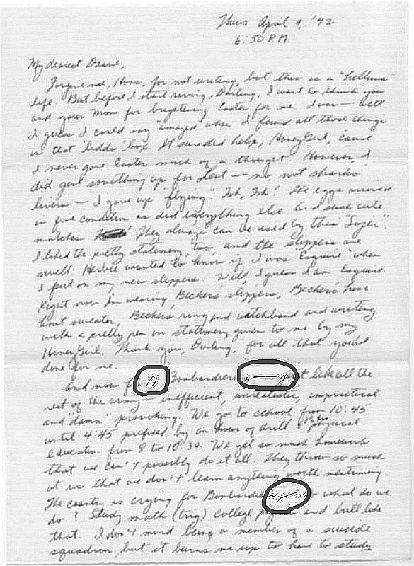

4 września 1942 roku jakiś Frankie pisał list o Lorraine. Pisał go z
jednostki wojskowej, w której poddawano go właśnie drylowi unitarki, jak
sądzę, by wkrótce wysłać go na plaże Bretanii, a może do pensjonatów
Brytanii, kto wie?

Czy chciał coś ukryć przed czujnym okiem cenzorów czytających wszelką
wychodzącą z wojskowych baz korespondencję, czy może po prostu lenił się
pisać pismem długim? A może to był jakiś szyfr między nim, a Lorraine?

Klasycznie długa pozioma kreska to m-n, czyli np. "men". Łuk to t-v, ale
nie wiem, co by to mogło znaczyć. Nad trzecim znakiem członkowie grupy
miłośników systemu Gregga właśnie się głowią.
