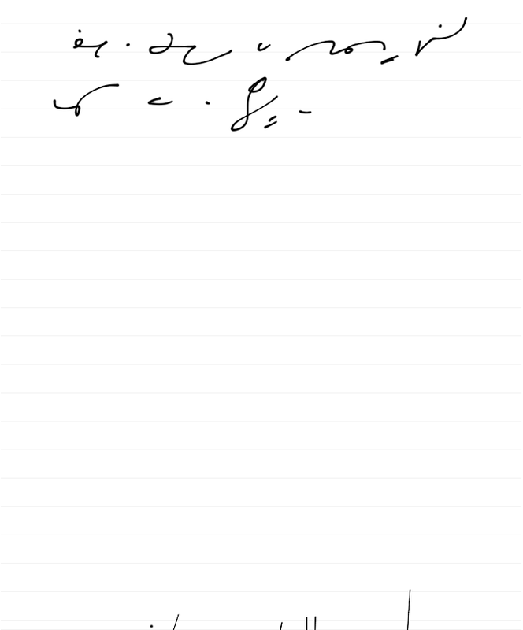

Oto przykład z grupy miłośników systemu Gregga - zapis stenograficzny
dokonany rysikiem na ekranie Ipada. Moim zdaniem w niczym nie ustępuje
zapisowi na papierze. Kto wie, może czeka nas powrót 
sztuki epistolarnej - zamiast bezosobowych drukowanych literek znowu odręczne bazgroty?

Trwa dyskusja nt. pozycjonowania pisaka na ekranie oraz opóźnienia tzw.
echa, czyli widocznej kreski względem ruchu piszącego.
