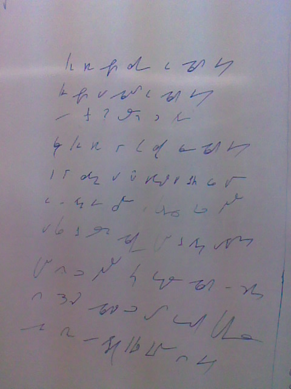

Wrzucam przedświąteczną dygresję, jak w tytule. Ponieważ systemy
stenograficzne dzielą się tylko (i aż) na kursywne i geometryczne, a ich
znaki są bardzo proste, stenogramy wyglądają bardzo podobnie,
niezależnie prawie od charakteru pisma:

Linkuję ten obrazek, bo jako żywo wygląda jak zapis w moim systemie
**Ste*Mi***, aż przez krótki moment czułem coś na kształt
chciałabym-ale-boje-sie, że ktoś już użył tych strzępów informacji,
które zdarzyło mi się tu opublikować.

Jednakowoż, jeśli się głębiej wczytać, to po mojemu będzie tu napisane:

- *K-ie game apu zykę aksym gyk*  
- *K-ie apu u ygzaudź ge gyk*  
- *Y kre? Ąze-t ć krty*

i tak dalej. Jak widać, podobieństwo jest tylko pozorne.

Mam nadzieję, że przed świętami zamieszczę chociaż życzenia, więc się
nie żegnam.
