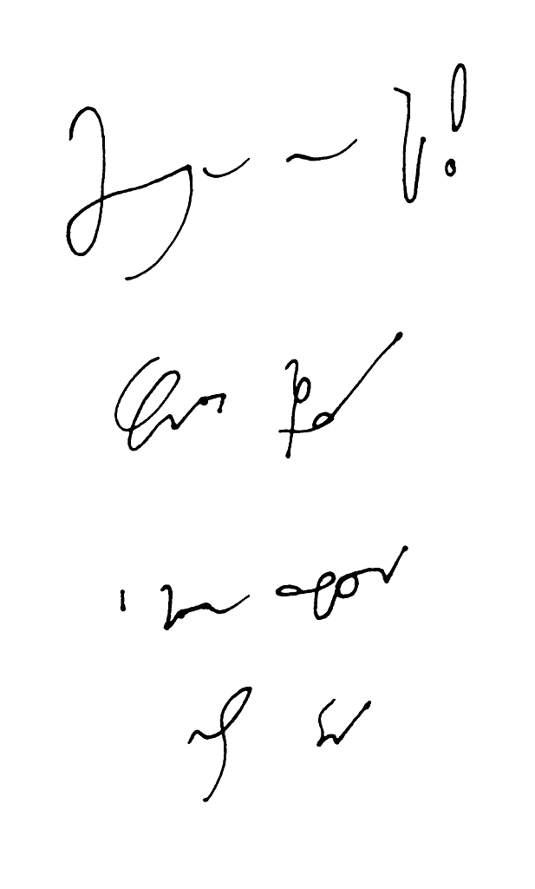

Tak mi się skojarzyło z jedną przedszkolną zagadką: co znaczy
"szczęśliwy"?

<!--

Szczęśliwego Nowego Roku!
Wspaniałej imprezy
i miłego przebudzenia
następnego dnia
-->



Życzenia noworoczne znowu systemem SteMi. Trochę więcej skrótów:

- "*szczęśliwego*" napisane jest "*szczęś\_o*", co zgodne jest z
opisanym skrótem dopełniaczowym z poprzednich życzeń, a także zawiera
skrót takich końcówek jak "*-śliwy/tliwy/rliwy*", które mnie bolały w
czasie ćwiczeń,
- "*nowego*" napisane skrótem "*no*", co nie wymaga tłumaczenia,
- "*roku*" napisane "*rku*"

Dalej wykorzystałem skrócenie z jęz. angielskiego (tj. powszechnie
stosowane w ichnim szorthendzie) dla wyrazów zaczynających się na
"*in-/im*" w słowie "*imprezy*", dalej widać znowu skrót dopełniacza w
"*miłego*", lekceważące podejście do pisania "*u*" w "*przebudzenia*",
niechlujnie napisany skrót "*nst*" (miało być "*nast*") jako
"*następnie/następnego*". Dnia.

Tak czy owak - tego właśnie życzę Kochanym Czytelnikom ;-)
