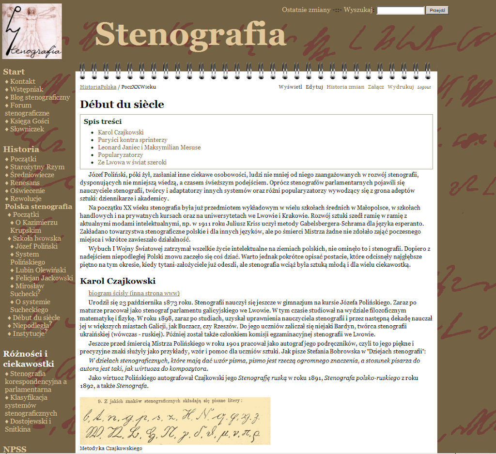

Żmudnie, mozolnie, ale jednak do przodu (dwa do przodu, trzy do tyłu
;-)). W końcu uznałem, że nie ma co się zmóżdżać więcej nad tym tekstem
i postanowiłem odsłonić go czytelnikom. Oto, proszę wycieczki,
[kolejny rozdział historii stenografii polskiej](../../historia_polska/debut_siecle/),
opracowany głównie (praktycznie z braku innych źródeł) na podstawie
["Dziejów stenografii polskiej" Stefanii Bobrowskiej i Szymona
Tauba](https://alpha.bn.org.pl/search~S5*pol?/cII+1.202.828+A/cii+1+202+828+a/-3%2C-1%2C0%2CB/frameset&FF=cii+1+202+828+a&1%2C1%2C).

<!--

  [Debut du siecle](http://stenografia.pl/pmwiki/index.php?n=HistoriaPolska.PoczXXWieku)
-->

Mam nadzieję, że mimo starań jednak nigdzie się tam nie rypłem (czyli
nie pomyliłem), albo nie wstawiłem jakiegoś kompromitującego ortografa.

Miłej lektury.
