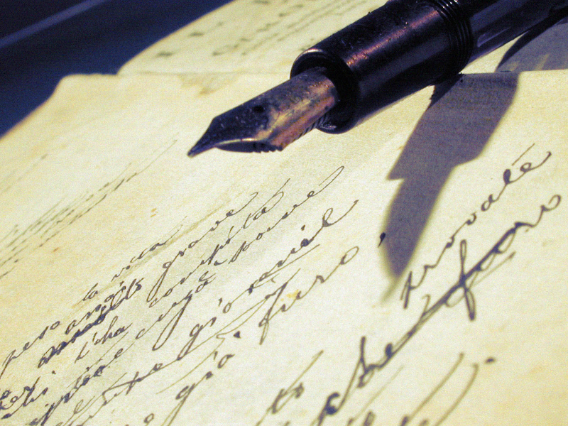
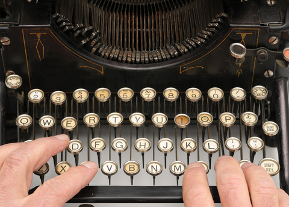
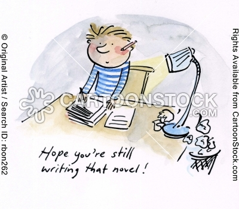

Zadano mi pytanie na tymże blogu - o domyślny Czytelniku! - czy mamże
zamiar książkę o historii stenografii kiedyś napisać?

Otóż odpowiedź jest prosta: oczywiście, że mam, materiałów na wiele
tematów mam znacznie więcej, niż przekazuję na swoich stronach, bo
strona www nie jest najlepszym miejscem na szczegółowy wykład, ale:

**Po pierwsze primo:** Pisanie książki to minimum rok ciężkiej,
codziennej pracy.

**Po drugie primo:** Przed napisaniem książki typu
encyklopedyczno-historycznego potrzeba zapewne roku na uporządkowanie
materiałów, ofiszkowanie, opisanie, ukonspektowanie... No, nie znam się
na tym, ale pewnie potrzeba.

**Po trzecie primo:** Nigdzie się nie wybieram, ale też donikąd mi się
nie spieszy.

**Po czwarte primo:** Choć z wiekiem robię się coraz bardziej
konsekwentny, nie wykluczam, że znowu przyjdzie jakaś powódź, albo inna
przyjemność, która skutecznie zabierze mi mój czas, który ewentualnie
mógłbym na to przeznaczyć, albo po prostu spadnie mi temperatura
zainteresowania tematem, bo np. już wszystko na ten temat będę wiedział.

Konkluzja z powyższego jest taka, że:

1. Książka szybko się nie ukaże.
2. Może nigdy.
3. Choć wolałbym jednak ją napisać - szkoda tego trudu, który już w to
włożyłem.

Mam kontakt z paroma starymi stenografami, stenologami, ale zwyczajnie
brakuje mi czasu i pieniędzy, żeby się do nich wybrać i wyrwać od nich
ewentualne materiały, które mogłyby mi mój zbiór uzupełnić - a z lektury
archiwum "Stenografów Polskich" wiem, że gdzieś w Polsce chować się
muszą (o ile nie spłonęły, albo nie zatonęły) bezcenne zbiory np. p.
Edwarda Trepnaua, albo wcześniejsze jeszcze Szymona Tauba, Władysława
Chrapusty - jakieś resztki tego przetrwać musiały, ale spadkobiercy może
nawet nie wiedzą, jakie białe kruki u siebie przechowują?

A co np. z wycieczką do Pragi, gdzie z pewnością leżą antyki także
polskiej stenografii (twórcy polskiej stenografii byli członkami -
przynajmniej honorowymi - Praskiego Towarzystwa Stenograficznego). A
może i do Budapesztu? A może kontakt z Intersteno?

Wiem, że w Brazylii ponoć mieści się (w USA też - biblioteka Gregga, ale
kto to ma?) największy zbiór książek o stenografii na świecie i jest
własnością stowarzyszenia, czyli jest szansa się do niego dobrać. Ale
kto mi kupi bilet do Brazylii?

Kiedy się zabiorę do pisania niniejszej, toż przecież bezwarunkowo
takowe podróże poszukiwawcze odbyć muszę. I listy powysyłać. I z
utęsknieniem czekać. Może się uda.

Czy ja w ten sposób nie przyznałem się, że po prostu trochę mnie to
przeraża?

A zatem - trzymajcie kciuki.
