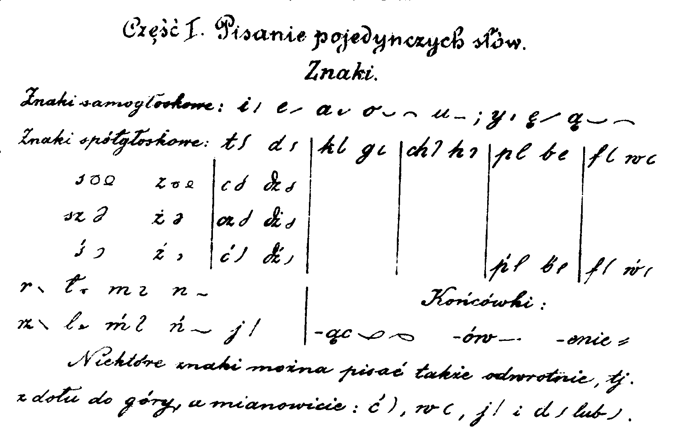

Wreszcie się wziąłem (wziołem i zrobiołem) i zrobiłem. Artykuł o
Mirosławie Sucheckim. W ten sposób mogę uznać, że praca nad pierwszym
rozdziałem stenografii polskiej została zamknięta, przynajmniej na czas
jakiś, to znaczy długi czas.

Porywa mnie moja fascynacja innymi rzeczami, dlatego ostatnio tak
niewiele nowego się pojawiało. Czuję się cokolwiek wyprany
intelektualnie. Chciałbym wrócić do opracowania stenografii na świecie,
czyli byłaby teraz kolej na następny rozdział do umieszczenia powyżej
menu z historią polską. Znowuż w historii polskiej mam zaplanowane
jeszcze dwa duże rozdziały i - zależnie od dostępnych materiałów - kilka
podrozdziałów opowiadających o wybitnych osobach danego okresu. Za to w
stenografii światowej jest jeszcze duuuużo do opowiadania. Cóż, patrząc
sumarycznie, jest ona po prostu o wiele większa.

[Miłej lektury.](../../historia_polska/suchecki/)

**[&gt;&gt; CZYLI TU KLIKNIJ](../../historia_polska/suchecki/)**
