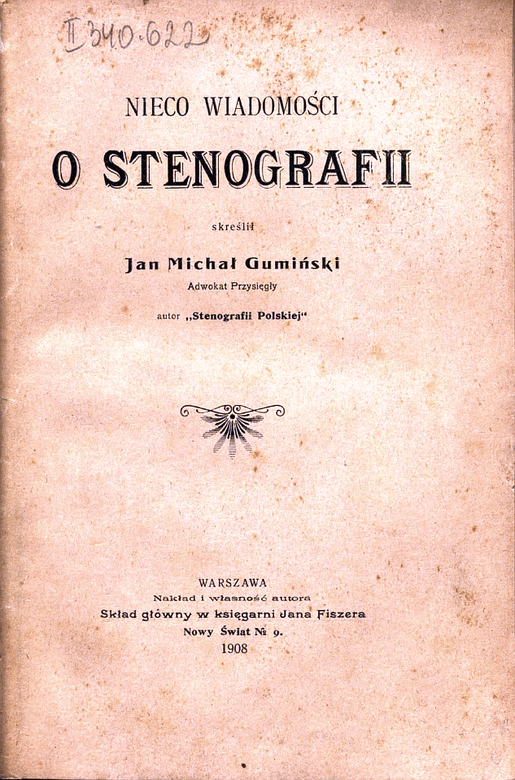

Pod takim tytułem w roku 1908 ukazała się 
[broszurka autorstwa Jana Michała Gumińskiego. Polecam lekturę](https://www.archive.org/details/NiecoWiedzyOStenografii),
zwłaszcza, że jest już dostępna w Internecie. Zawiera czasem
interesujące informacje. W tym o rodzącej się wówczas stenotypii.

Bardzo mi się podoba praktyczne podejście Gumińskiego do stenografii i
stenotypii: "*Na zakończenie niniejszego tytułu, należy uspokoić
czytelników, że maszyna stenograficzna nie grozi zgubą zawodowi
stenografa, tak jak maszyna do pisania nie zgubiła pisarzy. Czy
stenograf pisze na maszynie, czy ołówkiem (piórem), jest to kwestya
obojętna, - aby tylko pracę swą wykonał należycie: idzie o skutek, nie o
środek. Stenografowanie na maszynie wymaga nie mniejszego naprężenia
umysłowego i szybkości ręki, niż stenografowanie ołówkiem.*"
Jak dziś już wiemy, faktycznie w Polsce maszyna stenograficzna nie
zagroziła zawodowi stenografa, albowiem w ogóle się tu nie pojawiła.
Odeszła w przeszłość, zanim zaistniała w teraźniejszości. Nie zmienia to
faktu, że powoli pracujemy nad tym zagadnieniem i może kiedyś się
doczekamy czegoś sensownego.

Miłej lektury.
