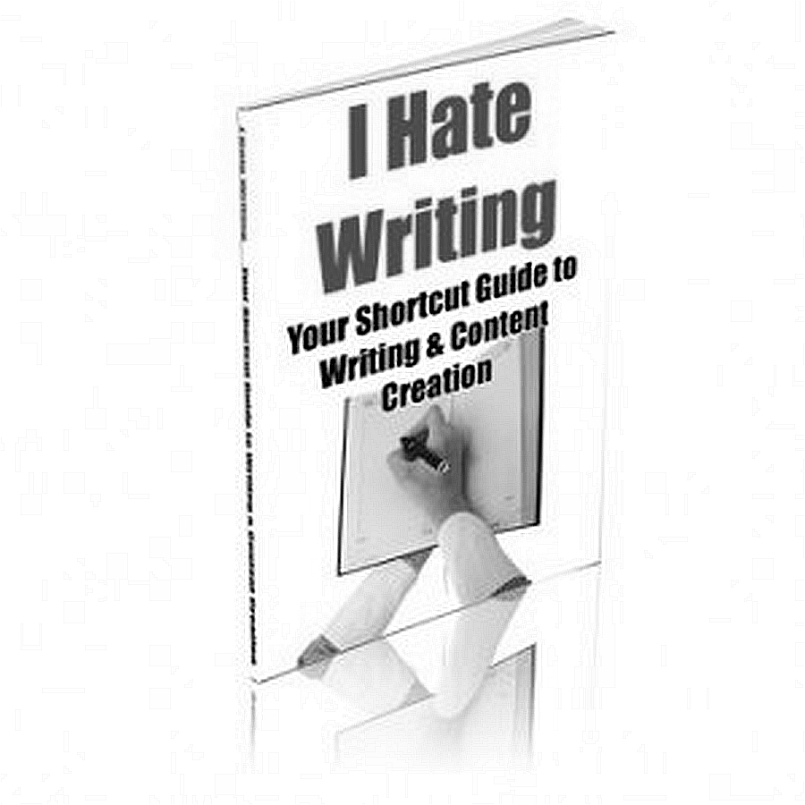
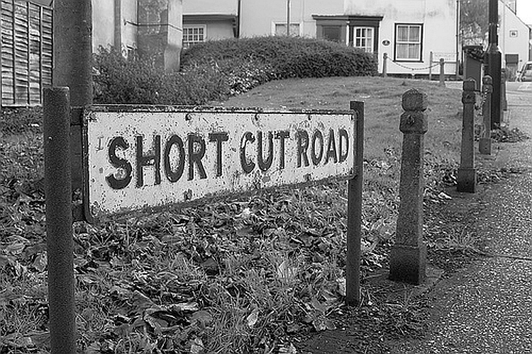

W ramach prezentowania cudzych tekstów pozwalam sobie tutaj przedrukować
krótki felieton Jerzego Krupińskiego, znanego niektórym czytelnikom tego
bloga jako autor najpopularniejszego ongi podręcznika do stenografii
systemu Polińskiego z r. 1971. Artykuł poniższy ukazał się w
**Stenografie Polskim** nr 7(108) z września roku 1966(XX).

*Od razu zaznaczam, że jeżeli istnieją spadkobiercy P. Krupińskiego, to
**bardzo proszę** o kontakt przez strony tego bloga.*

## Pismo skrócone czy krótkie?

Spotkać się można nieraz z określeniem, że stenografia jest pismem
skróconym, a to z tego pozornie prostego powodu, że jest znacznie
krótsza od pisma zwykłego. używanie w stosunku do stenografii terminu
"pismo skrócone" spotkać można nawet w niektórych podręcznikach
stenograficznych. Wydaje się, że w dziedzinie terminologii, dotyczącej
tak dość ważnej sprawy jak zdefiniowanie pojęcia stenografii - potrzebne
jest pewne uściślenie.

Określenie "pismo skrócone", używane w stosunku do stenografii jako
takiej, wydaje mi się terminem zupełnie błędnym. Stenografia nie jest
pismem skróconym dlatego, że założenia dotyczące budowy systemu
stenograficznego nie polegają na skróceniu jakiegoś innego pisma. Pismo
stenograficzne jest pismem samoistnym, rządzącym się zupełnie innymi
zasadami, niż pismo zwykłe. Wprawdzie podstawowe elementy pisma
stenograficznego wywodzą się z najprostszych elementów, z których
zbudowane są litery kursywowego pisma zwykłego, ale na tym kończy się,
zresztą bardzo pozorna, łączność pisma zwykłego ze stenografią. Ta
bardzo nikła łączność jest tylko pozorna dlatego, że gdybyśmy nawet
chcieli, nie znając pisma zwykłego, wymyślić jakieś podstawowe elementy
graficzne dla pisma stenograficznego, to byśmy na pewno nie doszli do
niczego innego, jak właśnie do tych najprostszych elementów, na których
podstawie zbudowane są litery pisma łacińskiego. Stąd chyba wysnuć można
wniosek, że stenografia jest pismem krótkim w stosunku do pisma
zwykłego, będącego w porównaniu do stenografii pismem długim.

Krótkość swą zawdzięcza stenografia przede wszystkim prostym, utworzonym
dla poszczególnych dźwięków społgłoskowych znakom (nie literom!), które
łączą się następnie w grupy spółgłoskowe i zgłoskowe, oraz specjalnym
krótkim znakom dla przedrostków, przyrostków itd. Nie mniej ważną i może
najcharakterystyczniejszą cechą pisma stenograficznego jest symbolizacja
samogłosek, tzn. oznaczanie ich w pewien określony, obrazowy sposób w
poprzedniej lub następnej spółgłosce lub grupie spółgłoskowej. Wskutek
tego pismo stenograficzne jest zasadniczo pismem sylabowym, zgłoskowym,
a więc staje się niejako pismem naturalnym, w stosunku do sztucznego,
zwykłego pisma literowego.

W związku z tym nasuwa się refleksja, że stenografia jest więc pismem
krótkim i jednocześnie pismem naturalnym, w stosunku do długiego i,
niestety, bardzo sztucznego pisma zwykłego. Dopiero w obrębie samego
pisma stenograficznego dokonywanych jest w celach praktycznych szereg
operacji polegających na różnych skracaniu tego pisma (znaczniki,
skrócenia logiczne, tematyczne itd.), co jest już zupełnie odrębnym
tematem wchodzącym w zakres ogólnej teorii owego krótkiego pisma, jakim
jest stenografia.

                                                                       
                  Jerzy Krupiński
