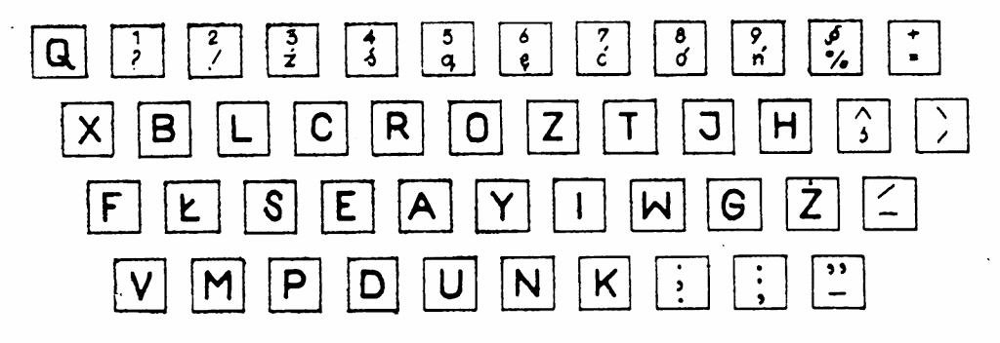

Ponieważ oprócz czystej,
tekstowej stenografii interesuje mnie stenotypia, a też, przy okazji, że
opanowałem sztukę bezwzrokowego klepania, zagadnienia związane z
klawiaturami, cieszy mnie fakt, że przekopując się przez archiwa
Stenografa Polskiego znalazłem w numerze z kwietnia 1974 artykuł Janusza
Kaczmarka nt. polskiego układu klawiatury.

Otóż jeszcze w latach zapiekłego stalinizmu ci bohaterowie walki o
naszą, polską biurokrację przedstawili projekt polskiej klawiatury
zoptymalizowanej dla naszego języka ojczystego. Z poniżej zamieszczonej
tabelki wynikać ma jasno i wprost, że układ zaproponowany przez nich,
nazwijmy go roboczo *pl.SSiM*, pozwala na korzystniejszy rozkład pracy
pomiędzy poszczególne palce złożone na klawiaturze maszyny do pisania. A
naszym, współczesnym, wypadku - na klawiaturze komputera.

| Porównanie rozkładu liczby uderzeń na poszczególne palce w procentach |       |             |            |       |             |
|-----------------------------------------------------------------------|-------|-------------|------------|-------|-------------|
| Lewa ręka                                                             |       |             | Prawa ręka |       |             |
| palec                                                                 | układ |             | palec      | układ |             |
|                                                                       | qwert | proponowany |            | qwert | proponowany |
| mały                                                                  | 12,8  | 2,3         | mały       | 10,2  | 2,8         |
| serdeczny                                                             | 9,3   | 5,8         | serdeczny  | 11,8  | 5,2         |
| środkowy                                                              | 13,4  | 10,3        | środkowy   | 13,1  | 10,6        |
| wskazujący                                                            | 11,2  | 30,5        | wskazujący | 18,2  | 32,5        |
|                                                                       | 46,7  | 48,9        |            | 53,3  | 51,1        |

Kto zechce się uważniej przypatrzeć, zauważy ciekawostkę:
Otóż układ, nazwijmy go QWERT, bo tyczy się to zarówno
współcześnie-światowego, a w rzeczywistości po prostu amerykańskiego,
QWERTY, jak i jego wariantu QWERTZ, który adaptowany był w Polszcze
przez długie lata, jeszcze i na komputerach, zaprojektowany został w
1872 roku przez niejakiego
[Sholesa](http://pl.wikipedia.org/wiki/Christopher_Latham_Sholes), który
wiedziony był pragnieniem, aby wciąż doskonalące się w sztuce szybkiego
klepania sekretarki, nie niszczyły jego z takim trudem wyprodukowanych
maszyn, a konkretnie czcionek i tych ramiączek, do których czcionki były
przyczepione. Otóż zdolne one dziewczęta (głównie) tak znakomicie
potrafiły opanować klepaninę, że wkrótce dochodziło do strasznej rzeczy:
otóż jedna czcionka nie zdążyła wrócić na swoje miejsce, kiedy już na
spotkanie z papierem pędziła następna! Dochodziło do kolizji gdzieś w
połowie drogi, czcionki się klinowały, trzeba było dzwonić po serwis, a
telefony wtedy drogo kosztowały. I tak to właśnie pan Sholes wymyślił
układ QWERTY, znany nam wszystkim znakomicie, którego celem było
maksymalne utrudnienie (w przeciwieństwie do ułatwienia) pracy klepaczom
maszynowym, aby czcionki nie zasuwały tak szybko jedna po drugiej. Do
tego celu zastosował sztukę statystyczną i na podstawie
reprezentatywnego korpusu języka angielskiego opracował rozkłady
częstości występowania poszczególnych liter i tak je porozkładał na
klawiaturze, żeby zawsze było daleko i pod górkę. A do tego nie
faworyzował palców silniejszych, co w ówczesnych, mechanicznych
maszynach, gdzie klawisz należało nacisnąć mocno, żeby odbił się znak na
papierze, stanowić musiało pewne utrudnienie. Sukces odniósł połowiczny:
małe paluszki faktycznie niezbyt chciały działać z maszyną do pisania,
ale tak samo rzeczy się miały przed jego wynalazkiem. Klepaczki po
prostu przechodziły na technikę ośmiopalcową i tyle. Wkrótce znowu
zasuwały tak, że aż się czcionki klinowały. Ale że wkrótce nadeszła
jedna wojna, później kryzys, później druga wojna, to już jakoś nikomu
nie chciało się nad tym zmóżdżać.

Oprócz niejakiego [Dvoraka](http://pl.wikipedia.org/wiki/August_Dvorak),
który łaskaw był spostrzec i pomyśleć, że ten Sholes to idiota jakiś
musiał być, bo jakżesz to tak ludziom życie utrudniać, zamiast ułatwiać.
I w 1933 roku opatentował układ klawiatury, który w języku angielskim
faworyzował zdecydowanie 6 większych i silniejszych palców
spoczywających na środkowym rzędzie klawiszy maszyny do pisania. I co? I
nic. Pomysł się nie przyjął. I tak dziś, kiedy problem klinowania się
czcionek dawno już zniknął (konkretnie w latach 60-tych, kiedy IBM
wynalazł kulistą głowicę z czcionkami zamiast ruchomych czcionek na
ramionkach, to się nazywało "Selectric"), dalej łaskawi jesteśmy używać
kompletnie nieefektywnego układu QWERTY Sholesa z drugiej połowy XIX
wieku. To podobno tak samo, jak z samochodami...

Ale wróćmy do spostrzeżeń z tabelki. Otóż tam pokazane są rozkłady
"użycia" poszczególnych palców w układzie QWERTZ i proponowanym,
pokazanym przeze mnie na samej górze tego artykułu. Zwróćcie uwagę,
proszę, na fakt, że rozkład dla QWERTY jest **płaski**! Z tego wynika
hipoteza, że jest on płaski (w granicach błędu statystycznego) dla
dowolnego języka, bo polski wobec angielskiego jest kompletnie dowolny.
A zatem - geniusz, czy idiota?

Tak czy owak, klawiatury elektryczne, w których siła uderzenia przestała
mieć jakieś znaczenie, pojawiły się mniej więcej w tym samym czasie, co
głowica Selectric, a w ciągu następnych 2 dekad upowszechniły się
elektryczne maszyny do pisania o różnym stopniu komputeryzacji.
Tymczasem w naszym kraju mogliśmy się pochwalić rozpoczęciem własnej
produkcji maszyn do pisania marki Łucznik (oraz paru innych fabryk
broni), całkowicie mechanicznych, czyli niezawodnych, gniotsja, nie
łamiotsja, z pozostałości metali użytych do odlewania zamków karabinów i
ołowiu do wypełniania płaszczy pocisków. Atoli zanim jeszcze nowoczesny
przemysł polski zaczął produkować (na zmianę z czołgami) maszyny do
pisania, dzielni innowatorzy na polu stenografii i biuralistyki podjęli
odważne, cenne i godne odnotowania inicjatywy.

Ale cofnijmy się nieco i zacznijmy tak jakby ab ovo, czyli najpierw
opowiedzmy to i owo, a potem do konkretów. Otóż maszyna do pisania
spowodowała zamęt w głowach innowatorów na całym świecie. Pojawiały się
różne pomysły, w tym układy klawiatur dla jednorękich (niekoniecznie
bandytów). Szukano układu o najmniejszej możliwej liczbie klawiszy,
ograniczonej tylko do liter alfabetu i cyfr, ale żeby jak najmniej
klawiszy. W ramach jednej czcionki starano się zatem umieścić jak
najwięcej znaków, pojawiły się zatem potrójne, a nawet poczwórne
czcionki, których dodatkowe znaki uruchamiano operatorami typu
podniesienie, przesunięcie szyny. Maszyna marki "Adler" miała zaledwie
30 klawiszy.

<!--
  {width="320" height="250"}](BlickU-1000px.jpg)
  To akurat jest Blick, ale też pasuje ;-)
-->



Z drugiej strony pojawiały się monstra o 84 klawiszach, np. "Smith
Premier 10A"

<!--
  {width="320" height="268"}](smithpremier10-01.jpg)
  Czy to nie ma więcej niż 84 klawisze?
-->



A przecież równolegle z maszyną do pisania narodził się wynalazek
stenotypii, co prawda na razie dla języka angielskiego, ale zawsze.
Pojawiały się zatem też twory pośrednie, o trudnym do wyobrażenia
zastosowaniu

**CDN**

